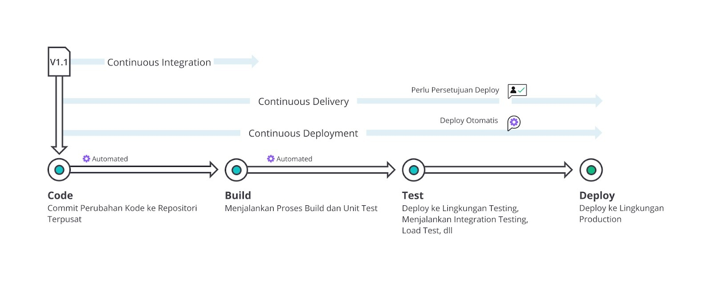
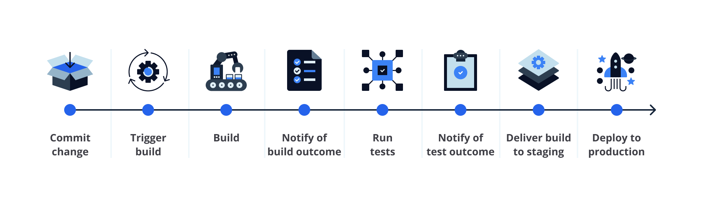

# ci/cd
## Continuous Integration (CI)
- merupakan praktik pengembangan aplikasi/perangkat lunak di mana Developer secara teratur (atau sesering mungkin) 
  - mengunggah (push) atau menggabungkan (merge) perubahan kode (code changes) mereka ke sebuah repositori terpusat (central repository) 
  - dan/atau ke mainline trunk (seperti branch master/main), 
  - setelah itu proses pembentukan (build) dan pengujian (test) secara otomatis akan dijalankan

- Source control version management
  - git
- Build automation => file hasil dari proses build disebut “build artifact”, umumnya termasuk package, compressed file, container image, dll.
  - Jenkins.
- Automated testing

## Continuous Delivery/Deployment (CD)

- Continuous delivery adalah perpanjangan dari continuous integration karena secara otomatis melakukan deploy terhadap semua perubahan kode ke testing 
  - dan/atau production environment sesaat setelah tahapan build usai dan/atau lolos test

## CI/CD Pipeline
- merupakan serangkaian langkah yang harus dilakukan untuk menghadirkan versi perangkat lunak yang baru. 
  - CI/CD Pipeline adalah praktik yang berfokus pada peningkatan software delivery (pengiriman perangkat lunak) 
  - di seluruh siklus pengembangan perangkat lunak (build, test, dan deploy kode) melalui automasi.

# alur CI / CD

- Plan→Code→Build→Test→Release→Deploy→Operate→Monitor

## Plan => mencakup semua yang terjadi sebelum Developer mulai menulis kode.
- https://www.atlassian.com/software/jira

## Code => membuat code, melakuukan push ke repositori
- vs code, text editor

## Build => triger dan akan melakukan build dan menghasilkan artifact
- Jenkins

## Test => Setelah proses build sukses, artifact (artefak/arsip) build secara otomatis di-deploy ke testing atau staging environment untuk dilakukan pengujian yang lebih mendalam.
- synk
- ketika testing akan dilakukan kedua ini secara bersama sama
  - Pengujian manual => User Acceptance Test (UAT)
  - Pengujian otomatis => menjalankan pemindaian keamanan terhadap aplikasi, memeriksa perubahan pada infrastruktur, menguji kinerja aplikasi, atau load testing.

- Functional testing: Memvalidasi sistem aplikasi apakah memenuhi kebutuhan fungsional, yakni proses-proses yang akan dilakukan oleh sistem.
- Integration testing: Setiap unit atau komponen aplikasi digabungkan dan diuji sebagai sebuah grup/kelompok. Bila Anda penasaran apa perbedaan unit test dan integration test, silakan pelajari di sini.
- Regression testing: Menjalankan kembali pengujian fungsional dan non-fungsional (functional and non-functional test) untuk memastikan bahwa aplikasi yang telah dikembangkan dan diuji sebelumnya masih berfungsi setelah terjadi perubahan kode.
- Acceptance testing: Pengujian dilakukan oleh klien, pengguna, atau entitas resmi lainnya guna menentukan apakah kebutuhan aplikasi dan proses bisnis sudah terpenuhi atau belum.
- Load testing: Pengujian kinerja aplikasi yang menyimulasikan beban kerja atau traffic pada dunia nyata.
- Security testing: Mengidentifikasi kerentanan, kelemahan, ancaman, dan risiko keamanan pada aplikasi guna mencegah serangan berbahaya dari penyusup.

## Release
- JFrog, Docker Hub, atau GitHub Packages.
- Tahapan Release adalah titik di mana tim bisa mengatakan bahwa artifact (artefak/arsip) build siap untuk di-deploy ke production environment.
- Bergantung pada perusahaan masing-masing, mereka dapat memilih untuk langsung men-deploy aplikasi secara otomatis 
  - atau artifact build diberi “tanda” (seperti nomor versi) terlebih dahulu dan disimpan sebelum pada akhirnya di-deploy secara manual (tergantung jadwal deploy setiap perusahaan).

## Deploy
- Infrastructure as Code (IaC)

## Operate
- Ansible
- Pada tahap ini, aplikasi (atau perubahan kode) sudah di-deploy dan bisa diakses oleh pengguna. 
  - Ingat! Pekerjaan tak berhenti sampai di sana. Kita perlu memastikan bahwa semuanya berjalan lancar tanpa ada gangguan atau kendala sedikitpun. 

## Monitor
- Prometheus dan Grafana.
- mengumpulkan data dan analitik tentang perilaku pengguna, kinerja, bug, dan lainnya