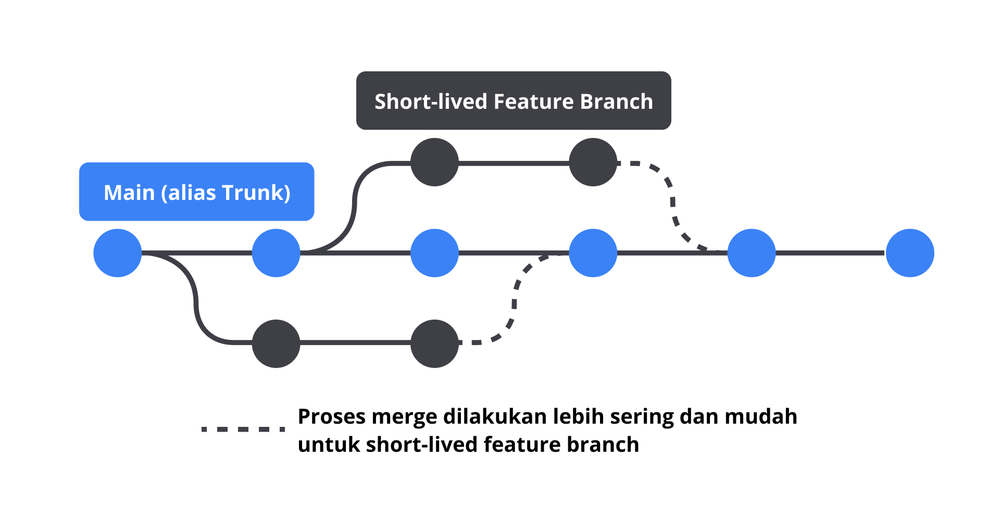

# continues intergrasi
## git
- Repository adalah istilah yang digunakan sebagai penyimpanan source code.
- Clone (cloning) adalah proses menyalin atau mengkloning repositori dari remote repository (misal, GitHub repository) ke local repository (komputer pribadi) untuk mempermudah penambahan, pengubahan, atau penghapusan kode
- branch => Sebagaimana yang kita tahu, git adalah version control system, di mana versioning ini salah satunya diatur oleh fitur branch (cabang).
- Commit merupakan sebuah aksi yang dilakukan Developer untuk membuat rekam jejak (snapshot) terhadap perubahan kode yang ia tulis.
- Perintah git push merupakan tindakan lanjutan dari perintah git commit.
  - Push merupakan aksi untuk mengirim perubahan kode dari local repository ke remote repository. 
- Pull Request adalah sebuah pengajuan/permintaan (request) untuk menggabungkan perubahan kode pada suatu branch ke branch lain.
- Merge merupakan aksi untuk menggabungkan perubahan kode pada suatu branch ke branch lain.

## Branching Strategy
### GitHub flow
- eveloper akan memulai pengembangan aplikasi di main branch. Kemudian, jikalau ingin membuat fitur atau melakukan perubahan besar pada kode aplikasi, Developer perlu membuat branch baru (yang berasal dari main branch, disebut feature branch) guna mengisolasi pekerjaan mereka. 

### Trunk-based development
- Trunk-based development adalah branching strategy yang mendorong Developer untuk berkolaborasi pada kode di branch tunggal bernama “trunk” (alias “main” jika dalam nomenklatur git).

## Hubungan Git dengan CI/CD

- webhooks
  - Contohnya, saat Developer melakukan commit, git server akan mengirimkan webhook ke build tools yang kemudian akan memulai proses build, test, dan deploy aplikasi.
