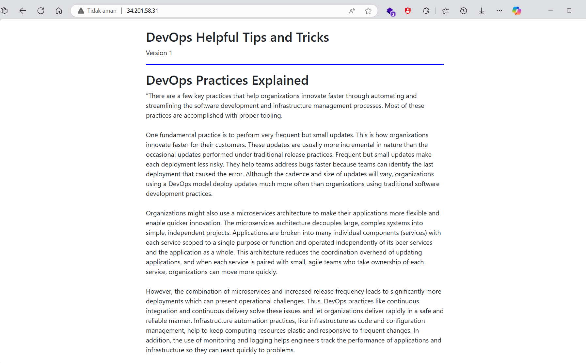

# Latihan Deploy Aplikasi dengan AWS CodeDeploy
- Berikut adalah tahapan proses yang akan kita lakukan.
  - Anda akan membuat IAM role yang diperlukan selama latihan.
  - Membuat EC2 instance bernama TEST-environment yang nantinya digunakan untuk deployment.
  - Menginstal CodeDeploy agent di dalam EC2 instance.
  - Membuat S3 bucket dan mengunggah berkas aplikasi ke sana.
  - Membuat dan mengonfigurasi AWS CodeDeploy.
  - Deploy ulang aplikasi dengan versi terbaru (mengubah source code).

## Membuat IAM Role
- Pertama, Anda akan membuat IAM role dan menetapkan permission kepadanya untuk kebutuhan latihan ini. 
- Di AWS Management Console, masuklah ke halaman IAM melalui fitur pencarian layanan. Pastikan Anda berada di Region Singapore.
- Di panel navigasi sebelah kiri, klik menu Roles, lalu pilih Create role.
- Pada halaman Select trusted entity, konfigurasikan seperti berikut.
  - Trusted entity type: AWS service.
  - Service or use case: CodeDeploy
  - Use case: CodeDeploy.
- Jika sudah, klik tombol Next.
- Lewati halaman Add permissions dengan klik tombol Next. 
- Setelah itu, isilah bagian Role name dengan CodeDeployServiceRole dan pilih Create role.
- Buat IAM role lainnya dengan klik Create role.
- Lalu, lakukan konfigurasi seperti berikut.
  - Trusted entity type: AWS service
  - Service or use case: EC2 
  - Use case: EC2
- Jika sudah, klik tombol Next. 
- Pada kotak pencarian, masukkan “s3full” dan centang AmazonS3FullAccess policy. Lalu, klik tombol Next.
- Untuk Role name, isikan EC2S3FullAccess dan pilih Create role.

## Meluncurkan EC2 Instance
- Dari halaman IAM, masuklah ke halaman EC2 menggunakan fitur pencarian layanan (pastikan Anda masih berada di Region Singapore).
- Di panel navigasi sebelah kiri, pilih Instances, lalu klik tombol Launch instances.
- Pada halaman Launch an instance, sesuaikan dengan konfigurasi berikut.
  - Name: TEST-environment
  - Amazon Machine Images (AMI): Amazon Linux 2023 AMI
  - Instance type: t2.micro
  - Key pair name: Klik tombol Create new key pair, isikan "test-environment" untuk field Key pair name. Kemudian, klik Create key pair.
- Pada bagian Network settings,  pilih Create security group dan centang semua opsi:
  - Allow SSH traffic from -> Anywhere
  - Allow HTTPS traffic from the internet
  - Allow HTTP traffic from the internet
- Buka bagian Advanced details. Pada IAM instance profile, pilih EC2S3FullAccess.
- Setelah itu, klik tombol Launch instance di sebelah kanan.
- Tunggu beberapa saat, lalu klik View all instances.
- Klik tombol Refresh instances untuk memunculkan instance yang baru dibuat.
- Tunggu kolom Instance state berubah menjadi Running.

## Menginstal CodeDeploy Agent
- Dari halaman Instances, pilih TEST-environment (centang box di sebelah nama instance) dan klik tombol Connect. 
- Pada halaman Connect to instance, pastikan Anda berada di tab EC2 Instance Connect dan klik Connect. 
- Apabila Anda mengalami warning "Missing active route to internet gateway", artinya Anda harus membuat internet gateways terlebih dahulu dan attach ke VPC Anda.
  - Buka halaman Internet gateways dan klik Create internet gateway. Isikan "devops-igw" pada field Name tag. Klik Create internet gateway.
  - Klik Attach to a VPC. Pada field Available VPCs, pilih VPC yang tersedia. Klik Attach internet gateway., 
  - Buka halaman Route tables, centang route table yang tersedia. Buka tab Routes di bagian bawah dan klik Edit routes. Pada kolom Target pada bagian Internet Gateway, pilih internet gateway yang tersedia. Klik Save changes.
  - Silakan kembali ke halaman EC2 Instance Connect dan klik Connect.
- Sebuah browser tab baru akan terbuka dan menampilkan sebuah terminal. Dari sana, instal CodeDeploy agent dengan perintah berikut.
  ```bash
  sudo yum update -y
  sudo yum install ruby -y
  sudo yum install wget -y
  ```
- Instal versi terbaru dari CodeDeploy agent.
  ```bash
  cd ~
  wget https://aws-codedeploy-us-west-2.s3.us-west-2.amazonaws.com/latest/install
  chmod +x ./install
  sudo ./install auto
  ```
- Verifikasi bahwa CodeDeploy agent sedang berjalan.
  ```bash
  sudo service codedeploy-agent status

  # if not run
  sudo service codedeploy-agent start
  sudo service codedeploy-agent status
  ```

## Membuat S3 Bucket dan Mengunggah Berkas Aplikasi
- Masuklah ke halaman S3 melalui fitur pencarian layanan.
- Pastikan Anda berada di menu General purpose buckets dan klik tombol Create bucket untuk membuat sebuah S3 bucket.
- Untuk Bucket name, isikan sebuah nama dengan format devops-blog-app-<nama>-<angka>. Apabila nama yang Anda masukkan telah digunakan, cobalah dengan angka yang lain.
- Scroll ke bawah dan klik Create bucket. Sekarang, bucket yang Anda buat seharusnya muncul di daftar bucket.
- Setelah itu, unduh berkas aplikasi DevOps Blog App berikut DevOps_Blog_App.zip.
  - [https://github.com/dicodingacademy/assets/raw/main/cicd_academy/DevOps_Blog_App.zip](https://github.com/dicodingacademy/assets/raw/main/cicd_academy/DevOps_Blog_App.zip)
- Pada halaman S3, klik pada nama bucket yang Anda telah buat, lalu klik Upload.
- Klik tombol Add files, lalu pilih berkas yang telah Anda unduh di komputer pribadi, kemudian klik Upload.
- Setelah itu, klik Close. Anda akan melihat bahwa berkas tersebut sudah berhasil terunggah.

## Membuat dan Mengonfigurasi AWS CodeDeploy
- Masuklah ke halaman CodeDeploy melalui fitur pencarian layanan.
- Di panel navigasi sebelah kiri, buka menu Applications, lalu klik tombol Create application.
- Di bagian Application configuration, sesuaikan seperti berikut.
  - Application name: TestApplication
  - Compute platform: EC2/On-premises
- Jika sudah, klik tombol Create application.
- Anda akan dibawa ke halaman Application details. Pada tab Deployment groups, klik tombol Create deployment group. Sesuaikan dengan konfigurasi berikut.
  - Deployment group name: TestDeploymentGroup
  - Service role: CodeDeployServiceRole
  - Deployment type: In-place
  - Environment configuration: Amazon EC2 instances
    - Key: Name
    - Value: TEST-environment
  - Agent configuration with AWS Systems Manager > Install AWS CodeDeploy Agent: Never
  - Deployment settings: CodeDeployDefault.AllAtOnce
  - Load balancer: Hilangkan centang pada Enable load balancing
- Jika sudah, lanjut klik tombol Create deployment group di paling bawah.
- Setelah itu, klik tombol Create deployment. Sesuaikan dengan konfigurasi berikut.
  - Deployment group: TestDeploymentGroup
  - Revision type: My application is stored in Amazon S3 
  - Revision location: Isikan dengan URL dari berkas yang tadi Anda unggah ke S3 bucket (contoh format: s3://devops-blog-app-<nama>-<angka>/DevOps_Blog_App.zip)
  - Revision file type: .zip
  - Deployment description: Isi sesuai keinginan Anda
- Apabila semua dirasa sudah aman, lanjut klik tombol Create deployment.
- Pada bagian Deployment lifecycle events, klik link yang ada pada Instance ID.
- Salin Public IPv4 address atau Public IPv4 DNS dan buka pada browser tab baru.
- Yes! Seharusnya Anda sekarang melihat tampilan dari DevOps Blog App.
  
- Kembali ke browser tab yang berisi AWS CodeDeploy deployment. Pada bagian Deployment lifecycle events, klik tautan View events.
- Anda bisa melihat bahwa AWS CodeDeploy mengeksekusi aplikasi Anda sesuai dengan yang tertuang pada berkas appspec.yml.

## Memperbarui Aplikasi
- Pada komputer Anda, ekstrak berkas DevOps_Blog_App.zip.
- Setelahnya, buka aplikasi Visual Studio Code. Klik menu File -> Open Folder -> pilih berkas DevOps_Blog_App.
- Buka berkas index.html. Bila muncul pop-up, pilih Yes, I trust the authors.
- Buatlah 2 perubahan pada berkas tersebut dengan mengubah nilai untuk background-color dan Version.
  - Temukan background-color: #0000FF; lalu ubah menjadi background-color: #FFC0CB;
  - Temukan Version 1, lalu ubah menjadi Version 2.
- Jangan lupa simpan berkas tersebut, lalu compress kembali menjadi berkas DevOps_Blog_App.zip. Ingat, yang di-compress bukan folder ya, melainkan isi berkasnya.
- Oke, kembali ke AWS Management Console. Masuk ke halaman S3 melalui fitur pencarian layanan.
- Klik pada nama bucket yang sudah Anda buat sebelumnya (devops-blog-app-<nama>-<angka>).
- Centang pada berkas DevOps_Blog_App.zip, lalu pilih Delete.
- Pada bagian Permanently delete objects?, ketikkan permanently delete dan klik Delete objects. Kemudian, pilih Close.
- Untuk mengunggah berkas baru, klik tombol Upload, lalu Add files.
- Pilih berkas DevOps_Blog_App.zip yang baru saja Anda ubah dan compress. Lalu, klik tombol Upload.
- Setelah itu, masuklah ke halaman CodeDeploy melalui fitur pencarian.
- Pada panel navigasi, buka menu Applications dan klik pada nama TestApplication.
- Selepas itu, klik pada nama TestDeploymentGroup, pilih Create deployment.
- Sesuaikan dengan konfigurasi berikut.
  - Revision type: My application is stored in Amazon S3
  - Revision location: Isikan dengan URL dari berkas yang tadi Anda unggah ke S3 bucket (contoh format: s3://devops-blog-app-<nama>-<angka>/DevOps_Blog_App.zip)
  - Revision file type: .zip
  - Deployment description: Isikan dengan “Deploy versi 2 dari aplikasi DevOps Blog App ke TEST environment”.
- Setelahnya, klik tombol Create deployment.
- Pada bagian Deployment lifecycle events, klik link yang ada pada Instance ID. 
- Salin Public IPv4 address atau Public IPv4 DNS dan buka pada browser tab baru.