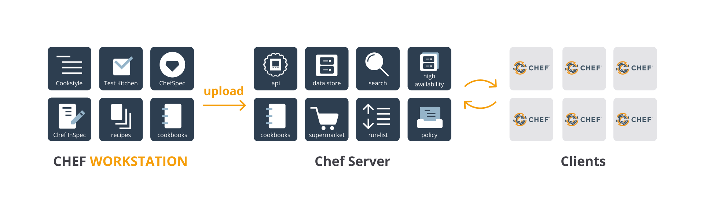
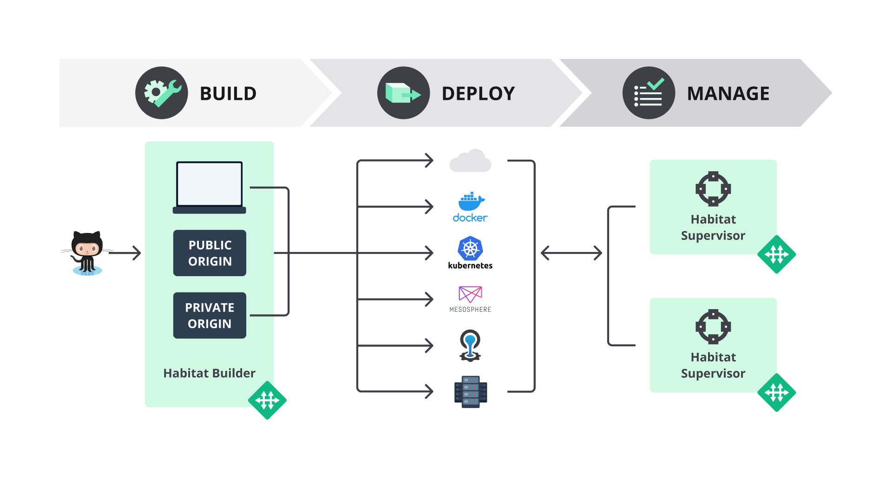
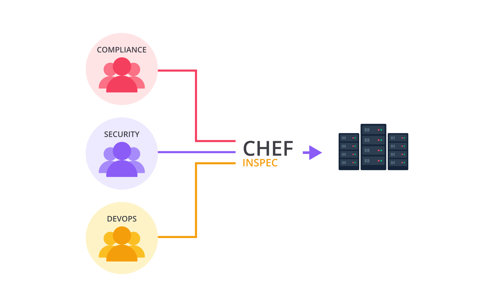
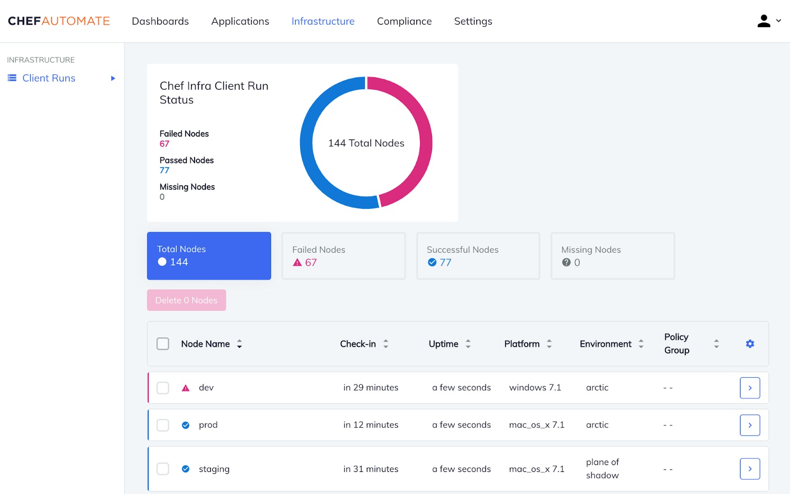
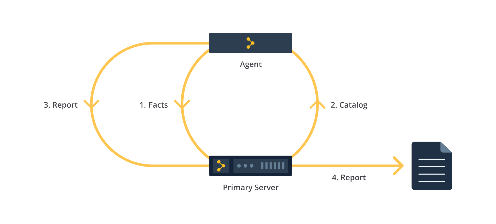
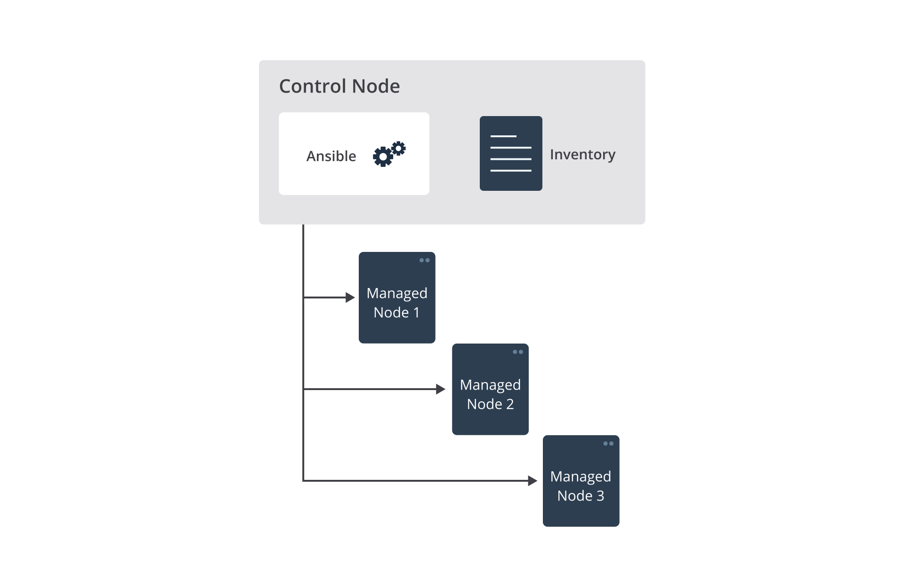

## Configuration Management
- Pada pembahasan modul sebelumnya, dijelaskan bahwa Infrastructure as Code memiliki banyak tools, yang tergolong dalam beberapa kategori. Dua hal yang kita bahas di kelas ini antara lain: infrastructure provisioning dan configuration management.
- Perihal Infrastructure Provisioning, sudah kita bahas sebelumnya dengan membawa Terraform dan AWS CloudFormation. Kali ini, kita akan mengangkat kategori kedua, yakni configuration management.
- Configuration management merupakan proses untuk memelihara sistem (perangkat lunak dan perangkat keras) agar konsisten dan dalam desired state (kondisi/keadaan yang diinginkan). Apa sih sebenarnya yang dimaksud desired state itu?
- Begini. Saat mengelola sistem IT, pastinya kita akan menentukan status/kondisi/konfigurasi yang diinginkan. Sebagai contoh, ketika membuat server, kita ingin ia memiliki nama tertentu, membuka firewall port tertentu, berada di jaringan tertentu, memiliki spesifikasi perangkat tertentu, dsb. 

- Nah, configuration management hadir menjadi solusi dari permasalahan tersebut. Ini adalah cara untuk memastikan bahwa sistem bekerja seperti yang diharapkan, seiring dengan perubahan yang kita lakukan terhadap infrastruktur dari waktu ke waktu. 

## Chef
- Chef merupakan perusahaan yang bergerak di bidang automasi/otomatisasi.

### Chef Infra
- Chef Infra adalah platform automasi canggih yang mengubah infrastruktur menjadi kode.
- Baik Anda beroperasi di cloud, lokal, atau keduanya, Chef Infra mengotomatiskan cara infrastruktur dikonfigurasi, di-deploy, dan dikelola.
  
- Cara kerjanya sederhana, Anda hanya perlu menggunakan Chef Workstation (lokasi di mana pengguna berinteraksi dengan Chef yang berjalan pada komputer yang Anda pakai sehari-hari)
  - untuk menulis kode, kemudian mengunggahnya ke Chef Server (bertindak sebagai pusat untuk data konfigurasi). Setelah itu, Anda bisa mengonfigurasi node (client) dengan Chef Clients.

### Chef Habitat
- Chef Habitat menawarkan pendekatan baru untuk deploy aplikasi yang disebut dengan application automation (otomatisasi aplikasi).
- Application deployment berarti bahwa sistem automasi dikemas bersama dengan aplikasi, tak peduli di mana pun aplikasi itu akan di-deploy.
  

### Chef InSpec
- Chef InSpec merupakan testing framework open source untuk menentukan persyaratan compliance (kepatuhan/ketentuan), security (keamanan), dan policy (kebijakan).
  
- Dengan mendefinisikan compliance sebagai kode, Anda dapat mengintegrasikannya ke dalam alur deployment. 
  - Dengan demikian, compliance terhadap suatu security policies (kebijakan keamanan) pada aplikasi Anda sudah teruji secara otomatis.
- Kode Chef InSpec dapat berjalan di berbagai platform. Anda dapat menjalankan serangkaian pengujian yang sama secara lokal, dengan perintah jarak jauh menggunakan SSH atau WinRM, atau dengan mekanisme eksternal seperti Docker API.

### Chef Automate
- Chef Automate menyediakan rangkaian lengkap kemampuan terkait visibility (visibilitas) dan compliance (kepatuhan/ketentuan) untuk node/client.
- Chef Automate terintegrasi dengan produk open-source seperti Chef Infra Client, Chef InSpec, dan Chef Habitat.
- Chef Automate memberi Anda compliance dan security yang berkelanjutan secara lengkap, serta visibilitas ke dalam aplikasi dan infrastruktur Anda.
  - Tools ini menghadirkan data warehouse (gudang data) yang dapat menerima input dari Chef Habitat, Chef Automate workflow dan compliance, serta Chef Server.

## Puppet
- Puppet adalah tools yang membantu Anda untuk mengelola dan mengotomatiskan konfigurasi server.
- Saat menggunakan Puppet, Anda menentukan desired state (kondisi yang diinginkan) dalam infrastruktur yang Anda kelola.
  - Hal ini dilakukan dengan menulis kode dalam Puppet Domain-Specific Language (DSL) alias Puppet code yang dapat Anda gunakan dengan beragam perangkat dan sistem operasi. 
- Puppet code bersifat deklaratif (sudah kita bahas pada materi Infrastructure as Code). 
  - Itu artinya, Anda hanya perlu mendefinisikan kondisi yang diinginkan dari sistem Anda, bukan langkah-langkah spesifik yang diperlukan untuk mencapainya.
- setelah itu, Puppet kemudian mengotomatiskan proses agar sistem dapat mencapai kondisi yang didefinisikan tersebut dan menjaganya untuk tetap konsisten. 

## Ansible 
- Ansible merupakan tools untuk IT automation yang dapat mengonfigurasi sistem, men-deploy perangkat lunak, hingga mengatur tugas-tugas IT yang lebih canggih seperti continuous deployment atau rolling update (pembaruan bergulir) tanpa henti. 
- Tujuan utama Ansible adalah kesederhanaan dan kemudahan menggunakan bahasa yang mudah dimengerti oleh manusia tanpa mengurangi fokus pada keamanan dan keandalan. 
- Ansible mengelola mesin dengan cara agent-less (tanpa agen).
- Itu artinya, kita tidak perlu menginstal software apa pun pada node/agent/client yang dikelolanya.
- Dengan demikian, praktik ini lebih andal dan hemat sumber daya. Selain itu, Ansible lebih aman karena menggunakan OpenSSH (tools konektivitas 
  - untuk login jarak jauh–remote login–dengan protokol SSH atau Secure Shell). 

tiga componen ansible

### Control node
- Sebuah sistem tempat di mana Ansible diinstal. Di sini, Anda bisa menjalankan berbagai Ansible commands seperti ansible atau ansible-inventory.

### Managed node
- Ini adalah sistem jarak jauh (remote system), atau host yang dikontrol oleh Ansible.

### Inventory
- Daftar managed node yang dikontrol oleh Ansible. Anda perlu membuat sebuah Inventory pada Control Node untuk mendeskripsikan host deployment (managed node) yang akan dikontrol oleh Ansible.

