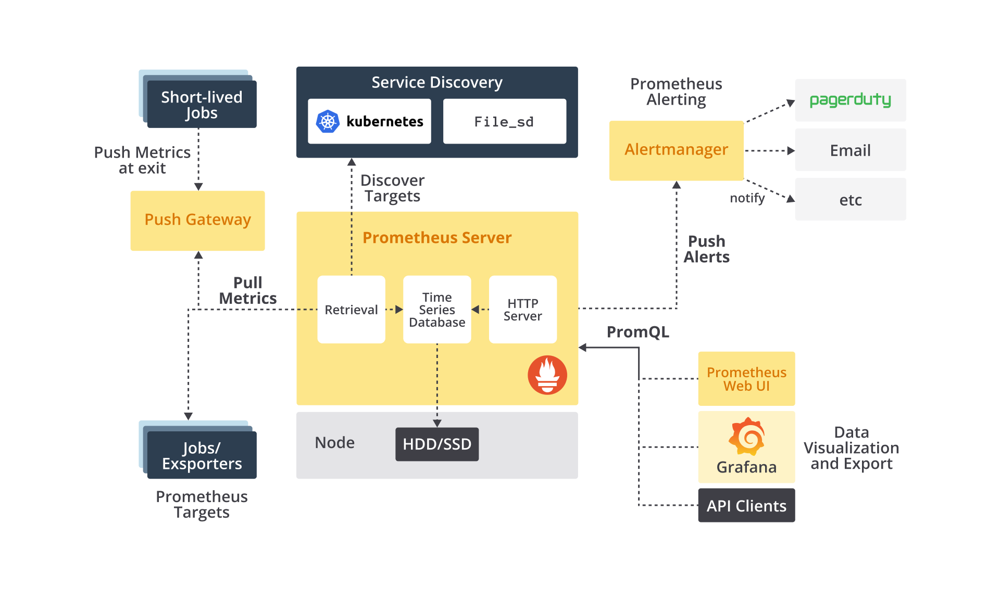
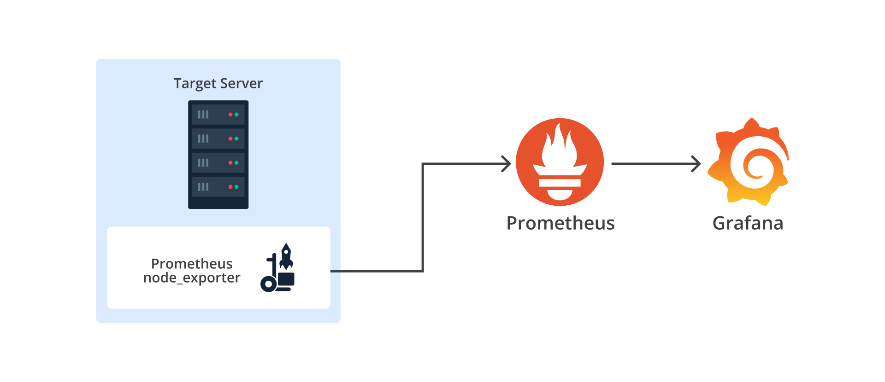
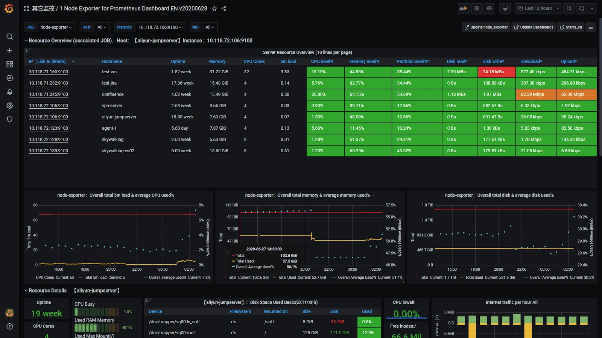
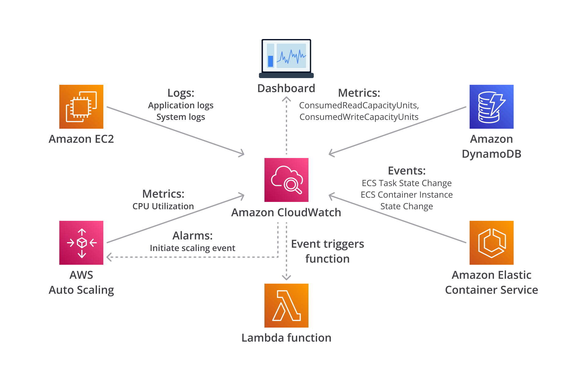
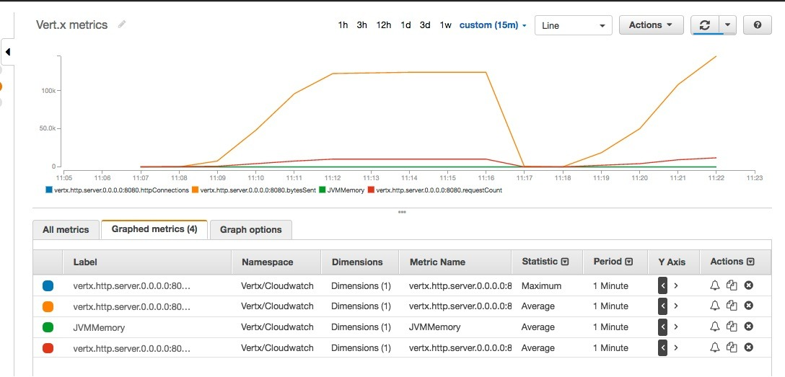
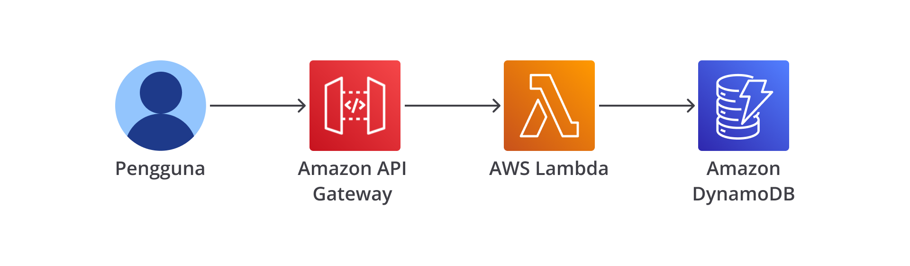
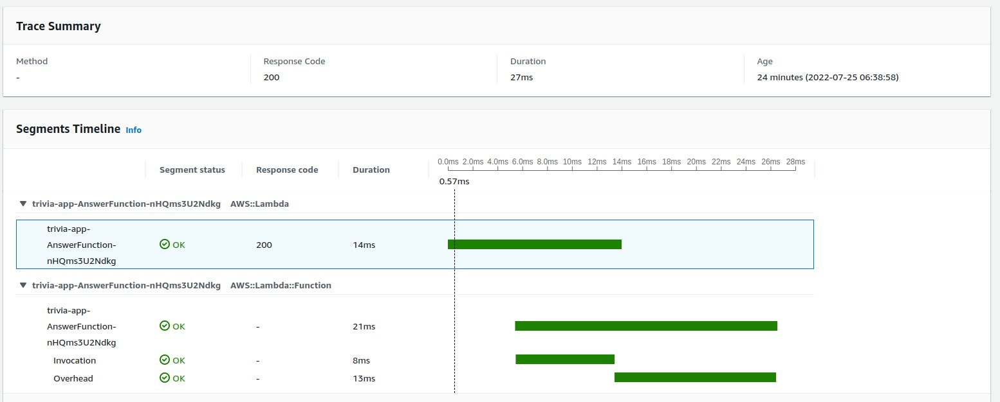
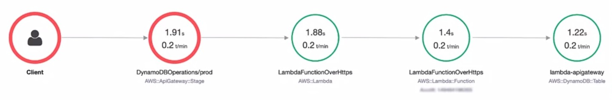

# Pengenalan Monitoring
- Monitoring adalah proses untuk mengumpulkan, menggabungkan, dan menganalisis metrics, guna meningkatkan awareness terhadap sistem Anda.
- Tujuan utama dari monitoring adalah tercapainya high availability (ketersediaan sistem yang tinggi) dengan meminimalkan metric kunci yang diukur dalam satuan waktu.
  - Time to detect (TTD): Ketika isu performa atau yang lainnya timbul, diagnostik data yang kaya mengenai isu tersebut dikirim ke tim developer melalui monitoring otomatis.
  - Time to mitigate (TTM): Tim DevOps bertindak berdasarkan informasi untuk memitigasi isu secepat mungkin sehingga pengguna tidak lagi terdampak. 
  - Time to remediate (TTR): Waktu penyelesaian (resolution) isu yang terukur. Setelah mitigasi, tim bekerja untuk mengatasi isu hingga akar masalahnya sehingga tidak terulang kembali.
- Metric dan Perannya

## Monitoring dalam DevOps
- Oke, kembali ke monitoring. Sebab DevOps merupakan siklus yang berkelanjutan, itu membuat monitoring menjadi tidak terbatas hanya pada aplikasi yang sudah di-deploy ke production saja. 
- Anda dapat menerapkan monitoring di seluruh siklus DevOps agar dapat memperbaiki dan meningkatkan proses development, building, testing, dan deployment.

# Environment Monitoring
- Mari kita mulai dengan aspek monitoring yang pertama, yakni environment (perangkat keras server dan segala konfigurasinya). 
- Environment merupakan komponen paling utama saat Anda membangun aplikasi. Tanpanya, aplikasi Anda dipastikan takkan berjalan dan bisnis pun tak bisa beroperasi. Maka dari itu, sungguh krusial untuk memonitor environment secara komprehensif. 
- Dengan memonitor environment, Anda akan mendapatkan gambaran tentang faktor-faktor yang memengaruhi performa server dalam melakukan pekerjaan. Jika server bekerja dengan baik, itu dapat memengaruhi aplikasi agar berkinerja dengan baik pula.
- Segala macam metrics yang terlibat dalam mengevaluasi ketersediaan atau performa server harus dikerahkan, terutama terkait penggunaan atau kinerja dari sistem operasi dan perangkat keras seperti
  - konsumsi memori,
  - penggunaan CPU,
  - ruang pada disk,
  - jumlah I/O (input/output) untuk proses read pada disk,
  - jumlah I/O (input/output) untuk proses write pada disk,
  - dan hal-hal operasional lainnya yang mampu mendeteksi hambatan pada infrastruktur server.

## Prometheus
- Salah satu tools yang open source dan populer untuk monitoring adalah Prometheus. Prometheus adalah tools monitoring (pemantauan) dan alerting (peringatan) yang pada awalnya dibuat di SoundCloud. 
- Prometheus mengumpulkan dan menyimpan metrik dalam bentuk data time series (deret waktu), yang berarti informasi metrik disimpan dari waktu ke waktu dengan pemberian timestamp (stempel waktu) dan (opsional) label. 
- Prometheus menawarkan banyak fitur menarik, di antaranya:
  - Model data multidimensi dengan data time series yang diidentifikasi melalui nama metric dan key-value pair (pasangan kunci-nilai).
  - PromQL, sebuah bahasa query yang fleksibel untuk mengolah data.
  - Tidak bergantung pada distributed storage (penyimpanan yang terdistribusi); single server node (instance server tunggal) bersifat otonom.
  - Pengumpulan data time series dilakukan menggunakan pull model (Prometheus mengambil data dari endpoint yang Anda tentukan) melalui HTTP.
  - Memungkinkan short-lived jobs (misal, batch jobs) untuk push (mengirim) data time series ke perantara, yang kemudian diambil oleh Prometheus menggunakan Pushgateway (nanti dibahas).
  - Target (server atau aplikasi tujuan) dapat ditemukan melalui service discovery atau static configuration (konfigurasi statis).
  - Dukungan beberapa mode grafik dan dashboard.
  - Visualisasi data melalui tools seperti Grafana (kita bahas soal ini nanti).
- Oke, kita sudah mengetahui apa itu Prometheus dan beberapa fiturnya. Sekarang, mari kita telisik lebih dalam. Saat bekerja dengan Prometheus, Anda harus mengetahui bahwa ia memiliki ekosistem yang terdiri dari beberapa komponen (sebagian opsional), yaitu
  - Prometheus server, yakni komponen utama yang scrape (mengeruk/mengambil) dan store (menyimpan) data time series.
  - Client libraries, untuk memperalati kode aplikasi, biasanya bertujuan membuat custom metrics yang spesifik terkait aplikasi.
  - Push gateway, yang memungkinkan short-lived jobs (misal, batch jobs) untuk mengekspos metrics ke Prometheus. Jadi, karena batch jobs biasanya berumur pendek (misal, sering terhenti atau terhapus), Prometheus tak memiliki cukup waktu untuk mengambil data darinya. Dengan begitu, batch jobs dapat push (mengirim) metrics ke Pushgateway, lalu Pushgateway kemudian mengekspos metrics tersebut ke Prometheus. Itulah mengapa Pushgateway terkadang disebut sebagai metrics cache, bukan tools untuk mengubah Prometheus menjadi berbasis push model (yakni ketika service mengirim metrics langsung ke Prometheus).
  - Exporter, agar memungkinkan sistem third-party mengekspor metrics mereka menjadi Prometheus metrics (kita bahas lebih dalam nanti). 
  - AlertManager, bertugas untuk menangani alerts (peringatan).
  - Serta berbagai tools pendukung lainnya.



- Secara garis besar, diagram di atas menjelaskan bahwa Prometheus server scrape (mengambil) metrics dari targets (server atau aplikasi tujuan), baik secara langsung atau melalui perantara push gateway (untuk short-lived jobs seperti batch jobs).
-  Prometheus server menyimpan semua metrics secara lokal dan mengolah data tersebut untuk membuat data time series baru atau menjalankan alert (peringatan). Anda bisa menggunakan Prometheus web UI, Grafana, atau API client lainnya untuk visualisasi data.
-  bagaimana jika kita ingin memonitor environment atau server? Tenang saja, untuk itulah Prometheus memiliki komponen exporter–sudah kita bahas sebelumnya dan akan diperdalam di sini. 
- Exporter perlu digunakan jika sistem yang Anda miliki tidak mendukung Prometheus metrics secara langsung. Prometheus memiliki segudang exporter, baik yang official (dikelola oleh tim Prometheus) maupun externally-contributed (dikelola oleh pihak luar), tersedia mulai dari soal infrastruktur, database, web server, CI tools (termasuk Jenkins), messaging system, API, storage, logging, sistem monitoring lain, dan sebagainya. Lebih lengkapnya bisa Anda lihat di halaman Prometheus documentation.

- Oke, sebenarnya ada banyak opsi. Namun, salah satu yang paling populer adalah Node/system metrics exporter alias node_exporter. Exporter ini memproduksi metrics terkait infrastruktur, termasuk
  - penggunaan CPU,
  - konsumsi memory,
  - ruang disk saat ini,
  - jumlah I/O (input/output) untuk proses read pada disk,
  - waktu aktif server,
  - hingga beban rata-rata server.

- Node exporter dapat menjadi solusi terbaik jika Anda ingin mengumpulkan semua metrics dan statistik terkait Linux server untuk pemantauan. Bahkan, Anda juga dapat menggunakan Node exporter dengan bantuan Grafana untuk memvisualisasikan metrics.





## Amazon CloudWatch
- Bisa dilihat bahwa Prometheus (dengan bantuan Node exporter) dapat memungkinkan Anda untuk memantau environment atau server. Lantas, bagaimana bila kita ingin memantau environment yang ada di AWS? 
- Sebenarnya, Prometheus pun bisa kita gunakan untuk memantau environment di AWS karena terdapat beberapa AWS exporter yang tersedia seperti AWS ECS exporter, AWS Health exporter, AWS SQS exporter, AWS CloudWatch exporter, atau mungkin menggunakan Node exporter untuk mengekspos metrics yang dimiliki oleh Linux instance.
- Namun, bagaimana jika kita tak mau berurusan dengan Prometheus dan ingin menggunakan solusi dari AWS? Oke, tak masalah. Terdapat layanan AWS yang memang berfungsi untuk memantau cloud environment secara komprehensif, salah satunya adalah Amazon CloudWatch.
- Amazon CloudWatch adalah serangkaian tools untuk memantau AWS resources dan aplikasi. Layanan ini memberikan kita kemampuan untuk melihat masalah yang terjadi pada infrastruktur dan bahkan memberi tahu ketika ada sesuatu yang tidak beres. 



### CloudWatch metrics
- CloudWatch metrics merupakan data berkaitan dengan sistem yang dikumpulkan dari waktu ke waktu. 
- Kerennya, sebagian besar AWS resources mengirim metrics ke CloudWatch secara otomatis seperti EC2 instance, Amazon SQS, Elastic Load Balancing, Amazon RDS, Amazon API Gateway, AWS Lambda, AWS CodeBuild, dan banyak lagi.

### CloudWatch alarms
- CloudWatch alarms Dengan CloudWatch alarms, Anda dapat menentukan alarm atau peringatan yang kemudian memicu tindakan lain jika ada sesuatu yang tidak beres pada environment.
- Alarm ini akan aktif ketika nilai dari metrics mencapai ambang batas (threshold) tertentu dalam suatu periode waktu.
- Pertanyaannya, threshold semacam apa yang harus kita pasang untuk memicu alarm? Ada dua tipe threshold yang harus Anda tahu, yakni static dan anomaly detection. Bila memilih static, Anda dapat menentukan kondisi kapan alarm akan terpicu. Contohnya, alarm akan aktif jika suatu metrics (misal, penggunaan CPU) lebih besar atau sama dengan 80%.
- Opsi lain, Anda bisa membiarkan mesin untuk memutuskan kondisi threshold dengan bantuan fitur anomaly detection. Dengan fitur ini, CloudWatch akan memeriksa metrics Anda dan menentukan threshold terbaik.

### CloudWatch logs
- Komponen lain yang tak kalah pentingnya adalah CloudWatch logs. Ini memungkinkan Anda untuk memusatkan berkas log dari semua sistem, aplikasi, dan apa pun yang Anda inginkan.
- Jika Anda menjalankan aplikasi pada EC2 instance, bisa pula menggunakan CloudWatch agent untuk push (mengirim) berkas log ke CloudWatch. Namun, bila Anda menggunakan AWS Lambda, Amazon API Gateway, AWS CodeBuild, atau AWS managed service lainnya, itu sudah terintegrasi dan berkas log otomatis terkirim ke CloudWatch.

# Network Monitoring
- Selain server, aspek lain yang perlu dimonitor adalah network alias jaringan karena ia berperan penting dalam mendukung keberlangsungan server dan aplikasi. 
- Jaringan adalah tulang punggung komunikasi, baik antar sistem komputer dan aplikasi. Bagaimana tidak? Ketika jaringan mati atau mengalami gangguan, dampaknya sangat terasa dan dapat mengakibatkan kendala layanan yang signifikan, bahkan dapat berimbas hingga kehilangan pendapatan karena operasional bisnis terhenti.
- Beberapa contoh metrics yang perlu dimonitor pada aspek jaringan antara lain:
  - konektivitas,
  - error rates (banyaknya error),
  - packet loss (banyaknya network packet atau paket jaringan yang hilang),
  - latensi, 
  - penggunaan bandwidth, dan
  - packet per detik.
- Network monitoring (pemantauan jaringan) dapat dilakukan salah satunya melalui logging (proses/aktivitas mengamati log). Logging amat berguna ketika kita ingin mengumpulkan informasi yang berkenaan dengan request yang masuk ke sistem.

## Prometheus SNMP Exporter dan NGINX VTS Exporter
- Kita sudah tahu sebelumnya bahwa Prometheus memiliki banyak dukungan exporter, baik untuk database, CI tools, API, HTTP, dan masih banyak lainnya. Syukurnya, Prometheus exporter juga mendukung dalam hal network monitoring.
- Salah satu metode yang paling umum digunakan untuk network monitoring adalah melalui penggunaan Simple Network Management Protocol atau SNMP.
- Ia adalah sebuah protokol yang digunakan untuk mengumpulkan dan mengelompokkan informasi tentang perangkat pada jaringan. SNMP marak digunakan dalam dunia IT untuk network monitoring (pemantauan jaringan). 
- Nah, pada Prometheus, kita bisa memanfaatkan exporter bernama snmp_exporter. 
  - Ini adalah exporter yang disarankan untuk mengekspos data SNMP dalam format yang dapat digunakan oleh Prometheus. Lebih lengkap soal snmp_exporter dapat Anda temukan di halaman berikut.
- Selain menggunakan SNMP dengan snmp_exporter, Anda juga bisa melakukan network monitoring menggunakan exporter pada kategori HTTP, salah satunya adalah NGINX VTS exporter. 

## VPC Flow Logs
- VPC Flow Logs berfungsi untuk menangkap informasi tentang IP traffic yang masuk ke VPC, subnet, dan segala macam network interface. 
- Bila Anda belum terlalu akrab dengan konsep network interface, ia adalah network card atau network adapter yang memungkinkan komputer untuk terhubung dengan jaringan.
- Network interface ini menangani hal-hal jaringan layaknya IP address, MAC address, dan banyak lagi. Inti dari poin pembicaraan di sini adalah bahwa EC2 instance atau AWS resources yang berjalan di atas EC2 instance (seperti load balancer atau Amazon RDS database) menggunakan network interface.
- Cara kerja dari VPC Flow Logs ini simpel.
  - Anda hanya perlu menentukan AWS resources yang diinginkan, entah itu VPC, subnet, atau EC2 instance;
  - Pilih jenis traffic yang ingin dikumpulkan, apakah hanya traffic yang diterima, ditolak, atau semuanya;
  - Tentukan tujuan traffic tersebut akan dikirim. Anda dapat mengirimnya ke CloudWatch Logs atau Amazon S3 bucket.
  - Kemudian, VPC Flow Logs memerlukan waktu beberapa menit untuk mulai mengumpulkan informasi traffic. 
  - Setelah itu, Anda akan bisa mendapatkan banyak informasi seperti jumlah network packet dan ukuran byte yang masuk disertai timestamp (stempel waktu) tentang kapan request itu dimulai dan berakhir. Bahkan, Anda juga bisa mengetahui berbagai informasi detail lainnya, seperti tipe dari traffic tersebut, entah itu IPv4 atau IPv6, adanya TCP flag, dan lain-lain. 
- Nah, itu dia VPC Flow Logs. Manfaatkan fitur ini dengan baik untuk memantau network traffic di AWS, misalnya dengan menelusuri logs guna mencari apakah terdapat traffic masuk yang mencurigakan atau tidak.

# Application Monitoring
- Aspek monitoring lain yang perlu diketahui dan tak kalah penting adalah application atau aplikasi.
- Aspek aplikasi tetap berkaitan dengan unit pemrosesan atau komponen server lainnya, tetapi biasanya lebih spesifik pada bagian yang mendukung aplikasi. 
- Berikut beberapa contoh metrics pada aspek aplikasi.
  - Tingkat kegagalan dan keberhasilan aplikasi.
  - Latensi terkait respons aplikasi.
  - Penggunaan resource (CPU, Memory, dsb) ketika menjalankan aplikasi. 
  - Jumlah pengguna yang mendaftar.
  - Total yang melihat halaman tertentu.
  - Letak query yang memperlambat respons aplikasi.
  - Kode yang tidak efisien dan perlu di-refactor.
  - Jumlah pengguna aktif per jam.
  - Total waktu yang dihabiskan setiap pengguna dalam menggunakan aplikasi.
- Indikator-indikator di atas dapat membantu para Developer dalam memecahkan masalah pada kode dan memvalidasi aplikasi agar berfungsi dengan benar dan efisien.
- Namun, sebab metrics tersebut sangat spesifik untuk aplikasi dan bisnis, metrics bawaan Prometheus dan CloudWatch tidak akan selengkap yang Anda inginkan. Bahkan, meski menggunakan Prometheus exporters, tetap saja terkadang masih belum cukup. Maka dari itu, diperlukan alternatif lain, yakni custom metrics yang akan kita pelajari sesaat lagi.

## Prometheus Client Libraries
- Jika menggunakan Prometheus, kita bisa memanfaatkan client libraries untuk instrumenting (memperalati) kode aplikasi. Prometheus client libraries mendukung beberapa bahasa pemrograman, misal Go, Java atau Scala, Python, Ruby, dan Rust. Di luar itu, terdapat juga banyak third-party yang mendukung beberapa bahasa pemrograman lain, contohnya: C, C++, Dart, PHP, R, Perl, Node.js, .NET atau C#, dan masih banyak lagi.
- Dengan client libraries, ini memungkinkan Anda untuk menentukan dan mengekspos internal metrics atau custom metrics melalui HTTP endpoint pada instance.
- Nantinya, client libraries akan mengirimkan status terkini dari setiap metrics ke HTTP endpoint tersebut dan Prometheus akan mengorek metrics dari sana. 
- Prometheus client libraries menyediakan empat tipe metrik: counter, gauge, histogram, dan summary.

### Counter
- Counter merupakan metrik kumulatif/inkremental yang merepresentasikan satu penghitung (counter) yang meningkat/bertambah (increment). Metrik jenis ini nilainya hanya dapat meningkat/bertambah atau direset ke nol saat restart. Sebagai contoh, Anda dapat menggunakan tipe counter untuk merepresentasikan total request (permintaan) yang dilayani aplikasi, tugas yang diselesaikan, atau jumlah error.
- Jangan gunakan tipe metrik ini untuk mengekspos nilai yang dapat menurun (decrease) seperti jumlah proses yang sedang berjalan, misalnya. Sebagai gantinya, gunakanlah gauge.

### Gauge
- Gauge adalah tipe metrik yang merepresentasikan nilai numerik tunggal yang dapat bertambah (increase) dan berkurang (decrease) secara tak tentu. Tipe metrik ini biasanya digunakan untuk nilai-nilai seperti suhu, penggunaan memori saat ini, hingga total concurrent request (permintaan yang terjadi secara bersamaan).

### Histogram
- Histogram adalah tipe metrik yang dapat mengambil sampel pengamatan, biasanya hal-hal seperti request duration (durasi permintaan) atau response/payload size (ukuran muatan dari response–disebut juga hasil request), dan menghitungnya dalam buckets (penyebutan untuk tempat menyimpan data histogram). Selain itu, tipe metrik histogram juga akan memberikan jumlah/total dari semua nilai yang diamati.

### Summary
- Mirip dengan histogram, summary juga mengambil sampel pengamatan, biasanya hal-hal semacam request duration dan payload size. Selain memberikan jumlah pengamatan dan total semua nilai yang diamati, tipe summary juga menghitung quantile melalui time window (jendela waktu).

## CloudWatch Custom Metrics
- Pada materi Environment Monitoring, kita sudah menilik kemampuan Amazon CloudWatch memonitor environment atau server yang berjalan di AWS, entah itu terkait penggunaan CPU, network packet yang masuk dan keluar, serta lainnya. Itu bagus untuk server, tetapi tidak tepat untuk metrik yang kita butuhkan, yakni berkenaan dengan aplikasi.
- CloudWatch metrik secara bawaan takkan bisa menghitung jumlah pengguna yang mendaftar pada aplikasi, total yang melihat halaman tertentu, atau jumlah pengguna aktif per jam.
- Lantas, bagaimana solusinya? Anda memerlukan CloudWatch custom metrics, yakni metrics yang spesifik untuk kebutuhan aplikasi Anda. Mirip seperti Prometheus client libraries, Anda bisa membuat CloudWatch custom metrics dengan memasukkannya langsung dalam kode aplikasi. Jadi, bila Anda menjalankan aplikasi di EC2, ECS, atau bahkan Lambda; Anda dapat menggunakan API call bernama put_metrics_data untuk menulis custom metrics yang diinginkan. 

Misalnya, berikut adalah custom metrics yang mengumpulkan data tentang jumlah pendaftaran pengguna aplikasi. \
```bash
from argparse import Namespace
import boto3
cloudwatch = boto3.client(‘cloudwatch’)
response = cloudwatch.put_metric_data(
    MetricData = [
        {
            'MetricName': 'UserSignUps',
            'Dimension': [
                {
                    'Name': 'SIGNUP_SERVICE',
                    'Value': 'CoolWebApp'
                },
                {
                    'Name': 'SERVICE_VERSION',
                    'Value': '1.0'
                },
            ],
            'Unit': 'Count',
            'Value': 1
        },
    ],
    Namespace = 'SignUps'
)
```

- Setelah berhasil membuat custom metric, Anda dapat memvisualkan semua metric tersebut pada CloudWatch console dengan memanfaatkan berbagai grafik seperti Line, Stacked Area, Number, Bar, bahkan Pie. 



## AWS X-Ray
- Ingat kembali tentang Trivia App. Arsitektur backend di belakangnya secara garis besar adalah seperti ini.



- Ketika pengguna melakukan request pada frontend, request tersebut kemudian akan datang melalui Amazon API Gateway, kemudian diproses oleh AWS Lambda, dan mengambil data di Amazon DynamoDB. 
- Dengan AWS X-Ray, kita bisa melihat proses perjalanan request dari pengguna pada beberapa tahapan tersebut untuk mengidentifikasi letak bottleneck (kemacetan/hambatan), lonjakan latensi, dan masalah lain yang mungkin perlu dipecahkan untuk meningkatkan kinerja aplikasi. 
- Jika Anda ingin mengaktifkan AWS X-Ray untuk AWS Lambda dan Amazon API Gateway, yang perlu Anda lakukan hanyalah mencentang opsi box di console. Akan tetapi, bila ingin menggunakan AWS X-Ray untuk Amazon EC2, Anda harus menginstal sebuah daemon pada EC2 instance.
- Setelah berhasil mengaktifkan AWS X-Ray, Anda dapat mulai mengumpulkan data dari aplikasi untuk menghasilkan segments, yakni informasi yang memberikan detail tentang request dan berbagai pekerjaan yang dilakukan. 



- Trace kemudian diproses untuk menghasilkan sebuah service map, yang memungkinkan kita untuk memvisualkan setiap AWS resource yang mengirimkan data ke AWS X-Ray dalam bentuk grafik. \


- Dengan begitu, Anda bisa melihat dengan jelas alur request dari pengguna diproses melalui Amazon API Gateway, AWS Lambda, dan Amazon DynamoDB disertai informasi mengenai latensi dan durasi request. 
- Makin kompleks arsitektur aplikasi yang Anda miliki, AWS X-Ray makin dapat membantu Anda dalam hal tracing (melacak) perjalanan request untuk menemukan bottleneck. 