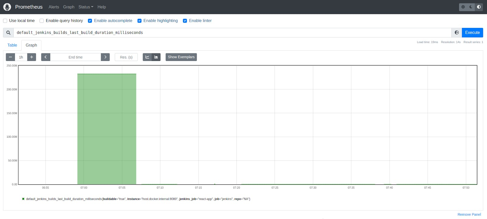

# Latihan Monitor Jenkins dengan Prometheus dan Grafana
- Prometheus sudah kita kupas mendalam sebelumnya. Namun, tampaknya Grafana belum kita bahas, ya? Oke, singkatnya, Grafana adalah tools untuk visualisasi data yang open source dan gratis. Tools ini menyediakan berbagai dashboard, bagan, dan grafik untuk berbagai data source (sumber data).
- Grafana memungkinkan kita untuk melakukan query, memvisualisasikan, dan menjelajahi berbagai metrics untuk data source yang dimiliki. Kita dapat membuat dashboard yang dinamis sendiri atau menggunakan template untuk monitoring dan visualisasi sistem. Jika ingin mengenal lebih dalam, silakan kunjungi situs resmi Grafana.
- Oke, kembali ke topik latihan. Intinya, kali ini kita akan mengonfigurasi Prometheus untuk memonitor Jenkins server dan menggunakan Grafana untuk membuat dashboard yang menarik serta berisi banyak informasi dan statistik mengenai Jenkins server.


- Sama seperti Jenkins, kita juga akan menjalankan Prometheus dan Grafana menggunakan Docker container. 
- Berikut adalah tahapan proses detailnya.
  - Pertama, Anda akan menginstal dan mengonfigurasi Prometheus plugin pada Jenkins.
  - Menjalankan Docker container untuk Prometheus dan Grafana serta memastikan keduanya dapat diakses.
  - Mengonfigurasi Prometheus agar ia bisa mengambil metrics dari Jenkins.
  - Menggunakan Grafana untuk memvisualisasikan metrics dari Prometheus.

## Menginstal Prometheus Plugin di Jenkins
- Buka halaman Jenkins melalui web browser Anda (misal, http://localhost:8080/) dan login bila diperlukan.
  - Catatan: Jika tidak terbuka, kemungkinan Jenkins container tidak berjalan. Anda bisa jalankan dengan perintah “docker start <nama_container>” atau melalui Docker Desktop.
- Setibanya di Jenkins dashboard, buka menu Manage Jenkins, klik Manage Plugins.
- Pada halaman Plugin Manager, buka tab Available dan cari “Prometheus metrics”.
- Centang Prometheus metrics dan klik tombol Download now and install after restart. Tunggu hingga proses penginstalan selesai.
- Setelah muncul teks “Downloaded Successfully. Will be activated during the next boot”, centang checkbox yang bertuliskan Restart Jenkins when installation is complete and no jobs are running. Kemudian, itu akan memulai ulang Jenkins server.
- Login dengan kredensial Jenkins dan navigasikan ke halaman Manage Jenkins -> Configure System. 
- Scroll hingga ke bagian Prometheus. Ingat kembali bahwa Prometheus bekerja dengan cara mengorek/mengambil data dari endpoint yang kita tentukan. Nah, dalam hal ini, secara default Prometheus akan mengambil Jenkins metrics dari endpoint /prometheus. Anda bisa menggantinya dengan mengubah bagian Path. Namun, untuk saat ini mari kita biarkan sebagaimana adanya.
  
- Sekarang, perhatikan bagian Collecting metrics period in seconds. Ini menjelaskan tentang seberapa sering metrics akan diekspos dalam hitungan detik. Default-nya ialah 120 detik, tetapi mari kita ubah menjadi 5 detik agar pengumpulan metrics menjadi lebih cepat. Silakan ubah nilainya menjadi 5.
- Perhatikan beberapa checkbox di bawahnya seperti Count duration of successful builds, Count duration of unstable builds, dan lain sebagianya. Mereka adalah beberapa metrics yang juga akan di-ekspos oleh Jenkins server.
- Setelah itu, silakan simpan dengan klik tombol Save. Agar perubahan yang barusan dilakukan dapat diterapkan secara efektif, kita perlu melakukan restart pada Jenkins. Silakan tambahkan akhiran /restart pada URL Jenkins (misal, http://localhost:8080/restart) dan tekan Enter. Lalu, klik Yes.
- Jenkins pun akan restart secara otomatis. Silakan login kembali hingga Anda kembali ke Jenkins dashboard.
- Sekarang, coba tambahkan akhiran /prometheus pada URL Jenkins, misalnya http://localhost:8080/prometheus. Anda akan melihat barisan metrics yang begitu banyak. Perhatikan, saat Anda membuka /prometheus, maka itu akan mengarahkan Anda ke /prometheus/. Ini penting saat kita mengonfigurasi Prometheus nanti.
  
- Nantinya, Prometheus akan mengambil data Jenkins metrics dari endpoint ini. Oh ya, karena kita telah mengubah periode pengumpulan metrics menjadi 5 detik maka Jenkins server akan mengekspos metrics ke endpoint ini setiap 5 detik. Silakan refresh secara berkala, Anda akan melihat bahwa beberapa data akan berubah.
- Untuk kembali ke Jenkins dashboard, hapus lagi akhiran /prometheus/ pada address bar dan tekan Enter.

## Menjalankan Prometheus dan Grafana
- Buka Terminal atau CMD pada komputer Anda. 
- Ketikkan perintah berikut untuk menjalankan Docker container bernama prometheus secara detach (berjalan di background) pada port 9090 yang diambil dari image prom/prometheus di Docker Hub (karena kita tak memiliki image tersebut di local).
  ```bash
  docker run -d --name prometheus -p 9090:9090 prom/prometheus
  docker run -d --name prometheus -p 9090:9090 --add-host=host.docker.internal:host-gateway prom/prometheus
  ```
- Selanjutnya, ketikkan perintah berikut untuk menjalankan Docker container bernama grafana secara detach pada port 3030 yang diambil dari image grafana/grafana di Docker Hub (karena kita tak memiliki image tersebut di local).
  ```bash
  docker run -d --name grafana -p 3030:3030 -e "GF_SERVER_HTTP_PORT=3030" grafana/grafana
  ```
- Catatan: Grafana sebenarnya secara default bekerja pada port 3000 dan bisa berjalan hanya dengan perintah berikut: “docker run -d --name grafana -p 3000:3000 grafana/grafana”. Namun, sebab port 3000 sudah dipakai oleh docker:dind alias jenkins-docker container (untuk aplikasi React App), kita perlu menjalankan Grafana container melalui port yang berbeda, yakni port 3030, sekaligus menentukan environment variable untuk HTTP port pada Grafana server.
- Kini, Prometheus dan Grafana container sudah berjalan. Coba buktikan dengan mengakses URL http://localhost:9090/ (Prometheus) dan http://localhost:3030/ (Grafana) pada browser untuk memastikan keduanya dapat diakses.

## Mengonfigurasi Prometheus
- Meski Prometheus plugin sudah terinstal, endpoint metrics-nya sudah siap, dan URL-nya sudah bisa diakses; itu tidak serta-merta menjadikan Prometheus bisa langsung digunakan untuk memonitor Jenkins. 
- Ingat kembali bahwa secara default Prometheus hanya mengekspor metrics tentang dirinya sendiri. Agar bisa memonitor sistem di luar dirinya sendiri, kita harus menggunakan Prometheus exporter atau client libraries. Namun, hal itu bisa kita lewati sebab kita telah menggunakan Prometheus metrics plugin di Jenkins. Plugin ini bekerja dengan cara mengekspos metrics ke sebuah endpoint (yakni /prometheus secara default) saat nantinya Prometheus server bisa mengambil data dari endpoint tersebut.
- Nah, hal yang perlu kita lakukan sekarang adalah mengonfigurasi Prometheus server agar ia dapat mengetahui endpoint tersebut.
- Pertama, kita cek dulu metrics yang terdaftar pada Prometheus. Silakan buka http://localhost:9090/ pada web browser untuk membuka halaman Prometheus.
- Setelah terbuka, klik ikon Open metrics explorer tepat di sebelah tombol Execute.
  
- Lalu, akan muncul Metrics Explorer yang berisi berbagai metrics, yang sebagian besar masih seputar Prometheus metrics.
  
- Oke, sudah dipastikan bahwa Prometheus masih belum memiliki Jenkins metrics. Untuk itu, kita akan mengonfigurasinya dengan masuk ke Prometheus container. Jika menggunakan Docker Desktop, Anda bisa buka menu Containers, lalu klik ikon Open In Terminal untuk container bernama prometheus.
  
- Apabila tak memiliki Docker Desktop, Anda bisa menggunakan Terminal atau CMD untuk menjalankan perintah berikut agar bisa masuk ke Prometheus container.
  ```bash
  docker exec -it prometheus sh
  ```
- Setelah masuk ke container, buka berkas prometheus.yml dengan tools vi editor.
  ```bash
  vi /etc/prometheus/prometheus.yml
  ```
- Agar bisa mengedit, tekan Insert pada keyboard. Di baris paling akhir, tambahkan kode berikut untuk mendefinisikan job name (nama tugas), metrics path (endpoint lokasi Jenkins metrics), dan targets (URL Jenkins).
  ```bash
  - job_name: "jenkins"                                                        
    metrics_path: /prometheus/                                                
    static_configs:                                                            
       - targets: ["host.docker.internal:8080"]
  ```
- Dengan demikian, bagian scrape_configs pada berkas tersebut secara keseluruhan menjadi seperti ini.
scrape_configs:
  ```bash
   # The job name is added as a label `job=<job_name>` to any timeseries scraped
  - job_name: "prometheus"                                                      
                                                                               
    # metrics_path defaults to '/metrics'                                      
    # scheme defaults to 'http'.                                              
                                                                               
    static_configs:                                                            
      - targets: ["localhost:9090"]                                            
                                                                               
  - job_name: "jenkins"                                                        
    metrics_path: /prometheus/                                                
    static_configs:                                                            
       - targets: ["host.docker.internal:8080"]
  ```
- Catatan: Sebab Jenkins dan Prometheus berjalan pada container yang berbeda, kita tak bisa menggunakan URL localhost:8080. Dari perspektif Prometheus, cara mengakses Jenkins adalah dengan host.docker.internal. Ini adalah nama DNS khusus untuk terhubung ke internal IP address yang digunakan oleh host (komputer).
- Oke, silakan simpan berkas tersebut dengan menekan Esc pada keyboard, lalu ketik :wq, dan tekan Enter. Pada terminal, ketik exit untuk keluar dari sesi container.
- Setelah itu, silakan restart Prometheus container agar ia menerapkan konfigurasi terbaru. Jika menggunakan Docker Desktop, Anda tinggal klik ikon Restart pada container bernama prometheus.
- Alternatif lain, Anda bisa jalankan perintah berikut di Terminal atau CMD.
  ```bash
  docker restart prometheus
  ```
- Akses kembali halaman Prometheus dengan URL http://localhost:9090/. Buka menu Status -> Targets.
  
- Perhatikan bahwa target endpoint untuk Jenkins dalam keadaan UP.
  
- Kembali ke halaman utama dengan klik logo Prometheus di pojok kiri atas. Setelah terbuka, klik ikon Open metrics explorer tepat di sebelah tombol Execute.
  
- Lalu, akan muncul Metrics Explorer yang berisi berbagai metrics. Cermati, kini ia juga berisi berbagai metrics dari Jenkins, seperti default_jenkins_builds_health_score, default_jenkins_builds_last_build_duration_milliseconds, default_jenkins_builds_last_build_result, dan macam-macam lainnya.
  
- Mari kita coba salah satu metrics. Pertama-tama, coba jalankan Jenkins Pipeline untuk react-app. Masuk ke halaman Jenkins dashboard, klik Open Blue Ocean, pilih react-app, dan klik Run. 
- Klik baris paling atas dan tunggu proses eksekusi pipeline berlangsung. Saat muncul opsi, klik Proceed untuk mengakhiri aplikasi. Oke, sampai di sini berarti react-app sukses dieksekusi oleh Jenkins Pipeline. Perhatikan bagian atas halaman yang menyatakan bahwa proses eksekusi pipeline ini berlangsung selama 30s alias 30 detik (bisa berbeda-beda).
  
- Kembali ke halaman Prometheus, klik ikon Open metrics explorer, dan pilih default_jenkins_builds_last_build_duration_milliseconds untuk mengetahui durasi build terakhir di Jenkins dalam satuan milidetik. Kemudian, klik tombol Execute.
- Hasil query akan muncul di bagian bawah. Terlihat bahwa proses build terakhir ada pada react-app pipeline dengan durasi 30317 milidetik. Bila dikonversi, ini setara dengan 30 detik. Sesuai!
  

## Membuat Dashboard di Grafana
- Setelah menyelesaikan berbagai tahapan sebelumnya, kini Jenkins bisa mengekspos metrics dan Prometheus dapat mengambilnya untuk diolah. Lalu, apa selanjutnya? Sudah barang tentu adalah visualisasi metrics agar bisa kita pantau dengan mudah.
- Sebenarnya, di Prometheus sendiri pun kita bisa memvisualkan data metrics. Mau coba? Buka kembali halaman Prometheus yang menampilkan hasil query durasi build terakhir. Alih-alih memilih Table, coba buka tab Graph. Anda akan melihat hasil query dalam bentuk grafik, bisa berupa unstacked line graph atau stacked graph.
  
- Namun, kemampuan Prometheus untuk visualisasi data metrics sangat terbatas. Tak banyak opsi yang bisa kita pilih untuk membantu melakukan monitoring. Oleh karena itu, kita akan menggunakan Grafana, yang dapat memvisualkan data metrics dengan lengkap dan menarik.

- Pastikan Grafana container masih berjalan. Anda bisa melihatnya melalui Docker Desktop atau Terminal/CMD. Pada Docker Desktop, seharusnya Grafana container menampilkan status Running.
  - Sementara itu, pada Terminal, Anda dapat menjalankan perintah docker ps dan Grafana container seharusnya menampilkan status Up.
    
- Selanjutnya, buka halaman Grafana dengan mengunjungi http://localhost:3030/ pada web browser. Tampilan Grafana login seketika akan muncul.
- Silakan isi dengan nilai berikut.
  - Email or username: admin
  - Password: admin
- Pada halaman berikutnya, Anda diminta untuk mengisi password baru. Silakan isi sesuai keinginan Anda atau lewati dengan klik Skip.
- Kemudian, Anda akan diarahkan masuk ke halaman Home dari Grafana.
- Hal pertama yang perlu kita lakukan untuk membuat dashboard di Grafana adalah menambahkan data source terlebih dahulu. Dari halaman Home, klik Add your first data source.
- Setelah itu, pilih Prometheus. Sesuaikan dengan konfigurasi berikut.
  - Name: Prometheus - Jenkins
  - URL: http://host.docker.internal:9090
  - Lagi-lagi, karena Prometheus dan Grafana berjalan pada container yang berbeda, kita tak bisa menggunakan URL untuk Prometheus seperti localhost:9090. Dari perspektif Grafana, cara mengakses Prometheus adalah dengan host.docker.internal. 
  - Ini adalah nama DNS khusus untuk terhubung ke internal IP address yang digunakan oleh host komputer. Bila Anda terkendala di bagian ini, kemungkinan versi Docker yang digunakan berbeda. Silakan akses forum Stackoverflow berikut ini.
- Jika semua sudah benar, scroll ke bawah dan klik Save & test. Pastikan tertera Data source is working.
- Itu artinya kini kita sudah siap untuk membuat dashboard. Masuk ke halaman Home dengan klik logo Grafana di pojok kiri atas. Klik Create your first dashboard, lalu pilih Add a new panel. 
- Lantas akan terbuka halaman Edit Panel. Berkreasilah dalam membuat dashboard yang Anda inginkan.
- Kami coba pandu, ya. Pertama, sesuaikan opsi visualization yang terletak di kanan atas. Ubah dari yang semula Time series menjadi Stat. 
- Selanjutnya, silakan sesuaikan dengan konfigurasi berikut.
  - Title: Durasi Build Terakhir
  - Description: Ini adalah metric yang menampilkan durasi dari proses build terakhir pada react-app pipeline di Jenkins
  - Transparent background: Aktifkan
  - Graph mode: None
  - Metric: default_jenkins_builds_last_build_duration_milliseconds
- Simpan panel dengan klik tombol Save. Isikan Jenkins Dashboard pada Dashboard name, lalu klik Save.
- Kini Anda memiliki sebuah dashboard yang hanya berisi 1 buah panel. Itu artinya, dashboard Anda hanya menampilkan sebagian kecil informasi saja terkait Jenkins.
- Anda bisa menambahkan panel sebanyak apa pun yang Anda suka dengan klik ikon Add panel di bagian atas halaman.
- Jika Anda merasa menambahkan panel satu per satu adalah kegiatan yang melelahkan, Anda bisa mengimpor dashboard yang tersedia di situs resmi Grafana.
  - [https://grafana.com/grafana/dashboards/?plcmt=footer](https://grafana.com/grafana/dashboards/?plcmt=footer)
- Silakan kunjungi Grafana dashboard. Pada kotak pencarian, isikan Jenkins. Filter dengan memilih Prometheus pada Data Source. 
- Pilih Jenkins: Performance and Health Overview. Klik tombol Copy ID to Clipboard. Ini akan menyalin ID dari dashboard tersebut ke clipboard Anda.
- Kembali pada halaman Jenkins Dashboard yang tadi Anda buat di Grafana. Arahkan mouse Anda ke ikon Dashboards di sebelah kiri, lalu pilih Import (klik Save dashboard -> Save jika Anda telah membuat perubahan).
- Paste (CTRL+V) dashboard ID yang tadi disalin pada kolom Import via grafana.com dan klik Load yang ada di sebelahnya.
- Halaman berikutnya akan memuat segala informasi yang berkaitan dengan dashboard yang Anda ingin import seperti siapa yang menerbitkan, kapan terakhir diperbarui, dan lain sebagainya. Lanjutkan dengan memilih Prometheus - Jenkins untuk bagian Prometheus dan klik tombol Import.
- Voila! Berbagai kebutuhan mengenai Jenkins pun sudah otomatis tersedia. Keren, kan?
- Jangan lupa simpan dashboard dengan klik tombol Save dashboard -> Save.

- Yeaah! Anda berhasil mengonfigurasi Prometheus dan Grafana dalam rangka memonitor Jenkins. Sebuah pencapaian yang luar biasa! Kini, Anda bisa memantau bagaimana Jenkins server dalam bekerja seperti penggunaan CPU, konsumsi memori, durasi job (proses eksekusi pipeline), jumlah job yang gagal, dan sebagainya.
- Anda bisa melihat metrics ini dalam periode tertentu, misal 30 menit terakhir, 3 jam terakhir, seminggu terakhir, atau bahkan sebulan terakhir
- Agar lebih membantu dalam monitoring, Anda juga bisa menentukan seberapa sering Grafana harus me-refresh dashboard secara otomatis, apakah setiap 5 detik sekali, 5 menit sekali, 1 jam sekali, atau mungkin secara manual.
- Sebab, sebelumnya kita mengeset Jenkins server untuk mengekspos metrics-nya setiap 5 detik sekali, maka praktik terbaiknya adalah juga menyetel Grafana agar me-refresh dashboard setiap 5 detik sekali.