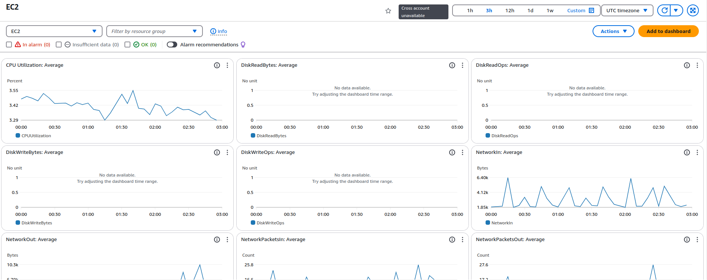
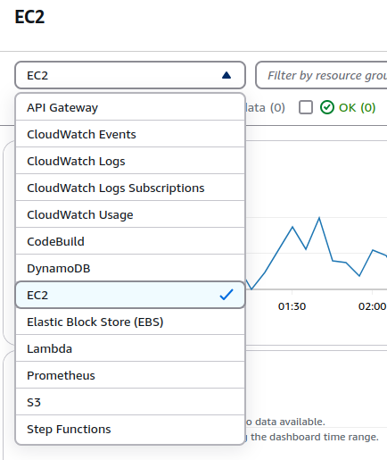
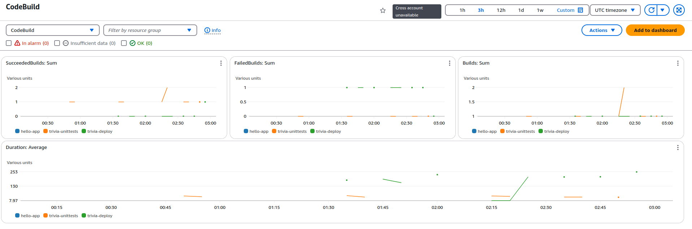

# Latihan Monitor Environment dengan AWS 
- Sebagaimana yang telah dipaparkan sebelumnya, salah satu solusinya adalah dengan menggunakan Amazon CloudWatch. Kita akan menggunakan CloudWatch untuk membuat dashboard dalam rangka memonitor EC2 instance, tempat DevOps Blog App bersarang.
- Berikut adalah tahapan proses untuk latihan ini.
  - Pertama, Anda akan mencoba membuat custom dashboard.
  - Setelah itu, melihat beberapa automatic dashboard yang telah dibuat oleh AWS untuk memudahkan pekerjaan.

## Membuat Custom Dashboard
- Buka halaman AWS CloudWatch Dashboards.
- Pada tab Custom dashboards, klik tombol Create dashboard.
- Isikan Dashboard name sesuai keinginan, misalnya InstanceMonitoring. Lalu, klik Create dashboard.
- Pilih widget yang Anda suka (misal Stacked area) dan klik Next.
- Pada bagian Metrics, pilih EC2 -> Per-Instance Metrics.
- Fokus pada kolom Instance name dengan nama TEST-environment dan centang metrics CPUUtilization. Anda juga bisa memilih lebih dari satu metrics. Lalu, klik Create widget.
- Kini Dashboard telah terisi oleh satu buah widget. Anda bisa menambahkan widget lain sesuka hati dengan klik tombol (+) alias Add widget di pojok kanan atas. Jika dirasa sudah cukup, jangan lupa simpan dengan klik Save.

## Menggunakan Automatic Dashboard
- Sebagaimana yang sudah dijelaskan sebelumnya, sebagian besar AWS resources mengirim metrics ke CloudWatch secara otomatis seperti EC2 instance, Amazon SQS, Elastic Load Balancing, Amazon RDS, Amazon API Gateway, AWS Lambda, AWS CodeBuild, dan banyak lagi.
  - Maka dari itu, pada tahapan ini, kita akan coba lihat beberapa automatic dashboard (dashboard otomatis sudah dibuatkan oleh AWS) yang tersedia.

- Buka halaman AWS CloudWatch Dashboard dan buka tab Automatic dashboards.
- Pada daftar yang tersedia, pilih layanan EC2.
- Voila! Tak perlu melakukan apa pun, Anda sudah dibuatkan dashboard yang komprehensif secara otomatis oleh AWS.
  
- Di sini, Anda bisa melihat berbagai macam visualisasi metrics seperti penggunaan CPU, jumlah network packet yang masuk dan keluar, total operasi write pada disk, dan sebagainya.
- Jika ingin melihat dashboard dari layanan AWS lain, Anda bisa pilih dari service dropdown di bagian kiri atas.
  
- Berikut tampilan automatic dashboard untuk CodeBuild.
  