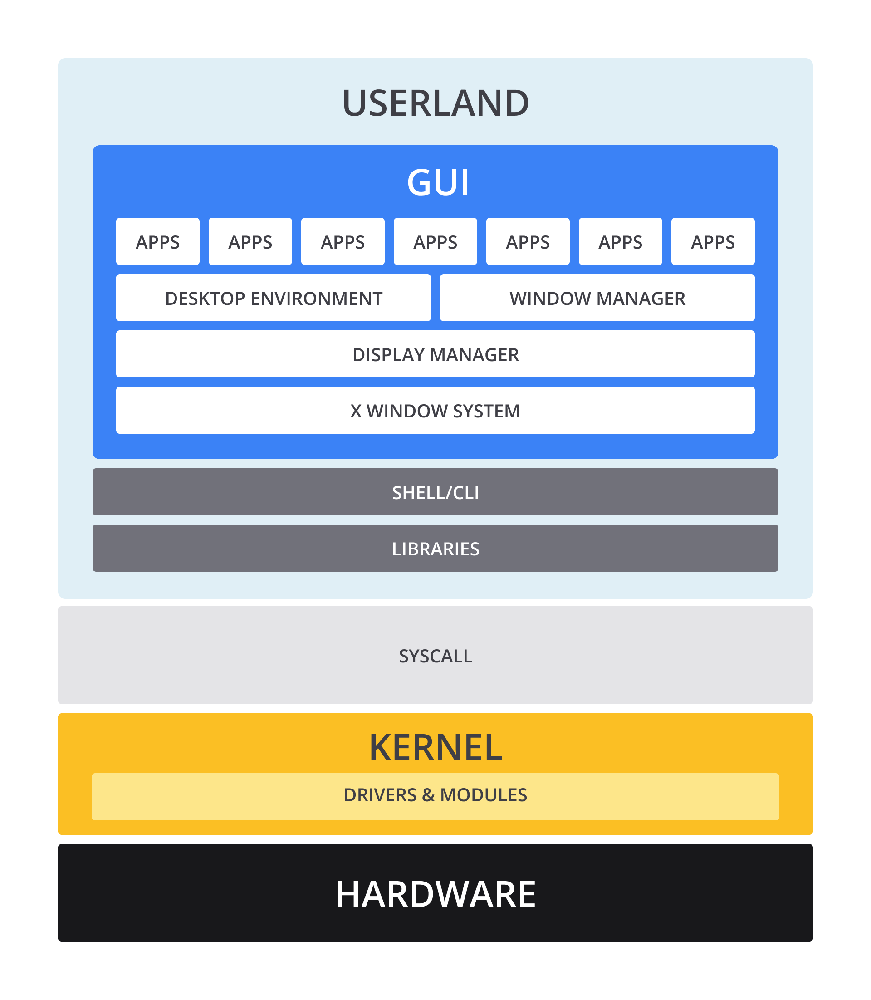

# Free/Open Source Software
- Linux merupakan sistem operasi open source yang paling terkenal dan paling banyak digunakan
- Free/Open Source Software (FOSS) atau Perangkat Lunak Kode Sumber Terbuka dan Bebas adalah perangkat lunak dengan source code (kode sumber) yang bisa digunakan, dipelajari, dimodifikasi, dan dibagikan secara bebas [1]. Dalam banyak hal, publik mengenalnya dengan sebutan open source.
- Bila Anda tak begitu familier dengan istilah source code, ia adalah kumpulan dari instruksi-instruksi yang dapat dibaca oleh manusia dengan tujuan untuk membuat sebuah program.
- Bisa berupa skrip ataupun terkompilasi (compiled) ke binari yang bisa dijalankan oleh komputer secara langsung. Setelah source code terbuat, ia otomatis memiliki hak cipta dan pemegang hak cipta tersebut bisa mengatur ketentuan bagaimana perangkat lunak bisa disalin, diadaptasi, dan didistribusikan. Pengguna dapat menggunakan perangkat lunak ini di bawah naungan lisensi perangkat lunak.

- Sebagian perangkat lunak, source code-nya hanya bisa dilihat, diubah, atau didistribusikan oleh pembuatnya (pemiliknya). Jenis perangkat lunak tersebut umumnya disebut sebagai perangkat lunak proprietary atau closed source. Biasanya jenis lisensi ini hanya mengizinkan pengguna untuk memakai perangkat lunaknya saja atau sedikit (sangat terbatas) akses ke source code.
- Perangkat lunak berbasis open source sangat berbeda dengan perangkat lunak berbasis proprietary. Pemegang hak cipta dari sebuah perangkat lunak di bawah naungan lisensi open source mengizinkan pengguna akhir (end user) untuk menjalankan program dan juga untuk melihat, mengamati, mengubah, mengompilasi, serta, menyebarkan source code-nya ke siapa saja.

## Sejarah Open Source
- Budaya FOSS dimulai oleh para “hacker” sejak tahun 1960-an dan 1970-an pada beberapa laboratorium ilmu komputer di universitas Berkeley, Stanford, Carnegie Mellon, dan MIT. Komunitas programmer yang jumlahnya sedikit dan saling terikat satu sama lain saling berbagi kode program.

## Pengantar Sistem Operasi
- Operating system atau sistem operasi adalah serangkaian perangkat lunak yang pertama kali dijalankan saat komputer dinyalakan atau dikenal dengan proses booting. 
- Sistem operasi inilah yang mengendalikan perangkat keras yang ada pada komputer serta menjalankan aplikasi-aplikasi yang dipasang oleh pengguna. 
- Pada sistem operasi tersedia utilitas-utilitas untuk mengelola sistem, seperti melihat isi direktori (ls atau dir) atau menghapus berkas (del).
- Ada banyak sistem operasi yang tersedia saat ini. Secara garis besar, sistem operasi bisa dibagi menjadi dua kelompok, yakni
  - sistem operasi “umum” (dipakai pada desktop, laptop, atau server) seperti Windows, MacOS, GNU Linux, Unix, Minix, BSD, OpenSolaris, ReactOS, MS DOS, dan FreeDOS; dan
  - sistem operasi perangkat bergerak alias mobile devices (dipakai pada tablet, smartphone, televisi, atau perangkat IoT) seperti Android, iOS, HarmonyOS, Tizen, Sailfish, dan WebOS.
- Dari banyaknya sistem operasi yang ada, tentu kita takkan membahas semuanya. Kita akan fokus pada salah satu sistem operasi yang sering digunakan pada bidang administrasi sistem, server, data center, cloud computing, dsb., yakni Linux. 

---
# Mengenal Linux Lebih Dala
- Mungkin Anda mengira sistem operasi Windows adalah yang paling banyak digunakan orang di seluruh dunia saat ini. Ya, jika kita berbicara tentang sistem operasi pada PC, Windows adalah yang paling masif digunakan. Namun, tahukah Anda bahwa sebenarnya yang menguasai sistem operasi di jagat raya ini ialah Linux. Mengapa demikian? Anda akan mengetahui alasannya sesaat lagi. 
- Linux sendiri awalnya hanya berupa kernel, yaitu inti atau bisa disebut jantung dari sebuah sistem operasi. Kernel Linux digabung dengan perangkat lunak lain sehingga menghasilkan sistem operasi varian Unix atau dikenal dengan Unix-like. Kernel Linux saat ini paling banyak digunakan pada perangkat bergerak alias mobile devices, seperti tablet, smartphone, serta chromebook.

## Sejarah Linux
- Linus Torvalds, mahasiswa tahun kedua Universitas Helsinki, secara mandiri mengembangkan sebuah kernel dan mendistribusikannya pada tahun 1991, tepatnya 5 Oktober 1991 dan akhirnya diberi nama Linux dengan maskot penguin.
- Kernel Linux dikembangkan secara bebas dan bersifat terbuka (open source) dengan jenis lisensi GPL (General Public License) sehingga source code Linux dapat dimodifikasi, digunakan, dan disebarluaskan kembali secara bebas oleh siapa saja.
- Pada waktu itu, selain kernel sistem operasi yang dibuat oleh Linus, terdapat beberapa program dan pustaka (library) berbasis C dari proyek GNU yang dikembangkan sejak 1983 oleh Richard Stallman dan kawan-kawan. Pada akhirnya, kernel yang dibuat oleh Linus kemudian dilengkapi dengan library dan program dari proyek GNU dan utilitas-utilitas lain sehingga menjadi sistem operasi yang komplit bernama GNU-Linux atau GNU/Linux, disingkat menjadi Linux.

- Linux sejak lama dikenal untuk dipergunakan sebagai sistem operasi pada server, baik itu server perorangan, sekumpulan server pada data center, ataupun cloud computing yang kini marak seperti Amazon Web Services.
- Namun, saat ini tak hanya server saja yang berbasiskan Linux. Bila Anda cermati, komputer pribadi (personal computer alias PC), embedded system, game console, smartphone, serta peralatan-peralatan IoT pun menggunakan Linux. 
- Dengan masifnya penggunaan sistem operasi Linux di berbagai perangkat, itu menjadi alasan kuat mengapa Linux menjadi sistem operasi yang paling banyak dipakai di seluruh dunia. Terlebih lagi, proyek pengembangan Linux didukung oleh perusahaan-perusahaan besar komputer dunia, seperti Intel, Dell, IBM, HP, Oracle, Novel, Red Hat, Google, bahkan Microsoft.

## Distribusi Linux
- Sistem operasi Linux dapat dikemas dalam berbagai bentuk media, mulai dari kepingan CD, DVD, hingga USB flashdisk. Bentuk media tersebut bergantung pada ukuran sistem operasi dan perangkat lunak pendukung yang terkandung di dalamnya. Misalnya, untuk web server, cukup menyertakan sistem operasi dan beberapa aplikasi terkait web server, seperti Apache atau NGINX. Kita tak perlu menyertakan aplikasi desktop seperti GIMP, Visual Studio Code, Spotify, dsb., sehingga ukurannya cukup kecil dan bisa disimpan dalam sebuah kepingan CD.
- Akan tetapi, pengemasan Linux ini tak mesti seperti itu. Anda bisa sesuaikan dengan kebutuhan. Anda boleh kok mengemas sistem operasi dengan sekumpulan aplikasi desktop untuk berbagai kebutuhan, misal berisi aplikasi perkantoran (seperti Libre Office), pengolah grafis (seperti GIMP), serta multimedia (seperti Kdenlive, Shotwell, dll). Bahkan, ada juga yang mengemas untuk keperluan audit keamanan sehingga berisi tools jaringan (seperti dig, nslookup, nmap, traceroute, dsb) dan keamanan (seperti metasploit, aircrack-ng, impacket, dsb). 
- Nah, kemasan-kemasan sistem operasi Linux semacam ini bisa disebut juga sebagai distro, yang merupakan singkatan dari distribution.
- Anda bisa membuat distro sendiri atau memilih salah satu dari banyak distro yang tersedia. Bila Anda memilih salah satu distro populer, umumnya di dalamnya sudah terpasang berbagai tools untuk berbagai kebutuhan disertai tampilan desktop yang menarik hati. 

- Beberapa distro yang sudah berumur dan terkenal adalah Debian, Slackware, dan Red Hat. Distro-distro ini memiliki distro turunan atau bisa disebut hasil modifikasi.
  - ebian memiliki turunan bernama Ubuntu dan menjadi lebih terkenal dari pada distro induknya. Bahkan, di Indonesia juga terdapat distro BlankOn yang merupakan turunan Debian. 
  - Slackware menurunkan SUSE/openSUSE.
  - Sementara itu, turunan Red Hat adalah CentOS dan Fedora. 

- Anda dapat melihat daftar distro Linux dan sistem operasi berbasis FOSS lainnya di www.distrowatch.com.
- Perlu Anda ketahui bahwa masing-masing distro Linux memiliki package manager (pengelola paket) yang berbeda satu sama lain. Ini perlu Anda pahami agar nanti tidak kebingungan saat menggunakan distro Linux yang berbeda, Contohnya, Debian, Ubuntu, beserta turunannya menggunakan apt; Slackware memiliki pkgtools dan SUSE/openSUSE memakai zyppe; sedangkan Red Hat, Fedora, CentOS, serta turunannya menggunakan yum.

- Ketahui juga bahwa setiap distro memiliki developer-nya sendiri. Salah satu tugasnya adalah mengemas berbagai aplikasi FOSS yang ada (atau terbaru) ke dalam repository sehingga pengguna bisa dengan mudah memasang program atau tools tanpa perlu melakukan kompilasi (compilation) secara mandiri. Repository dari suatu distro biasanya berisi ratusan ribu paket aplikasi dan pustaka (library) yang pengguna dapat instal sesuka hati sesuai kebutuhan.

---
# Keuntungan Menggunakan Linux
- Kita sudah melihat bagaimana seluk-beluk Linux, mulai dari sejarahnya hingga berbagai macam distribusinya. Lantas, memangnya apa saja sih keuntungan menggunakan Linux? Apa yang membuatnya begitu populer?
- Para pengamat teknologi beranggapan bahwa kesuksesan Linux disebabkan karena kemandiriannya dari vendor atau perusahaan tertentu. Dengan demikian, apabila ditemukan problem atau bug pada Linux, tidak harus satu pihak yang berkewajiban atau bertanggung jawab untuk memperbaikinya. Setiap orang bisa berkontribusi untuk memperbaiki Linux.
- Sebagai contoh, jika ditemukan bug pada Microsoft Windows, yang bertanggung jawab untuk memperbaikinya adalah perusahaan bernama Microsoft. Nah, hal tersebut tidak berlaku pada Linux. Semua orang ataupun vendor berkesempatan untuk memperbaiki, memodifikasi, meningkatkan, atau menambah fitur pada Linux.
- Selain manfaat tersebut, Linux juga memiliki keunggulan-keunggulan lain yang membuatnya tenar sampai saat ini:
  - Bebas digunakan
  - Cenderung lebih aman
  - Pemasangan aplikasi yang mudah
  - Kompatibel dengan perangkat tua atau spesifikasi rendah
  - Distro yang bervariasi
  - Repository yang berlimpah
  - Dukungan komunitas
  - Privasi yang terjaga

# Arsitektur Linux


- Apakah Anda merasa bingung menelaah gambar di atas? Tak apa, simak baik-baik penjelasan berikut, ya. Sejatinya, arsitektur Linux itu dapat dibagi menjadi 3 komponen utama, yakni Userland/User space (GUI, Shell, Libraries), Kernel space (Syscall dan Kernel), serta Hardware. Mari kita kupas satu per satu.

## A. Userland
- Kita awali dengan membahas Userland atau biasa disebut User space. Sebagaimana namanya, userland merupakan bagian yang mengindikasikan wilayah/area pengguna, di mana pengguna bisa berinteraksi dengan sistem operasi Linux. Di bagian ini, terdapat 3 komponen penting, yakni GUI, Shell, dan Libraries.

### 1. GUI
- Bagian GUI (graphical user interface) umumnya berkenaan dengan Linux Desktop, yakni menyediakan tampilan grafis yang ciamik serta aplikasi-aplikasi yang berjalan pada antarmuka grafis seperti LibreOffice, Inkscape, GIMP, dan sebagainya.
- Pada bagian ini, secara teknis terdiri dari beberapa komponen, antara lain X Window System, Display Manager, Window Manager, Desktop Environment, serta berbagai aplikasi pengguna.

### 2. Shell
- Shell adalah program yang bertugas untuk menerima input perintah dari pengguna. Tanpa adanya GUI, komputer masih bisa dioperasikan melalui shell. Bahkan, jika suatu komputer hanya terdiri dari hardware, kernel, dan shell (tanpa GUI); maka itu sudah cukup untuk menjadikannya sebagai sebuah server. 
- Di Linux, terdapat beraneka ragam shell, tetapi yang umum digunakan adalah bash dan zsh. Shell di Linux tidak terikat dengan GUI. Misalnya, pada aplikasi GNOME Terminal, kita bisa bebas menggunakan bash ataupun zsh di dalamnya. Secara umum, kita dapat menyebut Shell sebagai Terminal. Apabila terbiasa dengan sistem operasi Windows, mungkin Anda akan lebih familier penyebutan shell di sana dengan Command Prompt atau cmd.
- Shell sungguh powerful. Segala aplikasi ataupun utilitas pada sistem operasi dapat dipanggil melalui shell. Berikut contoh-contohnya.
  - Perintah ls, rm, mv, dan ln digunakan untuk pengelolaan berkas. 
  - Perintah wget dipakai untuk mengunduh berkas.
  - Perintah curl dimanfaatkan untuk mengirim atau mengambil data melalui URL.
  - Perintah ssh dipakai untuk menggunakan shell secara remote.
  - Perintah ping berfungsi untuk memeriksa kondisi jaringan.

- Saat memasuki shell atau terminal, kita akan disuguhkan sebuah area tampilan yang disebut prompt, ditandai dengan bagian akhir berupa kursor tempat kita mengetikkan perintah. Umumnya, prompt menggunakan format username@hostname:~$ seperti di bawah ini.
  ```bash
  haris@server:~$
  ```
### 3. Libraries
- Komponen lain dari userland atau user space adalah libraries. Ia berfungsi untuk mendukung aplikasi yang ada pada sistem operasi. Tanpa libraries, aplikasi tidak bisa bekerja dengan baik. Misalnya, tanpa library bernama libpng, aplikasi pengolah gambar takkan bisa menampilkan gambar; tanpa library bernama libmpg, pengguna takkan bisa memutar berkas lagu berformat mp3; dan sebagainya.

## B. Kernel Space
- Komponen kedua dari arsitektur Linux adalah Kernel space. Bagian ini berperan penting dan merupakan inti dari sistem operasi. Terdapat 2 komponen utama, yakni Syscall dan Kernel itu sendiri.

### 1. Syscall
- Syscall atau System Call adalah komponen yang menerima instruksi dari pengguna untuk dijalankan oleh kernel/sistem operasi. Bisa dibayangkan bahwa syscall adalah seperti backend dari sistem operasi, sementara shell beserta aplikasi pengguna adalah frontend. 
- Sebagai contoh, perintah ls yang fungsinya untuk melihat isi dari sebuah direktori membutuhkan library bernama glibc. Library ini bersifat sebagai API. Jadi, ketika pengguna membuka shell dan menjalankan perintah ls, maka perintah tersebut akan memanggil API glibc, dan glibc akan memanggil syscall untuk kemudian diproses oleh kernel. Hal itu berlaku juga dengan perintah-perintah lainnya. 
- Proses tersebut bisa diamati dengan utilitas pembantu bernama strace. Cukup jalankan strace <nama perintah> maka akan keluar proses-proses yang dijalankan oleh sistem operasi.

### 2. Kernel
- Seperti penjelasan sebelumnya, kernel adalah inti dari sebuah sistem operasi. Melalui kernel, hardware (perangkat keras) yang ada pada komputer bisa dikenali dan dikendalikan oleh sistem operasi. Tugas utama kernel adalah mengelola sumber daya (seperti memori, prosesor, dsb) serta mengatur akses fisik ke perangkat keras (seperti USB, printer, keyboard, mouse, dsb).
- Lebih lengkapnya, kernel memiliki 4 tugas penting.
  - Memory management: Melacak berapa banyak memori yang digunakan saat menjalankan pekerjaan.
  - Process management: Menentukan proses mana yang dapat menggunakan CPU, kapan, dan untuk berapa lama.
  - Device drivers: Bertindak sebagai mediator/penerjemah antara perangkat keras dan proses pada sistem operasi.
  - System calls and security: Menerima permintaan dari berbagai proses pada sistem operasi.
- Jika Anda masih bingung dengan bentuk dan tugas dari kernel, pikirkan seperti ini. Kernel itu ibarat asisten pribadi untuk seorang eksekutif di suatu perusahaan (hardware). Tugas dari asisten pribadi ini adalah
  - menyampaikan pesan dan permintaan (process) dari karyawan dan publik (user) ke eksekutif tersebut;
  - mengelola dan mengingat lokasi penyimpanan berbagai barang sang eksekutif (memori); dan
  - mengatur jadwal sang eksekutif, seperti menentukan siapa yang memiliki akses ke eksekutif pada waktu tertentu dan untuk berapa lama.
- Semoga kini Anda makin paham ya dengan kernel.

## Hardware
- Komponen terakhir pada arsitektur Linux adalah hardware alias perangkat keras, yang mana sudah kita sebutkan beberapa kali sebelumnya. Seperti yang Anda tahu, hardware ini umumnya seperti keyboard, mouse, printer, dan sebagainya. 
- Pada sistem operasi Linux, kita bisa dengan mudah mendapatkan informasi terkait hardware. Adapun beberapa utilitas untuk memeriksa hardware yang kita gunakan adalah sebagai berikut.

```bash
lspci: Menampilkan daftar hardware yang menggunakan bus PCI.
lsusb: Menampilkan daftar haradware yang terpasang melalui port USB.
cat /proc/cpuinfo dan lscpu: Menampilkan informasi prosesor.
cat /proc/meminfo: Menampilkan informasi memori komputer.
fdisk -l: Menampilkan informasi disk dan partisi yang digunakan.
dmidecode: Menampilkan informasi lengkap terkait hardware komputer.
hwinfo
```

- Selain utilitas di atas, kita juga bisa memasang aplikasi tambahan bernama hwinfo yang bila dijalankan akan menghasilkan banyak informasi terkait hardware yang sedang digunakan.