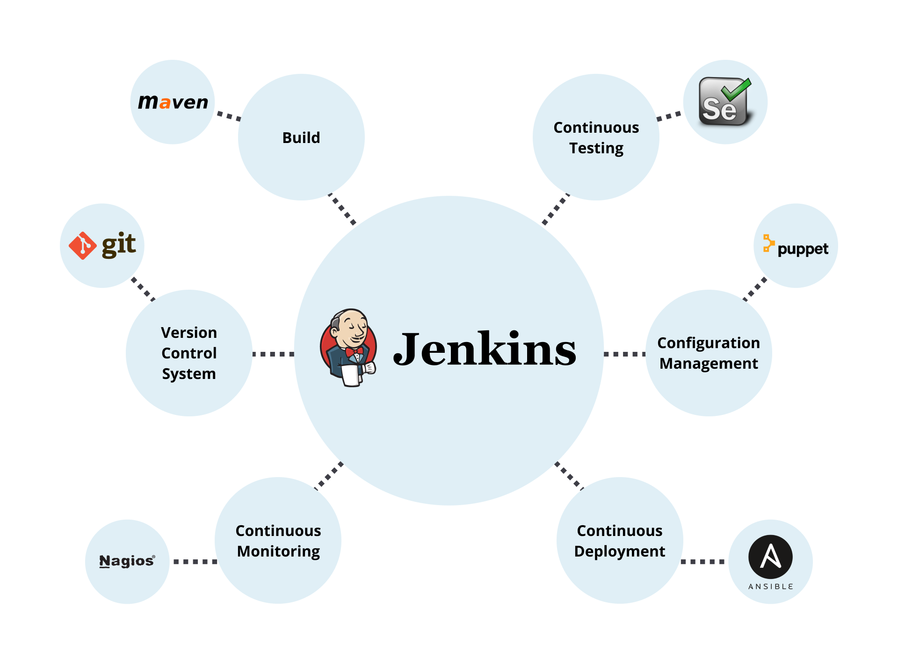
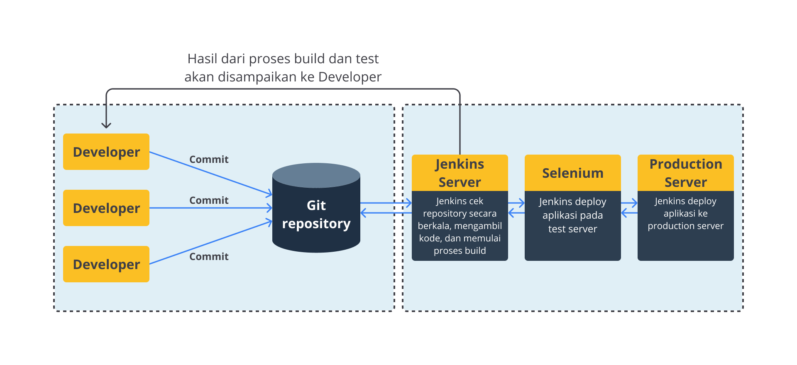
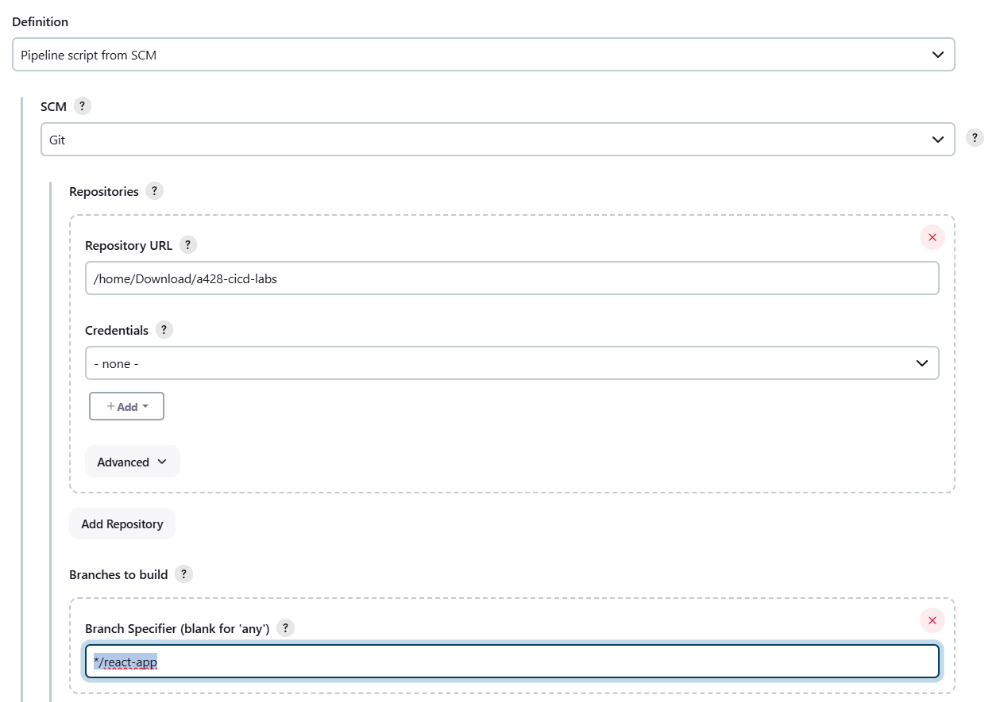
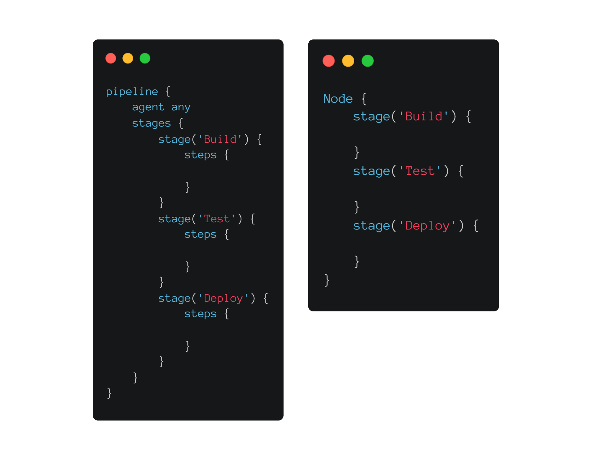

# Berkenalan dengan React App
## Tahapan Plan di React App
- Jira Software.

## github
## jenkins
- Jenkins adalah tools otomatisasi open source yang dapat digunakan untuk mengotomatisasi semua jenis pekerjaan terkait building, testing, dan delivering/deploying perangkat lunak. 
- Jenkins dapat diinstal di berbagai sistem operasi (Windows, Linux, macOS, FreeBSD, dll) melalui native package, Docker, Kubernetes, 
  - atau dijalankan secara mandiri (standalone) oleh mesin apa pun dengan WAR (Web application Archive) files.





### install jenkins pake docker
### Fork dan Clone React App Repository
- [https://github.com/dicodingacademy/a428-cicd-labs/tree/react-app](https://github.com/dicodingacademy/a428-cicd-labs/tree/react-app)
- dan pastikan mematikan centang Copy the main branch only
- clone repo
  ```bash
  cd /home/ariafatah/Download
  git clone -b react-app https://github.com/ariafatah0711/a428-cicd-labs.git
  ```

## Membuat Pipeline Project di Jenkins
- Buka halaman Jenkins. Bila perlu, buka http://localhost:8080/ dan login kembali dengan kredensial Anda.
- Di bagian Welcome to Jenkins!, klik Create a job. Bila Anda tak melihatnya, klik New Item di sebelah kiri atas.
- Pada kolom Enter an item name, isikan dengan nama pipeline yang Anda inginkan, misal react-app. Kemudian, pilih Pipeline dan klik OK.
- Pada halaman berikutnya, isikan deskripsi singkat untuk pipeline Anda di kolom Description, misalnya Sebuah pipeline sederhana untuk proyek React App.
- Setelah itu, buka tab bertuliskan Pipeline di atas kolom Description yang akan membawa Anda scroll ke bawah ke bagian Pipeline.
- Pada bagian Definition, pilih opsi Pipeline script from SCM. Opsi ini menginstruksikan Jenkins untuk membuat Pipeline dari Source Control Management (SCM), yang mana berarti Git repository yang Anda clone sebelumnya ke local environment.
- Pada kolom SCM, pilih Git.
- Pada bagian Repository URL, isikan directory path (lokasi direktori) dari local repository untuk React App yang sebelumnya Anda clone, yakni dari user account atau home directory pada mesin host (komputer) Anda yang dipetakan ke direktori /home pada Jenkins container. Contohnya (sesuaikan dengan struktur direktori di komputer Anda).
  ```bash
  /home/Download/a428-cicd-labs
  ```
- Setelah itu, scroll ke bawah. Pada bagian Branch Specifier (blank for 'any'), ubah menjadi */react-app. Ini mengartikan bahwa kita ingin fokus ke branch bernama react app (sesuai yang kita clone sebelumnya).
- Kemudian, klik tombol Save untuk menyimpan Pipeline project Anda.



## Membuat Jenkins Pipeline dengan Jenkinsfile
- Jenkinsfile adalah sebuah text file yang berisi definisi dari Jenkins Pipeline. Ini merupakan fondasi dari "Pipeline-as-Code" yang memperlakukan CI/CD pipeline sebagai bagian dari source code aplikasi. 
- Jenkins Pipeline mendukung 2 bentuk sintaks, yakni Declarative (diperkenalkan di Pipeline 2.5) dan Scripted Pipeline. Berikut contoh perbedaan antara keduanya.



- Buka Visual Studio Code yang telah Anda buka sebelumnya untuk folder a428-cicd-labs (React App). Kemudian, buka Terminal window di dalam VS Code dengan memilih Terminal -> New Terminal.
- Setelah berkas Jenkinsfile terbuka, salinlah kode Declarative Pipeline di bawah ini ke berkas tersebut.
  ```bash
  pipeline {
    agent {
        docker {
            image 'node:16-buster-slim' 
            args '-p 3000:3000' 
        }
    }
    stages {
        stage('Build') { 
            steps {
                sh 'npm install'
            }
        }
    }
  }
  ```
  - image 'node:16-buster-slim': Parameter image ini (dari parameter docker bagian agent) mengunduh Docker image bernama node:16-buster-slim
  - Node container menjadi agent yang digunakan Jenkins untuk menjalankan Pipeline project Anda. Namun, container ini hanya akan berjalan selama durasi eksekusi Pipeline Anda saja.
  - args '-p 3000:3000': Parameter args ini membuat Node container ini dapat diakses (sementara) melalui port 3000. Ini penting untuk menjalankan berkas jenkins/scripts/deliver.sh. Kita akan bahas soal itu nanti.
  - stage('Build'): Mendefinisikan sebuah stage (tahapan) yang disebut Build yang muncul di Jenkins UI.
  - sh 'npm install': Langkah sh (dari bagian steps) mengeksekusi perintah npm untuk memastikan bahwa semua dependencies yang diperlukan untuk menjalankan aplikasi React App telah diunduh ke direktori node_modules.
- Setelah disimpan, kini commit berkas tersebut ke local repository Anda dengan menjalankan perintah berikut.
  ```bash
  git add .
  git commit -m “Add initial Jenkinsfile”
  ```
- Kembali ke halaman Jenkins, login bila perlu, dan klik Open Blue Ocean di sisi kiri untuk mengakses antarmuka Blue Ocean pada Jenkins.
- jika tidak berhasil lakukan restart pada contaienr docker jenkins dua duanya
  ```bash
  docker restart jenkins-blueocean jenkins-docker
  # dan buka url ini http://localhost:8080/blue/pipelines
  ```
- Pilih react-app, lalu klik Run. Kemudian, segera klik tautan yang bertuliskan OPEN yang muncul di kanan bawah untuk melihat bagaimana Jenkins mengeksekusi Pipeline project Anda.
- Sesudah menyalin local repository react-app Anda, Jenkins menaruh project Anda di queue (antrean) untuk dijalankan di agent. Kemudian, mengunduh Node Docker image dan menjalankannya sebagai sebuah container di Docker.
- Selanjutnya, Jenkins akan menjalankan tahapan Build (yang didefinisikan di dalam Jenkinsfile) pada Node container
- Catatan: Jika proses build container gagal, Anda bisa buka menu Artifact (di kanan atas) dan klik pipeline.log untuk membuka log output.
  - Jika error disebabkan karena port is already allocated atau npm ERR! network Socket timeout, Anda bisa ubah port pada Node container (di Jenkinsfile) dengan port number yang lain.
  - Jika error disebabkan karena request to https://registry.npmjs.org/react failed, itu kemungkinan besar karena jaringan yang Anda pakai memblokir atau tidak bisa meneruskan request dari Docker container ke internet. Solusinya, coba ganti jaringan Anda.
- Antarmuka Blue Ocean seharusnya berubah menjadi hijau yang mengindikasikan bahwa proses Pipeline telah sukses.
- Setelah itu, klik tanda silang (X) di pojok kanan atas untuk kembali ke halaman utama pada antarmuka Blue Ocean.
- Oke, Anda sudah berhasil membuat Pipeline. Namun, ia hanya berisi tahapan Build saja, sementara kita juga butuh tahapan test untuk menguji aplikasi. Jadi, silakan kembali ke aplikasi VS Code Anda dan pastikan berkas Jenkinsfile masih terbuka.
- Salin sintaksis Declarative Pipeline berikut tepat di bawah Build stage.
  ```bash
   stage('Test') {
      steps {
          sh './jenkins/scripts/test.sh'
      }
  }
  ```
- Kembali ke halaman Jenkins, login bila perlu, dan pastikan Anda mengakses antarmuka Blue Ocean.
- Klik tombol RUN di pojok kiri atas, lalu segera klik tautan bertuliskan OPEN yang muncul di kanan bawah untuk melihat bagaimana Jenkins menjalankan Pipeline project Anda. Jika Anda tak bisa membuka tautan OPEN, klik baris teratas pada antarmuka Blue Ocean.
- Dari proses ini, Anda akan melihat bahwa Jenkins tidak perlu lagi mengunduh Node Docker image. Alih-alih, Jenkins hanya perlu menjalankan container baru dari Node image yang telah diunduh sebelumnya. Selain itu, mulai saat ini, tak ada npm dependencies (baru) yang perlu diunduh selama tahap "Build". Oleh karena itu, proses Pipeline kali ini seharusnya akan berlangsung jauh lebih cepat.
- Apabila Pipeline berjalan dengan sukses, seperti inilah tampilan dari antarmuka Blue Ocean.
- Klik tanda silang (X) pada pojok kanan atas untuk kembali ke halaman utama pada antarmuka Blue Ocean.

# stop and run
```bash
docker stop jenkins-blueocean jenkins-docker
docker start jenkins-blueocean jenkins-docker
```