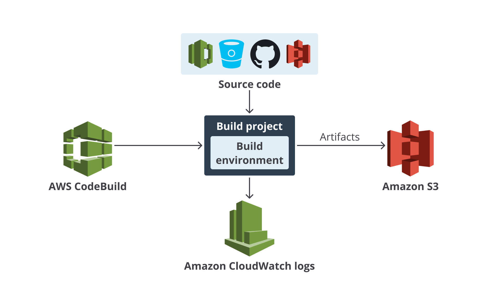

# continuous integration aws
## Build di AWS (CodeBuild)
- Di AWS, terdapat layanan yang dapat membantu kita dalam urusan build sehingga memungkinkan continuous integration, ia adalah AWS CodeBuild.
  - Layanan ini memungkinkan kita untuk meng-compile kode, menjalankan test, dan membuat deployment packages.

### Build project
- Build project berisi informasi tentang bagaimana menjalankan sebuah proses build, di antaranya seperti berikut.
  - Project configuration: Nama dan deskripsi dari Build project.
  - Source: Lokasi untuk mendapatkan source code dari aplikasi atau proyek Anda, bisa Amazon S3, GitHub, Bitbucket, GitHub Enterprise Server, dsb.
  - Environment: Lingkungan (server) yang akan mengonfigurasi aplikasi dengan Docker image dan memiliki spesifikasi yang bisa Anda tentukan sendiri, lalu AWS CodeBuild akan membuat lingkungan (server) tersebut, dan menjalankan proses build Anda di sana.
  - IAM role: Mengatur bagaimana suatu service mengautentikasi ke service lain. Jika proses build memerlukan interaksi dengan layanan AWS lain, Anda perlu menyertakan IAM role.
  - Buildspec: Menggunakan buildspec file atau menuliskan build commands secara langsung. Nanti dibahas di poin berikutnya.
  - Artifact: Tempat untuk menyimpan output dari proses build, umumnya ke Amazon S3 bucket.
  - Logs: Anda bisa melihat log output dari proses build. Ini penting dan diperlukan untuk men-debug proses build Anda. Kita dapat mengonfigurasi AWS CodeBuild untuk menulis log ke Amazon CloudWatch Logs dan Amazon S3.
- Buildspec file: Kumpulan atau serangkaian build commands (perintah selama proses build) dan konfigurasi terkait. Berkas ini ditulis dalam format YAML dan digunakan oleh AWS CodeBuild untuk menjalankan proses build.



### Menyiapkan Development Environment di AWS CloudShell
- Pada AWS Management Console Home, klik ikon AWS CloudShell di pojok kanan atas
- Kemudian, pada bagian Terminal jalankan perintah untuk clone repository.
  ```bash
  git clone -b hello-world https://github.com/dicodingacademy/a428-cicd-labs.git hello-world
  ```
- Pindah ke direktori hasil clone repository dan lihat bahwa semua berkas sudah tersalin dengan baik.
  ```bash
  cd hello-world/
  ls
  ```

### Membuat GitHub Repository dan Amazon S3 Bucket
- Masuklah ke halaman GitHub Dashboard pada browser tab baru dan klik tombol New.
- Untuk Repository name, isikan hello-world dan pilih opsi Public. Setelah itu, klik tombol Create repository. 
- Kembali ke browser tab AWS CloudShell. Inisialisasikan local repository Anda, navigasikan ke branch main, buat commit baru, lalu push source code Hello World ke GitHub repository.
  ```bash
  git init
  git checkout -b main
  git add .
  git commit -m "initial commit"
  git remote remove origin
  git remote add origin git@github.com:<username_github>/hello-world.git
  git push origin main
  ```
- Apabila Anda mengalami kendala dalam push kode ke GitHub, lakukan kembali langkah yang sama seperti di bagian Menaruh Source Code di GitHub (sesuaikan dengan aplikasi Hello World).
- Kembali lagi ke browser tab GitHub dan coba refresh. Anda akan melihat bahwa kini hello-world repository telah sinkron dengan local repository.
- Oke, repository sudah aman, kini Anda perlu membuat Amazon S3 bucket baru untuk kebutuhan proses build. Kembali lagi ke browser tab AWS CloudShell dan jalankan perintah berikut di terminal untuk membuat S3 bucket.
  ```bash
  aws s3 mb s3://<nama><angka>-hello-artifacts/
  aws s3 mb s3://aria1-hello-artifacts/
  ```

### Menjalankan Proses Build dengan AWS CodeBuild
- Masuklah ke halaman AWS CodeBuild build projects. Kemudian, klik tombol Create project.
- Pada bagian Project configuration, isikan Project name dengan hello-app.
- Pada bagian Source, sesuaikan dengan hello-world repository yang tadi dibuat. Anda bisa menyamakannya seperti berikut.
  - Source provider: GitHub
  - Credential: Default source credential
  - Manage default source credential -> GitHub App -> create a new GitHub connection -> isikan hello-world-app -> Connect to GitHub -> Connect. Kembali di halaman Manage default source credential, pilih hello-world-app di bagian Connection -> Save.
  - Repository: Public repository
  - Repository URL: https://github.com/<username_github>/hello-world
  - Source version: main
- Pada bagian Environment, gunakan sistem operasi Ubuntu dan buat IAM role (service role) baru. Sesuaikanlah seperti konfigurasi berikut.
  - Environment Image: Managed Image
  - Operating system: Ubuntu
  - sRuntime(s): Standard
  - Image: 7.0
  - Service role: New service role (secara default mengizinkan AWS CodeBuild untuk menulis log di Amazon CloudWatch Logs dan mengunggah berkas ke Amazon S3).
- Untuk Buildspec, gunakan buildspec file yang sudah kita miliki di source code aplikasi Hello World.
  - Build specifications: Use a buildspec file
  - Buildspec name: buildspec.yml
- Karena aplikasi Hello World perlu menghasilkan sebuah artifact dan menyimpannya ke Amazon S3, silakan sesuaikan bagian Artifacts dengan konfigurasi berikut.
  - Type: Amazon S3
  - Bucket name: <nama><angka>-hello-artifacts
  - Enable semantic versioning: Centang (karena kita ingin menggunakan nama artifact dari buildspec file)
  - Artifacts packaging: Zip (sesuai dengan apa yang kita inginkan di buildspec file)
- Pada bagian Logs, biarkan pilihan CloudWatch logs tetap tercentang agar kita bisa melihat output dari proses build di Amazon CloudWatch Logs.
- Lanjut, pilih Create build project.
- Oke, kini hello-app build project sudah berhasil dibuat. Selanjutnya, klik tombol Start build di kanan atas untuk memulai proses build.
- Proses build pun akan berlangsung. Klik Tail logs untuk melihat lebih detail.
- Setelah ikon pada bagian kiri atas menunjukkan Succeeded, Anda bisa perhatikan setiap baris log dengan saksama. Lihatlah setiap output yang dihasilkan dari masing-masing phase (tahapan yang ada pada buildspec file), mulai dari phase INSTALL, PRE_BUILD, BUILD, POST_BUILD, bahkan hingga UPLOAD_ARTIFACTS. Dari sini, Anda bisa mengerti bahwa AWS CodeBuild menjalankan perintah sesuai yang kita tulis di buildspec file.
- Terakhir, kita coba periksa apakah proses build benar-benar berhasil. Tutup Build logs window dengan klik tanda silang (X) pada bagian kanan atas.
- Buka tab bernama Build details.
- Scroll ke bawah dan klik tautan yang ada pada Artifacts upload location. Anda akan dibawa ke halaman Amazon S3 bucket.
- Tekan tombol Copy S3 URI untuk mendapatkan tautan S3 dari berkas tersebut.
- Buka AWS CloudShell dan jalankan perintah berikut di terminal
  ```bash
  cd ~/
  mkdir artifact
  cd artifact/
  aws s3 cp <S3 URI> .
  unzip hello-app-xxx-xx-xx.zip
  ```
- Seketika Anda akan melihat 2 buah berkas, persis seperti yang kita tulis dan harapkan pada buildspec file. Ini berarti benar bahwa proses build telah sukses