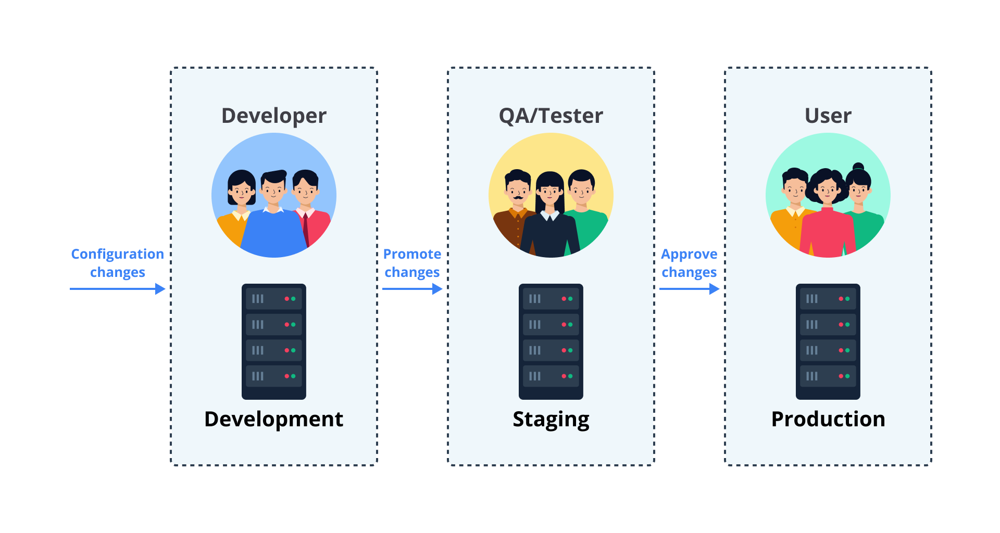

# pengenalan
- Kita tahu bahwa continuous delivery dan continuous deployment adalah hal yang “serupa tapi tak sama”. Perbedaan kentaranya hanyalah pada hadirnya manual approval di continuous delivery, sedangkan absen pada continuous deployment. 

## Pengertian Deployment
- adalah sebuah praktik yang mencakup semua langkah, proses, dan aktivitas yang diperlukan untuk membuat aplikasi/perangkat lunak atau pembaruan tersedia bagi pengguna yang dituju.
- Di balik itu semua, secara garis besar, proses deployment sebetulnya adalah sesederhana memindahkan kode dari satu environment (development atau staging/testing) ke environment lainnya (production).

- Ketika seorang Developer ingin menambahkan fitur pada sebuah aplikasi yang sudah berjalan di production, ia akan menulis kode dulu di development environment,
- bisa di local environment atau shared environment. Di sini, Developer bisa melakukan apa pun tanpa berimbas ke pengguna. Ia bisa melakukan build, test, hingga menguji coba langsung aplikasi melalui komputer pribadi. 
- Setelah dirasa puas, Developer kemudian akan commit perubahan ke central repository dan deploy ke staging environment untuk selanjutnya dilakukan test oleh QA/Tester. Jika semua pengujian lolos, kode tersebut bisa di-deploy ke production dan segera bisa diakses pengguna.

## Strategi Deployment
- Strategi deployment menentukan metode seperti apa yang kita inginkan untuk deliver aplikasi ke pengguna.

### In-Place atau Replacement
- Teknik dari strategi ini adalah melakukan deployment hanya dalam beberapa langkah sederhana. Pertama, kita terminate (menghentikan) proses untuk aplikasi A versi 1. Kemudian, kita deploy versi 2 ke server yang sama. That’s it!
  
- Kekurangan dari pendekatan ini adalah adanya downtime (waktu henti) ketika menghentikan aplikasi dan proses deploy versi baru. 
  - Keuntungannya, strategi ini sederhana dan cukup mudah untuk dipelajari.
- Oke, katakanlah kita sudah deploy versi 2 ke aplikasi A. Lantas, bagaimana jika terdapat bug pada versi 2 dan ingin rollback (kembali ke versi sebelumnya)? Simpel. Langkahnya sama seperti sebelumnya, yakni menghentikan versi 2, lalu deploy versi 1.

### Recreate
- Teknik ini tak kalah simpel dengan in-place/replacement. Caranya pun cukup mirip, yakni dengan mematikan atau shut down (semua) instance 
  - alias server untuk aplikasi A versi 1 (sehingga versi 1 tidak bisa diakses), kemudian deploy versi 2 di (semua) instance yang baru. Nah, 
  - perbedaannya dengan strategi sebelumnya adalah Recreate menggunakan instance baru, sedangkan in-place/replacement menggunakan instance yang sama.
- Untuk mempermudah penerapan strategi recreate, kita juga bisa menggunakan load balancer (sistem yang bertugas mendistribusikan network traffic yang masuk ke sekelompok instance).
  -  Jadi, setelah deploy versi 2, kita tinggal hubungkan (semua) instance baru tersebut pada load balancer. Dengan begitu, pengguna hanya perlu membuka endpoint load balancer untuk mengakses aplikasi tanpa tahu apa yang sebenarnya terjadi di balik layar.

- Keuntungan dari menerapkan strategi ini adalah langkah-langkahnya yang sederhana dan cukup mudah untuk dipelajari. Namun, ia memiliki kekurangan, yakni adanya downtime (waktu henti) ketika menghentikan aplikasi dan proses deploy versi baru.

### Ramped atau Rolling Release
- Cara kerja dari strategi ramped atau rolling release adalah merilis aplikasi secara perlahan dengan mengganti instance satu demi satu.
- Katakanlah aplikasi A versi 1 memiliki arsitektur dengan 3 instance yang berjalan di belakang load balancer. Lantas, bagaimana jika kita ingin deploy versi 2? Berikut teknik dari strategi Ramped yang dapat dilakukan.
  - Deploy versi 2 terlebih dahulu ke satu instance baru.
  - Lalu, register (tambahkan) instance baru tersebut ke load balancer.
  - Kemudian, satu instance versi 1 di-deregister (dikeluarkan) dari load balancer dan di-shut down (dimatikan).
  - Setelah itu, ulangi langkah-langkah tersebut ke instance yang lain.

Keuntungan menggunakan strategi ramped ini adalah takkan terjadi downtime. Namun, kekurangannya adalah ia sedikit lebih kompleks ketimbang Recreate.

### Blue/Green
- Strategi ini berbeda dengan ramped, di mana versi 2 (green) di-deploy beriringan dengan versi 1 (blue) dengan jumlah instance yang persis sama. 
  - Setelah instance untuk versi 2 siap menerima traffic, kita alihkan traffic dari versi 1 ke versi 2 pada load balancer.
- Keuntungan menggunakan strategi ini adalah dapat rollback (kembali ke versi sebelumnya) secara instan, yakni cukup alihkan traffic dari versi 2 ke versi 1 kembali. 
  - Untuk kepentingan rollback, biasanya versi 1 (blue environment) takkan dihapus untuk sementara waktu hingga versi 2 (green environment) 
  - benar-benar aman tanpa bug. Akan tetapi, kekurangannya adalah akan memakan biaya karena kita perlu menggandakan jumlah instance.

### Canary
- Cara kerja dari strategi canary adalah dengan secara bertahap mengalihkan traffic dari versi 1 ke versi 2. Umumnya, traffic dibagi berdasarkan bobot. 
  - Sebagai contoh, 90% request masuk ke versi 1 dan 10% ke versi 2. 
- Teknik ini sebagian besar digunakan jika pengujian kurang maksimal/komprehensif atau jika tim masih merasa kurang percaya diri soal stabilitas aplikasi dan/atau infrastruktur.
- Beberapa keuntungan dalam menggunakan strategi canary adalah kita bisa mengatur rilis versi hanya untuk sebagian porsi pengguna, cepat untuk proses rollback, dan cocok untuk memantau performa. 
- Salah satu kekurangan dari strategi ini adalah proses rilis yang lambat. Namun, ini tergantung sudut pandang Anda, rilis yang lambat bisa menjadi kelebihan atau kekurangan.

### A/B Testing
- A/B Testing bekerja dengan cara merutekan sebagian pengguna ke fungsionalitas baru dalam kondisi tertentu.
- Strategi ini biasanya dipakai sebagai teknik untuk membuat keputusan bisnis berdasarkan statistik.
  - A/B Testing banyak digunakan untuk menguji konversi fitur tertentu dan nantinya fitur yang dirilis adalah yang paling banyak konversinya.
- Berikut adalah daftar kondisi yang bisa digunakan untuk mendistribusikan traffic.
  - Browser cookie
  - Query parameter
  - Geolocalization
  - Bahasa
  - Dukungan teknologi: versi browser, ukuran layar, sistem operasi, dll.
- Keuntungan dalam menerapkan A/B Testing adalah Anda bisa memiliki beberapa versi aplikasi yang berjalan secara paralel dan memiliki kontrol penuh atas distribusi traffic untuk aplikasi. 
  - Namun, beberapa kekurangannya adalah memerlukan load balancer yang cerdas, sulit untuk mengatasi eror di beberapa sesi, dan wajib melakukan pelacakan untuk setiap versi.

| Strategi Deployment         | Dampak dari Deployment yang Gagal                                | Waktu yang diperlukan saat Deployment | Zero Downtime | Tanpa Pergantian DNS | Proses Rollback                                         |
|-----------------------------|------------------------------------------------------------------|---------------------------------------|---------------|----------------------|---------------------------------------------------------|
| In-Place atau Replacement   | Terjadi Downtime                                                 | Cepat                                 | ❌             | ✅                    | Deploy Ulang                                            |
| Recreated                   | Terjadi Downtime                                                 | Cepat                                 | ❌             | ✅                    | Deploy Ulang                                            |
| Ramped atau Rolling Release | Instance baru dapat dibatalkan dan tidak menghapus instance lama | Sedang                                | ✅             | ✅                    | Deploy Ulang                                            |
| Blue/Green                  | Minimal                                                          | Cukup Lama                            | ✅             | ❌                    | Trafik dipindahkan ke environment lama                  |
| Canary                      | Minimal                                                          | Cukup Lama                            | ✅             | ✅                    | Trafik dipindahkan kembali dan menghapus instance baru  |
| A/B Testing                 | Minimal                                                          | Cepat                                 | ✅             | ✅                    | Mengembalikan trafik ke fitur lama untuk fitur tertentu |

## kesimpulan
- Jika Anda ingin deploy aplikasi ke staging/testing environment, strategi recreate atau ramped umumnya merupakan pilihan yang baik.
- Namun, dalam hal production environment, strategi ramped atau blue/green biasanya lebih cocok
  - Perlu Anda perhatikan bahwa strategi blue/green akan lebih berdampak pada budget karena membutuhkan resource dengan kapasitas ganda. 

- Jika aplikasi Anda tidak memiliki pengujian yang komprehensif atau Anda kurang percaya diri soal stabilitas aplikasi, canary atau A/B testing adalah strategi yang bisa Anda gunakan. 

- Apabila perusahaan memerlukan pengujian untuk fitur baru ke sebagian pengguna (dengan kondisi atau parameter tertentu), Anda mungkin perlu melirik strategi A/B testing. 