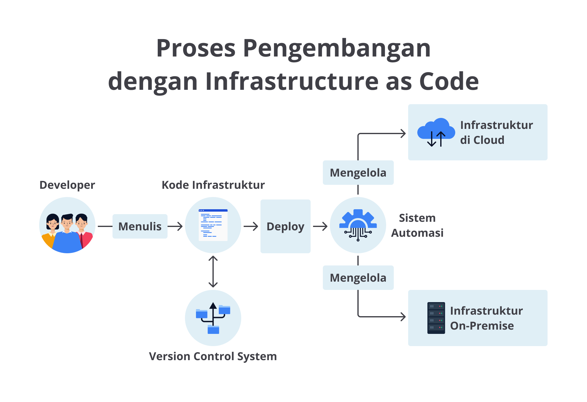
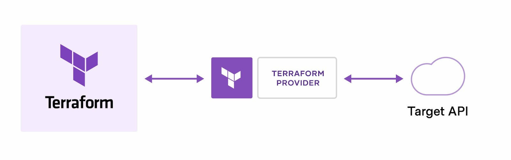
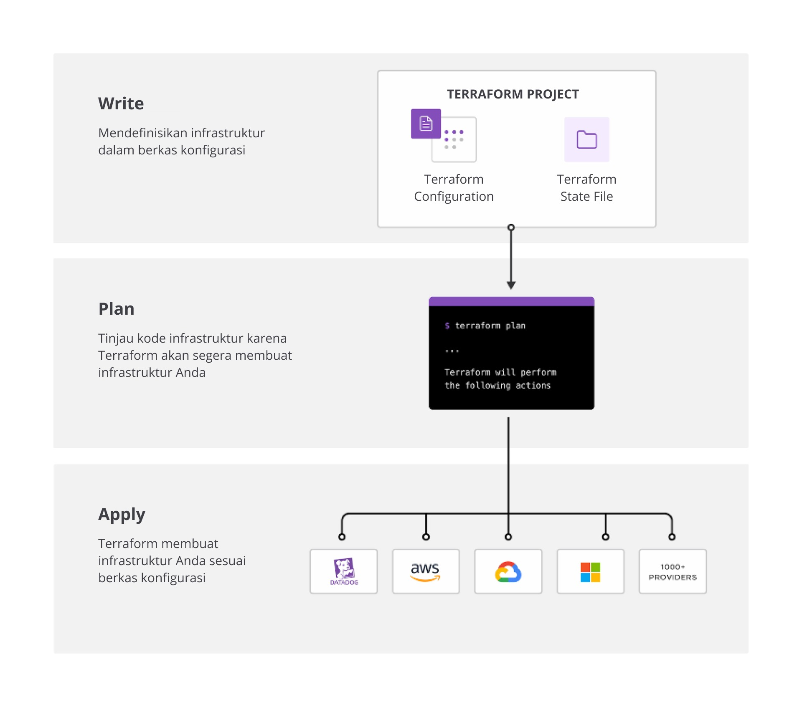
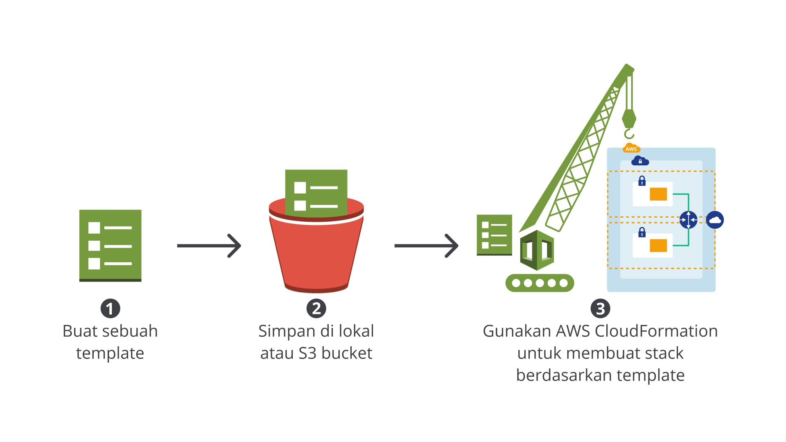

# Infrastructure as Code
- Anda sudah berhasil memahami dan mempraktikkan cara deploy aplikasi DevOps Blog App dengan AWS CodeDeploy. Sayangnya, kita belum mengimplementasikan continuous deployment. Kita masih melakukan proses deploy secara manual. Maka dari itu, kita perlu membuat CI/CD pipeline untuk DevOps Blog App.
  - Namun, kita tahu bahwa untuk membuat pipeline seperti Trivia App saja itu memerlukan banyak operasi manual. Misalnya, kita harus masuk ke halaman AWS CodePipeline, membuat pipeline, dan mengonfigurasi setiap stage pada pipeline. Belum lagi jika ingin menambahkan stage, kita perlu melakukannya secara manual dengan kembali ke halaman AWS CodePipeline.
  - Itu masih urusan pipeline, bagaimana dengan infrastruktur pendukungnya, seperti instance, network, permission, dan lain sebagainya? Ingat kembali, hanya untuk deploy aplikasi dengan AWS CodeDeploy di latihan sebelumnya, kita harus membuat IAM role, meluncurkan EC2 instance, menginstal CodeDeploy agent, membuat S3 bucket, mengonfigurasi AWS CodeDeploy. Semuanya dilakukan manual satu per satu. Kita harus mengatur semuanya di berbagai halaman layanan AWS yang berbeda. Sungguh merepotkan, bukan?
- Bagaimana kalau kami berikan kabar baik bahwa ternyata ada cara untuk mengotomatiskan pembuatan infrastruktur, dalam hal ini termasuk juga untuk deployment? Ini dinamakan Infrastructure as Code atau IaC. 

## Pengertian Infrastructure as Code
- Tak perlu repot-repot membuat keseluruhan environment secara manual di berbagai halaman yang berbeda, sebagaimana namanya (Infrastructure as Code)
  - kita bisa membuat semua infrastruktur yang dibutuhkan di satu tempat sebagai sebuah kode.
- Setelah itu, kita tinggal deploy kode tersebut, dan voila! Semua yang kita butuhkan tersaji dengan cepat. Dengan automasi semacam ini, kita bisa meminimalisir human error (kesalahan manusia) dan meningkatkan produktivitas.
- Karena memperlakukan infrastruktur sebagai kode, kita bisa menyimpannya di version control system seperti git, melakukan code review, bahkan deploy infrastruktur melalui pipeline (praktik ini kerap disebut sebagai GitOps).

- Kerennya lagi, Anda bisa menggunakan kode yang sama (tentunya dengan sedikit perubahan) untuk membuat beberapa environment yang identik seperti testing environment dan production environment dalam satu waktu. Dengan begini, setiap environment akan konsisten sehingga memudahkan pekerjaan Developer untuk deploy aplikasi.
  

## Berinteraksi dengan Infrastructure as Code
### Pendekatan Deklaratif
- Pendekatan deklaratif adalah ketika kita mendefinisikan kondisi/keadaan sistem yang diinginkan, termasuk resource apa yang dibutuhkan dengan segala propertinya. Sisanya, biarkan IaC tools yang akan mengonfigurasikannya untuk Anda.
- Ini persis ketika Anda datang ke sebuah kafe, cukup sebutkan kopi apa yang ingin dipesan ke kasir (misal espresso), kemudian barista akan membuatkan kopi sesuai pesanan Anda (yakni espresso).

### Pendekatan Imperatif
- Sebaliknya, pendekatan imperatif adalah ketika kita mendefinisikan perintah secara spesifik untuk mencapai konfigurasi yang diinginkan, lalu perintah tersebut perlu dijalankan dalam urutan yang benar. 
- Mengambil analogi kafe, alih-alih memesan kepada kasir, Anda malah memberikan instruksi yang terperinci kepada barista tentang apa yang harus ia lakukan untuk membuat espresso. Misalnya, Anda bilang kepada barista untuk
  - mengambil biji kopi,
  - menggiling dengan granularitas tertentu, 
  - menggunakan tamper kopi,
  - memasukkan kopi ke portafilter,
  - menyalakan mesin selama 25 detik, dan sebagainya.

- Pemilihan Deklaratif dan Imperatif
- Kebanyakan IaC tools menggunakan pendekatan deklaratif, yang mana akan membuat infrastruktur yang kita definisikan secara otomatis. Ketika kita membuat perubahan pada kode, declarative IaC tool akan menerapkan perubahan tersebut untuk kita. Coba cermati, perilaku ini seperti pada aplikasi, bukan? Namun, bedanya ini kita lakukan untuk infrastruktur.
- Berbeda dengan declarative IaC tool, imperative IaC tool memerlukan kita untuk mencari tahu sendiri bagaimana perubahan yang kita lakukan harus diterapkan. Sedikit merepotkan, ya? Di sisi lain, pendekatan imperatif memberi Anda lebih banyak kontrol karena harus bisa menentukan perintah yang begitu detail sesuai keinginan. 

## IaC Tools
- Ada banyak IaC tools tersedia yang bisa Anda gunakan dengan berbagai tujuan. Dari banyak IaC tools, mereka tergolong menjadi beberapa kategori. Kelas ini hanya akan membahas 2 kategori saja, yakni Infrastructure Provisioning dan Configuration Management.
- Infrastructure provisioning adalah suatu proses pembuatan infrastruktur dengan meminimalkan intervensi manusia untuk mengontrol hardware, software, network, OS, data storage, dan komponen lainnya yang digunakan oleh aplikasi atau layanan teknologi informasi.

### Terraform
- Terraform adalah IaC tool dari HashiCorp yang memungkinkan Anda untuk membuat, mengubah, dan mengelola infrastruktur dengan aman dan efisien menggunakan berkas konfigurasi yang bisa Anda taruh di version control system, gunakan kembali, dan bagikan ke tim.
- Terraform dapat mengelola low-level component, seperti compute, storage, dan network; serta high-level component DNS entries dan SaaS features.
- Terraform bekerja dengan cara membuat dan mengelola resource pada cloud dan platform lain menggunakan API (application programming interface) melalui Provider.
  
- Temukan semua provider yang tersedia secara publik di Terraform Registry, termasuk Amazon Web Services (AWS), Azure, Google Cloud Platform (GCP), Kubernetes, Helm, GitHub, Splunk, DataDog, dan banyak lagi.

- Saat menggunakan Terraform, ada 3 tahapan workflow (alur kerja) yang akan Anda temui.
  - Write => Definisikan resource yang Anda inginkan. Misalnya, Anda dapat membuat konfigurasi untuk deploy sebuah aplikasi pada virtual machine (VM) di suatu virtual private cloud (VPC) dengan aturan firewall dan satu load balancer.
  - Plan => Terraform membuat rencana eksekusi yang menjelaskan apa saja infrastruktur yang akan dibuat, diperbarui, atau dihapus berdasarkan infrastruktur yang ada dan konfigurasi Anda.
  - Apply => Bila disetujui, Terraform akan melakukan operasi dalam urutan yang sesuai. Misalnya, jika Anda memperbarui properti pada VPC dan mengubah jumlah VM di VPC tersebut, Terraform akan membuat ulang VPC sebelum menyesuaikan kapasitas VM.



- Kerennya, Anda bisa menjalankan Terraform melalui Jenkins untuk mengintegrasikan deployment infrastruktur ke dalam CI/CD pipeline. Dengan menggabungkan penggunaan Terraform dan Jenkins, Anda bisa menghilangkan banyak prosedur manual dan memaksimal praktik DevOps.
- [https://www.terraform.io/docs](https://www.terraform.io/docs)

### AWS CloudFormation
- AWS CloudFormation adalah layanan yang memungkinkan Anda untuk mendeklarasikan infrastruktur dalam sebuah berkas teks.
- Dalam berkas tersebut, Anda bisa mendefinisikan infrastruktur apa pun yang diinginkan dalam format JSON atau YAML. Setelah selesai dengan berkas tersebut, cukup kirimkan ke AWS CloudFormation untuk dibuatkan infrastruktur/environment sesuai dengan yang Anda definisikan.
 
- Dalam nomenklatur CloudFormation, berkas tersebut disebut sebagai template, sedangkan komponen infrastruktur dipanggil stack. Jadi, sebuah template adalah sebuah deklarasi dari AWS resources yang membentuk sebuah stack.
- Dengan membuat template, AWS CloudFormation dapat membuat resource dengan cara yang aman dan dapat diulang (repeatable). Ini memungkinkan Anda untuk membuat dan memperbarui infrastruktur dan aplikasi tanpa harus melakukan berbagai tindakan secara manual.
- Anda bisa membuat sebuah template dengan code editor apa pun, lalu upload ke dalam version control system seperti GitHub, dan memeriksanya dengan anggota tim sebelum akhirnya men-deploy-nya.

```yaml
Resources:
  HelloBucket:
    Type: 'AWS::S3::Bucket'
    Properties:
      AccessControl: PublicRead
      WebsiteConfiguration:
        IndexDocument: index.html
        ErrorDocument: error.html
```

- Template di atas mendeklarasikan bahwa kita akan membuat resource tunggal, yakni sebuah S3 bucket dengan nama HelloBucket dan berbagai properti. Mari kita telisik satu per satu.
- Resources object adalah bagian di mana kita bisa mendefinisikan berbagai resource yang diinginkan. Setiap resource yang didefinisikan memiliki berbagai atribut, salah satu yang mesti ada adalah atribut Type. Atribut yang satu ini menentukan tipe AWS resource yang ingin Anda buat. Atribut Type memiliki format khusus seperti berikut.
- Sebagai contoh, karena kita ingin membuat S3 bucket, resource type-nya adalah AWS::S3::Bucket. 