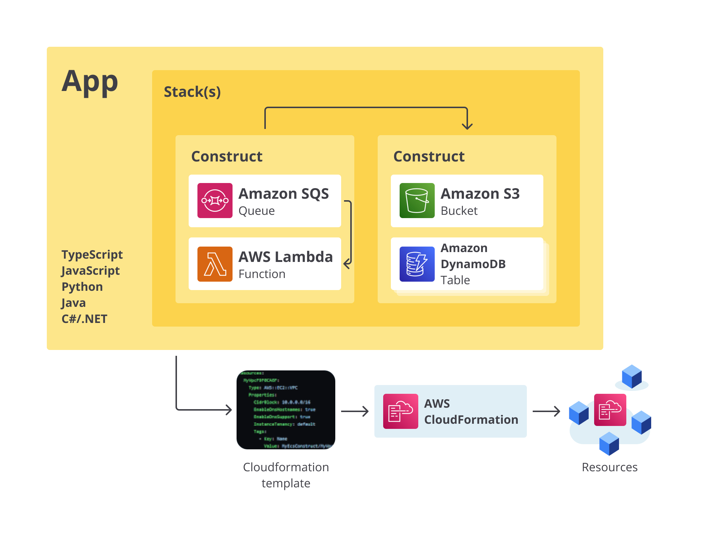
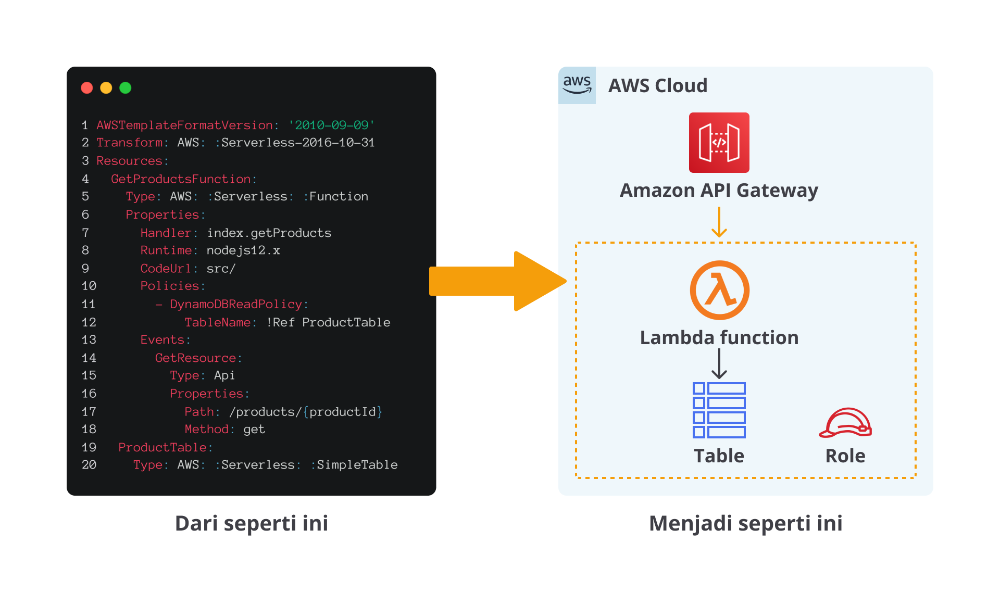

# Abstraksi IaC di AWS
- Prinsip dasar dari DevOps adalah memperlakukan infrastruktur dengan cara yang sama seperti Developer memperlakukan aplikasi, yakni dengan kode.
  - Untuk itu, pembuatan, pengelolaan, dan deployment infrastruktur sebaiknya memanfaatkan teknologi Infrastructure as Code (IaC).
- AWS menyediakan sejumlah IaC tools, salah satunya yang sudah kita lihat adalah AWS CloudFormation. 
- Ia adalah layanan IaC yang powerful untuk pembuatan infrastruktur dengan kode.
  - Akan tetapi, bila kita ingin merancang arsitektur cloud yang begitu kompleks–apalagi kalau melibatkan banyak serverless resources, CloudFormation template bisa sangat panjang.
  - Ini bisa menjadi masalah karena saking banyaknya baris kode yang ada, template menjadi sulit untuk dikelola oleh tim Anda.
  - Nah, untuk menanggulangi masalah kompleksitas ini, AWS menyediakan beberapa abstraksi untuk IaC di AWS, di antaranya adalah AWS Cloud Development Kit (AWS CDK) dan AWS Serverless Application Model (AWS SAM).

## AWS CDK
- AWS Cloud Development Kit alias AWS CDK adalah sebuah lapisan abstraksi untuk IaC yang menyediakan framework (kerangka kerja) yang dapat Anda gunakan untuk merancang infrastruktur cloud dalam baris kode menggunakan berbagai bahasa pemrograman pilihan.
- Bila AWS CloudFormation menggunakan format JSON atau YAML, Anda dapat menggunakan AWS CDK untuk memodelkan infrastruktur aplikasi dengan TypeScript, Python, Java, dan .NET. 
- Anda dapat menggunakan integrated development environment (IDE) sesuai keinginan dan memanfaatkan tools seperti autocomplete dan inline documentation guna mempercepat pengembangan infrastruktur.
- Setelah selesai membuat rancangan infrastruktur, AWS CDK kemudian membuat CloudFormation template dari baris kode yang Anda tulis.

- Dengan membuat CloudFormation template dari source code, Anda dapat memperluas integrasi dengan sistem eksternal.
- Katakanlah Anda ingin membuat 5 EC2 instance. Jika hanya menggunakan AWS CloudFormation, Anda perlu copy dan paste 5 individual resource dari Type AWS::EC2::Instance ke dalam template. 
  - Akan tetapi, kalau menggunakan Python (contoh) dengan AWS CDK, Anda dapat membuat 5 EC2 instance hanya dengan meletakkan construct yang me-render instance di dalam for loop. Keren, kan?
- Nah, berikut adalah contoh manfaat lainnya apabila Anda menggunakan AWS CDK. 
  - Onboarding cloud lebih mudah
  - Proses pengembangan lebih cepat
  - Dapat disesuaikan dan dibagikan
  - Tanpa pengalihan konteks

- Itulah beberapa keuntungan yang akan Anda dapatkan bila menggunakan AWS CDK. Nah, untuk mulai berinteraksi dengannya, Anda bisa manfaatkan AWS CDK Toolkit. 
- Pada AWS Command Line Interface (AWS CLI), Anda hanya perlu gunakan perintah cdk. 
  - Nantinya, AWS CDK Toolkit akan menjalankan kode, memeriksa model infrastruktur yang Anda tetapkan, dan memproduksi serta men-deploy CloudFormation template yang di-render melalui AWS CDK.

```python
import aws_cdk as cdk
from constructs import Construct
from aws_cdk import (aws_apigateway as apigateway,
                     aws_s3 as s3,
                     aws_lambda as lambda_)
 
class WidgetService(Construct):
    def __init__(self, scope: Construct, id: str):
        super().__init__(scope, id)
 
        bucket = s3.Bucket(self, "WidgetStore")
 
        handler = lambda_.Function(self, "WidgetHandler",
                    runtime=lambda_.Runtime.NODEJS_14_X,
                    code=lambda_.Code.from_asset("resources"),
                    handler="widgets.main",
                    environment=dict(
                    BUCKET=bucket.bucket_name)
                    )
 
        bucket.grant_read_write(handler)
 
        api = apigateway.RestApi(self, "widgets-api",
                  rest_api_name="Widget Service",
                  description="This service serves widgets.")
 
        get_widgets_integration = apigateway.LambdaIntegration(handler,
                request_templates={"application/json": '{ "statusCode": "200" }'})
 
        api.root.add_method("GET", get_widgets_integration)   # GET /
```

- Kita takkan membahas lebih lanjut soal contoh kode di atas. Bagi Developer, mungkin Anda akan cukup memahaminya. Namun, tak perlu khawatir bila Anda tidak cukup familier dengan kode tersebut.
- Ingatlah kembali bahwa tujuan utama kelas ini adalah pada praktik DevOps, bukan pada bahasa pemrograman. 



- Pada source code aplikasi (App), Anda perlu membuat construct untuk merepresentasikan “cloud component" atau AWS resource, misalnya Amazon S3 bucket, Amazon DynamoDB table, dsb. Gabungan dari construct tersebut dinamakan Stack (sebuah unit yang akan di-deploy).
- Stack tersebut didefinisikan dalam sebuah template, kemudian template tersebut diproses oleh AWS CloudFormation sehingga pada akhirnya menjadi sebuah atau kumpulan resources yang Anda inginkan.

## AWS SAM
- Jika Anda menjalankan aplikasi menggunakan infrastruktur serverless (nirserver), misalnya menggunakan AWS Lambda, Anda mungkin perlu memikirkan beberapa pertimbangan lain.
- Sebagai contoh, dependency (ketergantungan) terkait layanan AWS yang dibutuhkan oleh masing-masing Lambda function dapat menyebabkan masalah jika tidak dibuat dalam urutan yang benar.
- Selain itu, masih banyak masalah lain yang bisa disebabkan ketika kita berinteraksi dengan layanan serverless.
- Maka dari itu, dalam rangka membantu deployment menggunakan serverless, AWS menawarkan AWS Serverless Application Model (AWS SAM) yang merupakan sebuah open source framework yang dapat Anda gunakan sebagai kerangka untuk membuat dan mengatur serverless application di AWS. 
- Yang dimaksud dengan serverless application di sini adalah ketika Anda membuat suatu aplikasi dengan kombinasi Lambda function, event source, dan resource lainnya yang bekerja sama untuk melakukan sebuah tugas.
- Ingat bahwa application serverless lebih dari sekadar Lambda function, ia juga dapat menyertakan resource tambahan seperti API, database, dan lainnya.



- Nah, pada materi Continuous Integration, khususnya saat bekerja dengan aplikasi Trivia App, sadar tak sadar sebenarnya kita berinteraksi dengan AWS SAM.
- Jika lupa, silakan tengok kembali. Di Trivia App, kita bekerja dengan banyak serverless resource, seperti Amazon API Gateway, Amazon DynamoDB, AWS Lambda, dan AWS Step Function.
- Untuk bekerja dengan AWS SAM, kita perlu berinteraksi dengan beberapa komponen, yakni AWS SAM template specification dan AWS SAM command line interface (AWS SAM CLI)--jika Anda cermati, keduanya sudah kita lakukan saat bekerja dengan Trivia App.

### AWS SAM template specification
- Ketika ingin menggunakan AWS SAM, kita perlu membuat AWS SAM template specification untuk mendefinisikan serverless application, seperti menjelaskan detail dari function, API, permission, configuration, event, dan lainnya.
- Sejatinya, berkas AWS SAM template ini adalah perpanjangan atau extension dari AWS CloudFormation template dengan beberapa komponen tambahan yang membuatnya lebih mudah untuk bekerja dengan serverless.
- Jika Anda tak ingat bagaimana bentuk dari AWS SAM template specification, coba lihat lagi berkas template.yaml pada proyek Trivia App yang Anda miliki di AWS CloudShell.

### AWS SAM command line interface (AWS SAM CLI)
- Selain template, Anda juga perlu menggunakan AWS SAM CLI untuk bekerja dengan AWS SAM. 
- Tools ini digunakan untuk memulai proses build dan deploy serverless application yang Anda tentukan sebelumnya di AWS SAM template.
  ```bash
  sam build
  sam deploy --guided
  ```
- Itulah penjelasan mengenai abstraksi IaC di AWS. Kita sudah melihat dua tools yang sangat berguna, yakni AWS CDK dan AWS SAM.