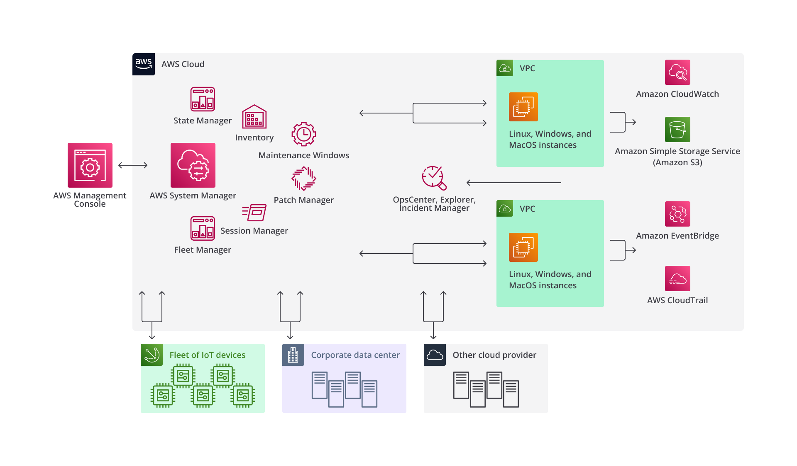
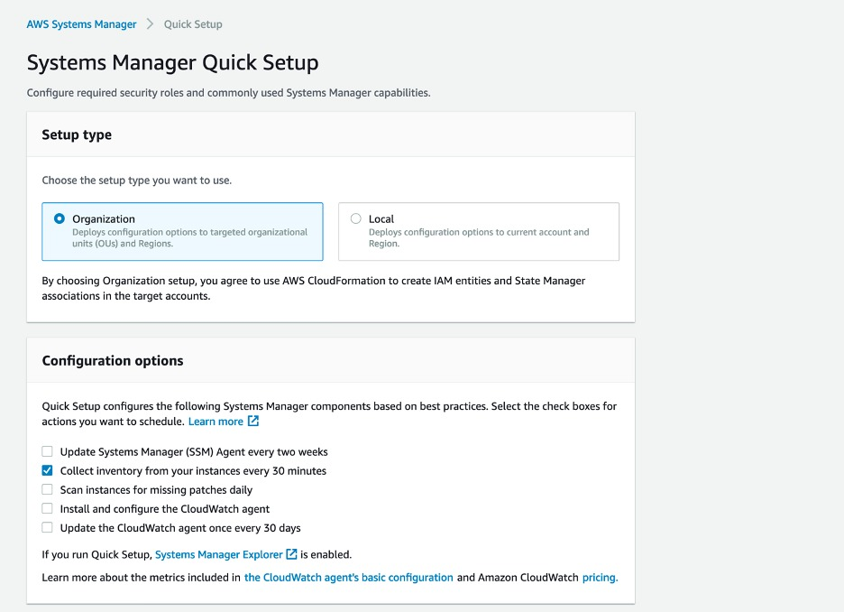

https://www.dicoding.com/academies/428/tutorials/24915?from=24910

# Mengontrol Infrastruktur dengan AWS Systems Manager
- AWS Systems Manager sejatinya adalah kumpulan tools yang dapat membantu Anda untuk mengelola atau mengontrol aplikasi dan infrastruktur yang berjalan di AWS Cloud.
- Layanan ini mampu menyederhanakan manajemen aplikasi dan AWS resources, mempersingkat waktu untuk mendeteksi dan menyelesaikan masalah operasional, serta membantu mengelola AWS resources dengan aman dalam skala besar.
  
- Jika kita berbicara soal AWS resources, layanan ini adalah pusat operasinya. Anda dapat melihat data operasional dari beberapa layanan AWS dan mengotomatiskan tugas operasional untuk seluruh layanan tersebut. 
- Layanan ini dapat membantu Anda untuk menjaga security (keamanan) dan compliance (kepatuhan) dengan memindai instance, kemudian melaporkan atau mengambil tindakan tertentu untuk setiap pelanggaran policy (kebijakan) yang terdeteksi. 
- Apabila Anda memiliki sekumpulan/armada EC2 instance, sudah pasti AWS Systems Manager adalah layanan yang sepatutnya Anda miliki. Pasalnya, ia dapat meringankan beban Anda dalam mengurus instance. Banyak hal yang bisa Anda lakukan dengan AWS Systems Manager. 
- AWS Systems Manager mengelompokkan fitur/kemampuan ke dalam beberapa kategori, yakni Quick Setup, Operations Management, Application Management, Change Management, Node Management, dan Shared Resources.

---
## Quick Setup
- Jika Anda ingin mengonfigurasi layanan dan fitur AWS dengan praktik terbaik yang disarankan, Quick Setup adalah solusinya.
- Fitur ini menyederhanakan pengaturan layanan, termasuk AWS Systems Manager, dengan mengotomatiskan tugas-tugas umum, 
  - contohnya adalah menginstal dan mengonfigurasi CloudWatch agent, memperbarui SSM agent setiap dua minggu, melakukan pemindaian patch secara berkala, dan sebagainya.
    

---
## Operations Management
- Kategori ini menawarkan banyak fitur seperti Incident Manager, Explorer, Ops Center, dan CloudWatch Dashboards. Mari bahas satu per satu.

### Incident Manager
- Incident Manager adalah sebuah fitur untuk pengelolaan incident (insiden) yang membantu pengguna dalam mitigasi insiden yang memengaruhi aplikasi.
- Incident Manager meningkatkan resolusi insiden dengan memberi tahu responden tentang dampak, menyoroti data terkait pemecahan masalah yang relevan, dan menyediakan tools kolaborasi untuk membuat layanan kembali aktif dan berjalan.

### Explorer
- Explorer merupakan sebuah dashboard operasi yang dapat dikustomisasi untuk mendapatkan laporan informasi tentang AWS resources.
- Explorer menampilkan agregat operations data (OpsData) baik untuk akun AWS Anda maupun di seluruh AWS Region.
- Di Explorer, OpsData menyertakan metadata tentang instance, detail terkait patch compliance, dan operational items (OpsItems).

### OpsCenter
- OpsCenter menyediakan lokasi terpusat agar kita bisa mengamati, menginvestigasi, dan menyelesaikan operational items (OpsItems) yang relevan dengan AWS resources.
- Fitur ini dirancang untuk mengurangi waktu rata-rata dalam menyelesaikan masalah yang memengaruhi AWS resources.

### CloudWatch Dashboards
- CloudWatch dashboard adalah halaman pada CloudWatch console yang dapat Anda gunakan untuk memantau AWS resources dalam satu tampilan.
- Anda bisa menggunakan fitur ini untuk membuat tampilan yang memuat metrik dan alarm untuk AWS resources Anda.

---
## Application Management
- Beberapa fitur utama pada kategori Application Management antara lain: Application Manager, AppConfig, dan Parameter Store. Yuk, kita ulik satu per satu.

### Application Manager
- Application Manager dapat membantu Anda untuk menyelidiki dan memperbaiki masalah yang ada pada AWS resources dalam konteks application dan cluster. 
- Dalam nomenklatur Application Manager, application adalah sebuah grup yang berisi AWS resources yang ingin Anda operasikan sebagai satu unit. Sementara itu, cluster merupakan sebuah container cluster termasuk Amazon EKS cluster dan Amazon ECS cluster.

### AppConfig
- AppConfig dapat membantu Anda untuk membuat, mengelola, dan men-deploy konfigurasi aplikasi dan feature flag.

### Parameter Store
- Parameter Store menyediakan penyimpanan hierarkis yang aman untuk data konfigurasi dan manajemen secrets (objek yang berisi sejumlah data sensitif).

---
## Change Management
### Change Manager
- Change Manager adalah sebuah framework (kerangka kerja) untuk change management (manajemen perubahan) yang bisa digunakan dalam rangka meminta, menyetujui, menerapkan, dan melaporkan perubahan operasional pada konfigurasi aplikasi dan infrastruktur.

### Automation
- Anda bisa menggunakan fitur Automation untuk mengotomatiskan tugas yang berkaitan dengan common maintenance (pemeliharaan umum) dan deployment.
- Banyak hal yang bisa Anda lakukan dengan Automation, antara lain membuat dan memperbarui AMI, menerapkan pembaruan untuk driver dan agent, mereset password pada Windows Server instance, mereset SSH key pada Linux instance, dan menerapkan OS patch atau pembaruan aplikasi.

### Change Calendar
- Fitur ini membantu Anda dalam menentukan periode waktu (dengan mengatur rentang tanggal dan waktu) untuk mengizinkan atau memblokir tindakan perubahan konfigurasi pada AWS resources.
- Terdapat dua tipe Change Calendar yang berbeda, yakni
  - Open by default: Mengembalikan status OPEN secara default; dan status CLOSED jika memiliki event (peristiwa) yang jatuh pada periode waktu yang diminta.
  - Closed by default: Mengembalikan status CLOSED secara default; dan status OPEN jika memiliki event (peristiwa) selama periode waktu yang dipilih.

### Maintenance Windows
- Gunakan Maintenance Windows ketika mengatur jadwal yang berulang untuk menjalankan tugas administratif seperti menginstal patch dan pembaruan tanpa mengganggu operasional bisnis.

---
## Node Management
- Kategori ini memiliki banyak sekali fitur di dalamnya seperti Compliance, Fleet Manager, Inventory, Session Manager, Run Command, State Manager, Patch Manager, Distributor, dan Hybrid Activations.

### Compliance
- Gunakan fitur ini jika Anda ingin memindai sekumpulan managed node (yakni segala mesin yang dikonfigurasi untuk AWS Systems Manager, mencakup EC2 instance, edge devices, VM di cloud provider lain, dan on-premise server) untuk mengetahui patch compliance dan inkonsistensi konfigurasi.
- Secara default, fitur Compliance menampilkan data mengenai Patch Manager patching dan State Manager associations. Meski demikian, Anda juga dapat menyesuaikannya dengan membuat tipe compliance sendiri berdasarkan kebutuhan IT dan bisnis.

### Fleet Manager
- Fleet Manager merupakan UI (user interface) terpadu yang membantu Anda dalam mengelola node dari jarak jauh. Dengan Fleet Manager, Anda dapat melihat status terkait health (kesehatan) dan performance (kinerja) dari seluruh fleet/armada/kumpulan node Anda melalui satu halaman.

### Inventory
- Fitur ini mampu mengotomatiskan proses pengumpulan software inventory (metadata tentang aplikasi, file, komponen, patch, dan lainnya) dari managed node.

### Session Manager
- Anda bisa menggunakan Session Manager untuk mengelola edge devices dan EC2 instance melalui shell interaktif berbasis browser atau melalui AWS CLI dengan aman tanpa perlu membuka inbound port, membuat bastion host, atau mengurus SSH keys.

### Run Command
- Sebagaimana namanya, fitur ini digunakan untuk menjalankan perintah untuk mengelola konfigurasi managed node dari jarak jauh (secara remote) dalam skala besar.
- Dengan fitur ini, Anda bisa memperbarui aplikasi, menyesuaikan time zone pada setiap instance, membersihkan berkas log lawas, menjalankan Linux shell script, menjalankan Windows PowerShell command, dsb.
- pada sekumpulan target, baik lusinan bahkan hingga ratusan managed node.
- Anda dapat melakukan berbagai hal menggunakan Run Command tanpa perlu terhubung ke instance melalui SSH atau bastion host.
- Instance tujuan tempat perintah akan dijalankan oleh Run Command disebut dengan Targets, ia bisa berupa grup berisi instance dengan tag tertentu, manual instance (di mana Anda perlu memberikan instance ID secara spesifik), atau resource group ( sekumpulan resource tempat Anda dapat menambahkan instance secara manual).

### State Manager
- State Manager berfungsi untuk menjaga managed node supaya tetap dalam status yang Anda tentukan (desired/defined state). 
- Contohnya, Anda dapat menggunakan State Manager untuk menjamin bahwa managed node hanya menjalankan perangkat lunak tertentu, 
- di-patch dengan software update tertentu saja, mengonfigurasi pengaturan jaringan, atau menggabungkan managed node dalam sebuah Active Directory domain.

### Patch Manager
- Fitur ini mampu mengotomatiskan proses patching untuk managed node dengan pembaruan terkait keamanan dan jenis pembaruan lainnya seperti sistem operasi dan aplikasi, baik satu per satu ataupun sekumpulan managed node menggunakan tag.

### Distributor
- Gunakan fitur Distributor bila Anda ingin membuat dan men-deploy package ke managed node. Dengan Distributor, Anda dapat mengemas perangkat lunak Anda sendiri untuk menginstalnya pada managed node. 
- Setelah Anda menginstal package untuk pertama kalinya, Anda dapat menggunakan Distributor untuk menghapus (uninstall) dan menginstal ulang (reinstall) versi package baru, atau menimpanya dengan berkas baru.

### Hybrid Activations
- Dalam rangka menyiapkan server dan VM pada on-premise sebagai managed node (untuk menciptakan hybrid environment), Anda harus melakukan aktivasi terlebih dahulu. Setelah menyelesaikan proses aktivasi, Anda akan menerima Activation Code dan Activation ID.

---
## Shared Resources
- Kategori shared resources saat ini hanya memiliki satu fitur utama: Systems Manager document (SSM documents).
- Fitur ini mendefinisikan berbagai tindakan yang dilakukan AWS Systems Manager.
- SSM documents punya beberapa tipe, termasuk Command document (yang digunakan oleh State Manager dan Run Command–nanti dibahas) dan Automation runbooks (yang digunakan oleh Systems Manager Automation).