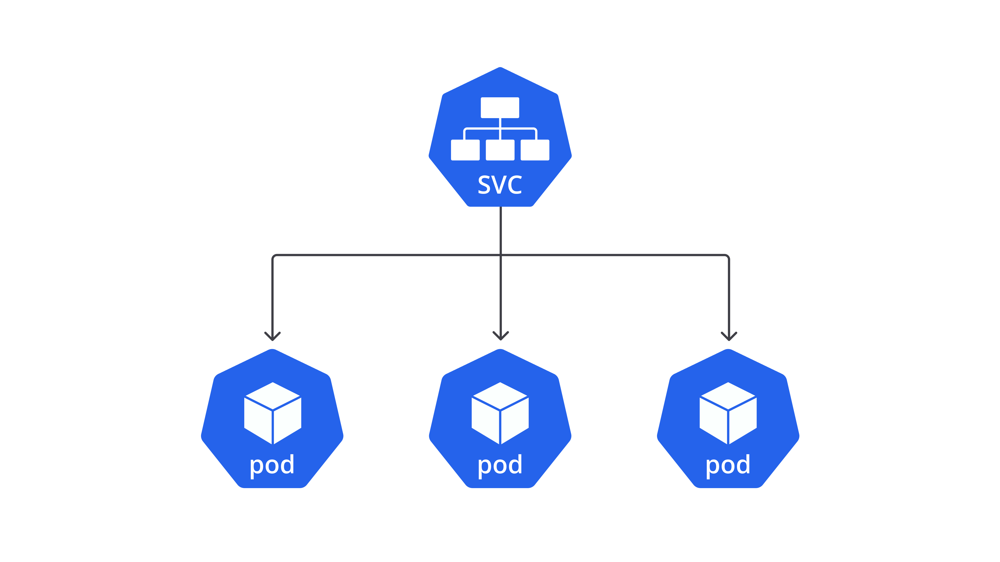
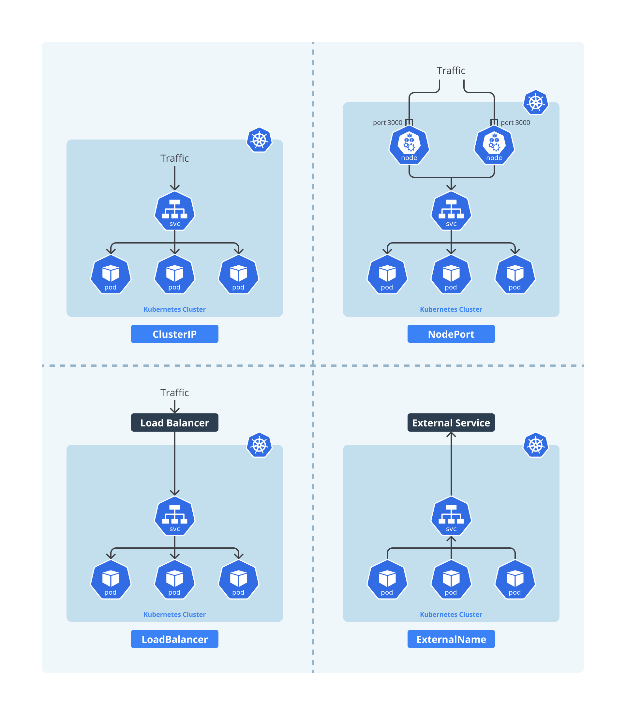
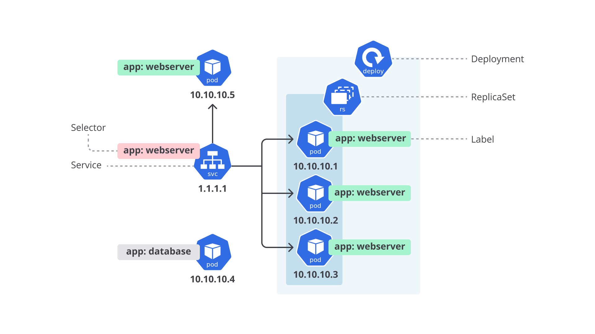

# Berinteraksi dengan Kubernetes Object: Service

Pada materi sebelumnya, kita telah berhasil menjalankan Pod dengan NGINX web server. Namun, akses ke aplikasi ini masih terbatas, hanya bisa dilakukan dari dalam Pod itu sendiri. Ini tentu tidak ideal untuk lingkungan produksi.

## Permasalahan IP Address pada Pod

Kubernetes melakukan restart pada Pod jika terjadi masalah, seperti Pod atau Node down. Saat restart, IP address Pod bisa berubah. Ini menjadi tantangan besar, terutama jika:
- Aplikasi frontend ingin mengakses backend,
- Jumlah Pod berubah karena scaling,
- IP address Pod tidak stabil.



## Solusi: Kubernetes Service

Untuk mengatasi masalah ini, Kubernetes menyediakan object bernama **Service**, yang bertugas:
- Mengekspos aplikasi dari satu atau lebih Pod sebagai sebuah layanan jaringan,
- Memberikan IP address tetap (static IP),
- Melakukan **load balancing**,
- Menyediakan **service discovery** (pencarian layanan secara dinamis berdasarkan label).

## Tipe-Tipe Service di Kubernetes

| Tipe         | Penjelasan |
|--------------|------------|
| **ClusterIP** | Default. Mengekspos layanan ke internal Cluster saja. |
| **NodePort** | Mengekspos layanan lewat IP Node dan port tetap (range 30000-32767). Dapat diakses dari luar Cluster. |
| **LoadBalancer** | Menggunakan load balancer eksternal. Cocok untuk Cloud Provider. |
| **ExternalName** | Memetakan Service ke DNS name eksternal (mengembalikan CNAME). |





## Cara Kerja Service

Service menggunakan **selector** untuk mengidentifikasi Pod berdasarkan **label**. Contohnya:
```yaml
selector:
  app: webserver
```
Dengan ini, semua Pod dengan label `app=webserver` akan diasosiasikan dengan Service.

## Contoh Penerapan: Membuat Service untuk NGINX Pod

Buat file `service.yaml`:
```yaml
apiVersion: v1
kind: Service
metadata:
  labels:
    app: webserver
  name: webserver
spec:
  ports:
  - port: 80
  selector:
    app: webserver
  type: NodePort
```

Deploy dengan:
```bash
kubectl apply -f service.yaml
```

Periksa daftar Service:
```bash
kubectl get service
```
Contoh output:
```
NAME         TYPE        CLUSTER-IP     EXTERNAL-IP   PORT(S)        AGE
kubernetes   ClusterIP   10.96.0.1      <none>        443/TCP        23h
webserver    NodePort    10.109.31.27   <none>        80:32599/TCP   45s
```

## Memeriksa Detail Service
```bash
kubectl describe service webserver
```
Amati bagian penting seperti:
- `NodePort`: Port yang digunakan untuk akses dari luar
- `Endpoints`: IP dan port Pod yang terasosiasi

## Mengakses Aplikasi dari Host

Untuk mengakses aplikasi via browser atau `curl`, gunakan format:
```
http://<NodeIP>:<NodePort>
```
Cara mendapatkan IP Node:
```bash
minikube ip
```
Contoh:
```bash
curl http://192.168.39.189:32599
```

### Catatan untuk Pengguna Windows
Gunakan:
```bash
minikube service webserver --url
```

## Kesimpulan

Dengan Service tipe NodePort, kita:
- Menghubungkan aplikasi ke dunia luar,
- Menyediakan static IP dan port akses,
- Mendapat fleksibilitas untuk load balancing dan service discovery.

Lanjut ke object Kubernetes lainnya untuk membangun sistem yang scalable dan resilient!