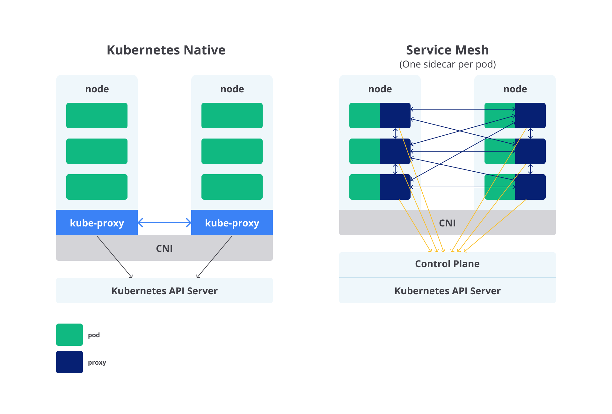

## Pengenalan Service Mesh

Terima kasih sudah berjuang sampai sejauh ini. Anda telah menempuh perjalanan yang begitu panjang di kelas ini hingga akhirnya berlabuh di materi tentang Service Mesh. Proyek submission sebelumnya telah membuktikan bahwa Anda menguasai cara deploy aplikasi menggunakan Kubernetes. Namun, itu bukan akhir. Sejatinya, ilmu microservices masihlah luas. Tak cukup bila kita hanya belajar dasar-dasar Kubernetes saja. Microservices ibarat danau yang kita kira dangkal, padahal sesungguhnya di dalamnya tersua ekosistem biota yang beragam.

Maka dari itu, kita akan menjajal konsep-konsep lain yang sering dijumpai pada arsitektur microservices, salah satunya adalah service mesh. Mari kita menyelam lebih dalam untuk mengetahui alasan kita perlu belajar soal ini.

## Latar Belakang Lahirnya Service Mesh

Aplikasi modern saat ini seringnya dirancang sebagai kumpulan "services" atau layanan berukuran kecil yang terdistribusi a.k.a microservices, di mana masing-masing service tersebut umumnya menjalankan fungsi bisnis tertentu.

Implementasi arsitektur microservices ini biasanya memanfaatkan teknologi container orchestrator (sudah dibahas sebelumnya) dalam mengatur services yang terdistribusi tersebut, dalam kelas ini kita menggunakan sistem Kubernetes.

Secara praktik, mula-mula perusahaan hanya memiliki services dalam hitungan jari. Ketika bisnis mereka makin berkembang, services yang ada pun kian bertambah. Saat kumpulan services ini tak terkontrol jumlahnya, pengelolaannya pun menjadi pelik.

Dengan ramainya services yang ada, Anda pasti memerlukan cara untuk service discovery (cara suatu service mendeteksi menemukan service lain via jaringan, biasanya melalui DNS lookup), load balancing (menyeimbangkan beban traffic yang masuk di antara services), failure recovery (pulih dengan cepat dari suatu kegagalan), serta monitoring (pemantauan sistem).

Mari kita ambil contoh lain. Dalam arsitektur microservices, setiap service umumnya bergantung pada service lain untuk memberikan apa yang diinginkan pengguna. Misalnya, bila pengguna aplikasi e-commerce ingin membeli sesuatu, mereka perlu mengetahui apakah barang tersebut tersedia.

Dalam kasus ini, Inventory Service yang berkomunikasi dengan Inventory DB perlu berkomunikasi dengan Product Service yang mana dirinya juga perlu berkomunikasi dengan Cart Service.

Untuk menambah nilai bisnis, perusahaan mungkin pada akhirnya akan membuat Recommendation Service yang memberikan rekomendasi produk dalam aplikasi kepada pengguna.

Secara prosedur, service baru ini akan berkomunikasi dengan Product DB dan Inventory DB untuk membuat rekomendasi. Intinya, untuk menjalankan fungsinya, satu service mungkin perlu meminta data dari beberapa service lainnya. Nah, jika proses komunikasi ini tidak diatur dengan baik, Anda akan dibuat ruwet.

Sebabnya, lahirlah teknologi service mesh yang dapat menjawab permasalahan itu semua.

## Pengertian Service Mesh

Service mesh adalah sebuah dedicated infrastructure layer (lapisan infrastruktur khusus) yang dapat Anda tambahkan ke aplikasi untuk menambah kemampuan untuk observability (transparansi untuk memahami perilaku dan kinerja sistem), traffic management (pengaturan lalu lintas jaringan, contohnya merutekan permintaan pengguna dari satu service ke service berikutnya), dan security (perlindungan keamanan).

Tak hanya itu, service mesh juga dapat menangani hal-hal lain yang lebih kompleks seperti berikut:

- **A/B testing**: metode pengujian untuk membandingkan dua versi aplikasi untuk menentukan mana yang lebih baik berdasarkan metric tertentu.
- **Canary deployment**: pola deployment untuk meluncurkan fitur baru ke sejumlah pengguna.
- **Rate limiting**: strategi untuk membatasi lalu lintas jaringan.
- **Access control**: teknik keamanan untuk mengatur entitas mana yang dapat mengakses suatu sumber daya.
- **Encryption**: cara untuk menyembunyikan informasi dengan mengubahnya sehingga tampak seperti data acak.
- **Authentication**: proses untuk memverifikasi suatu entitas.

Nah, dengan memanfaatkan service mesh, mengelola arsitektur microservices menjadi lebih mudah dan tak sesukar yang dibayangkan. Service mesh dapat membantu Anda untuk mengatur komunikasi antar services dengan baik dan efektif.

Salah satu kasusnya adalah untuk mengontrol proses dari satu service (bagian aplikasi) berbagi data dengan service yang lain. Service mesh dapat mendokumentasikan seberapa baik (atau tidak) bagian-bagian yang berbeda dari suatu aplikasi saling berinteraksi satu sama lain. Dengan begini, Anda bisa dengan mudah menemukan service mana yang harus diperbaiki agar proses komunikasi menjadi lebih optimal.

Anda mungkin punya pertanyaan yang mengganjal di pikiran, "Bukankah kita bisa menulis kode sendiri untuk mengatur komunikasi secara langsung ke tiap services yang diinginkan?" Oke, begini. Betul, Anda tentu saja bisa menulis kode sendiri untuk mengelola komunikasi di dalam arsitektur microservices, tanpa perlu bantuan service mesh.

Namun, sekali lagi, seiring bertambahnya jumlah services, komunikasi akan kian kompleks. Peran dari service mesh dalam kasus tersebut sangat membantu karena ia dapat mengabstraksikan proses tersebut (tanpa perlu menulis kode mandiri) ke dalam dedicated infrastructure layer (lapisan infrastruktur khusus) menggunakan sebuah proxy instance bernama sidecar proxy yang berjalan berdampingan pada tiap services.

Saat service mesh diimplementasikan, semua komunikasi antar services dialihkan melalui sidecar proxy (sehingga sidecar proxy akan berkomunikasi dengan sidecar proxy yang lain). Anda bisa memanfaatkan sidecar proxy tersebut untuk mengatur traffic yang masuk dan keluar dari service. Kita akan bahas soal itu lebih dalam nanti.

## Hubungan Antara Kubernetes dan Service Mesh

Pada dasarnya, Kubernetes bertugas untuk mengelola siklus hidup container yang menjalankan aplikasi melalui konfigurasi deklaratif, sedangkan service mesh berfungsi untuk mengelola lalu lintas antar services, manajemen keamanan, dan kemampuan observasi.

Jika Anda sudah memiliki platform aplikasi yang mapan menggunakan Kubernetes, bagaimana Anda mengatur proses load balancing dan traffic control untuk panggilan antar services? Nah, di situasi inilah service mesh berperan untuk mengisi kekosongan yang tidak dipunyai oleh Kubernetes. Dalam kata lain, service mesh adalah pelengkap Kubernetes.

Diagram berikut ini memvisualisasikan perbedaan pengaksesan service di Kubernetes native dan service mesh (satu sidecar proxy per pod).

---

## Keunggulan dan Tantangan Service Mesh

Sekarang Anda sudah memahami tentang service mesh, baik dari latar belakangnya, pengertiannya, hingga hubungannya dengan Kubernetes. Sebelum kita masuk lebih dalam, hal lain yang perlu Anda ketahui dari service mesh adalah tentang manfaat dan tantangan yang melekat padanya.

Keunggulan Service Mesh
Adapun manfaat yang akan didapatkan saat menggunakan service mesh adalah sebagai berikut.

**Increased interoperability**
Hadirnya service mesh dapat memperluas fungsionalitas fitur routing (perutean) pada arsitektur microservices untuk mendukung berbagai kode aplikasi yang disuguhkan ke pengguna web, mobile, dan SaaS (Software as a Service).

**Improve system reliability**
Service mesh bisa membantu meningkatkan keandalan sistem. Dengan mentransfer permasalahan fault tolerance ke service mesh, tiap service dapat lebih fokus pada logika bisnisnya. Service mesh menangani retrying request secara transparan, menerapkan timeout, dan melindungi sistem dari overload dengan teknik seperti circuit breaking.

**Enhanced service discovery**
Dalam arsitektur microservices, services perlu menemukan satu sama lain. Service mesh menyediakan discovery layer yang mempermudah komunikasi antar services melalui pendaftaran dan pencarian berdasarkan nama.

**Load balancing more flexible**
Service mesh memungkinkan auto scaling secara independen dan transparan, serta menyediakan berbagai algoritma load balancing seperti round-robin, weighted routing, dan least requests.

**Rich of routing rules**
Service mesh mendukung routing canggih seperti A/B testing dan canary deployment. Routing dapat dikonfigurasi berdasarkan header, versi, atau kriteria khusus lainnya.

**Detailed real-time monitoring and analytics**
Service mesh meningkatkan observabilitas dengan memantau aktivitas jaringan secara real-time, memberikan data detail dari backend dan web server.

**Enhance observability**
Sidecar proxy menyediakan metrics seperti request latency dan error counts, serta menghasilkan traces untuk visibilitas terhadap request yang diproses oleh sistem.

**Powerful automation of web and mobile scripts**
Developer dapat membuat script berbasis YAML (seperti Vagrant, Jenkins, Puppet, Chef) untuk mengelola service mesh, cocok untuk mendukung aplikasi SaaS yang kompleks.

**Increased security**
Dengan kontrol terpusat, policy bisa diterapkan secara global untuk semua services. Service mesh mendukung model zero trust, mengenkripsi komunikasi antar services (mTLS), serta mengontrol autentikasi dan akses untuk menghindari impersonation dan sniffing.

**Safe Rollout of Deployments**
Service mesh memungkinkan blue/green deployment, sehingga update aplikasi bisa dilakukan dengan aman tanpa mengganggu layanan yang sudah berjalan.

Tantangan Service Mesh
Berikut beberapa tantangan yang dihadapi saat menggunakan service mesh.

**Added complexity**
Menambahkan layer service mesh ke sistem akan meningkatkan kompleksitas, termasuk komponen seperti control plane dan sidecar proxy yang harus dikelola.

**More resource consumption**
Sidecar proxy yang berjalan di tiap service membutuhkan CPU dan memori tambahan. Semakin banyak service, semakin besar resource yang dikonsumsi.

**Security loopholes**
Bug atau konfigurasi yang salah pada service mesh bisa membuka celah keamanan, misalnya mengekspos services sensitif ke internet.

**Slower debugging**
Tambahan layer proxy memperbanyak network hops, menyulitkan debugging, terutama dalam melacak masalah jaringan.

Dengan memahami baik manfaat maupun tantangannya, Anda bisa membuat keputusan yang objektif dalam mengadopsi service mesh. Pastikan teknologi ini memang cocok dengan kebutuhan dan kompleksitas sistem yang Anda kelola.