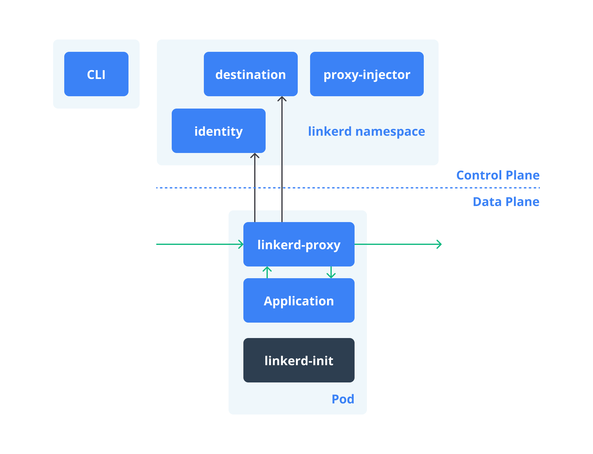
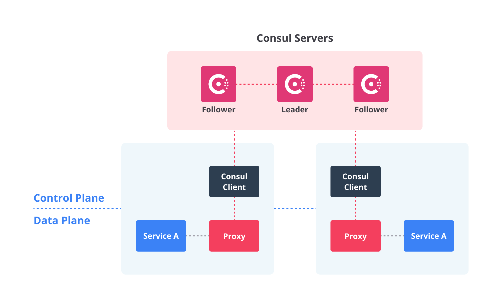
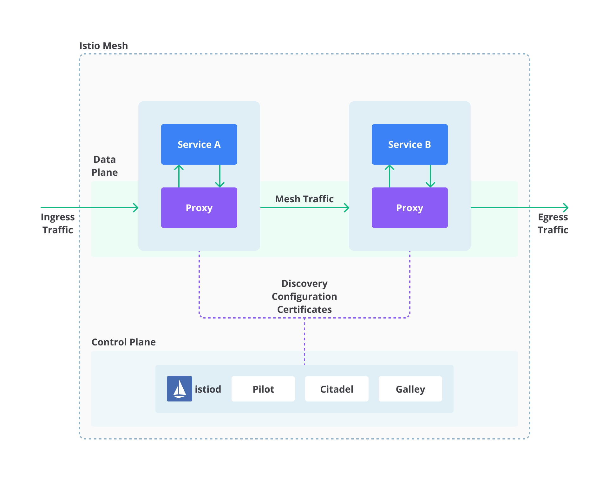

## Cara Kerja Service Mesh
Setelah mengenal service mesh serta mengetahui keunggulan dan tantangannya, sekarang mari kita sibak area yang lebih dalam. Untuk lihai menggunakan service mesh, Anda harus tahu dulu bagaimana service mesh bekerja.

Sebenarnya, service mesh tidak memperkenalkan hal yang baru ke dalam kode aplikasi Anda. Dengan kata lain, umumnya Anda tak perlu banyak mengubah/menambah kode aplikasi. Seperti yang kita tahu bahwa setiap aplikasi–dalam arsitektur apa pun–pasti membutuhkan suatu aturan untuk menentukan bagaimana sebuah request berpindah dari titik A ke titik B. Lantas, apa yang service mesh datangkan? Apa yang berbeda dengan hadirnya service mesh?

Pada dasarnya, service mesh akan mengabstraksikan logika komunikasi service-to-service dari aplikasi Anda. Jadi, alih-alih kita menuliskan kode yang mengatur proses komunikasi dari satu service ke service lainnya di dalam tiap-tiap service, kita dapat menyerahkan fungsionalitas tersebut ke service mesh. Dalam artian, kita memindahkan proses tersebut dari domain aplikasi ke domain infrastruktur.

Namun, bagaimana caranya? Nah, untuk melakukan ini, service mesh masuk ke dalam aplikasi sebagai sebuah sekumpulan network proxy. Bila Anda belum familier, proxy seyogyanya merupakan konsep yang umum di perusahaan IT–jika Anda mengakses materi ini dari komputer atau jaringan kantor, ada kemungkinan Anda baru saja menggunakan proxy.

Pengenalan Proxy
Mari kita bahas proxy lebih lanjut sebelum memahami cara kerja service mesh. Berikut adalah konsep umum dari sebuah proxy.

Katakanlah Anda saat ini tengah menggunakan komputer dan jaringan yang sudah menggunakan proxy. Saat Anda melakukan request (misal, membuka halaman www.dicoding.com), request tersebut pertama kali akan diterima oleh web proxy milik perusahaan.
Setelah melewati pengecekan keamanan oleh web proxy, request dari Anda kemudian dikirim ke server yang hosting (menjalankan) www.dicoding.com.
Selanjutnya, server akan memberikan respons berupa konten www.dicoding.com (yang akan dimuat oleh web browser Anda) kepada web proxy dan kemudian dilakukan pengecekan keamanan kembali.
Terakhir, barulah konten www.dicoding.com tadi dikirim dari web proxy kepada Anda (ditampilkan oleh web browser).
Seperti inilah gambaran besar proses komunikasi antara client dan server yang menggunakan web proxy.

Nah, konsep semacam ini mirip saat kita menggunakan service mesh. Hanya saja, mungkin tampak lebih “canggih”.

Konsep Sidecar Proxy pada Service Mesh
Jadi, ketika kita memanfaatkan service mesh, request yang masuk dan keluar di antara services dialihkan melalui proxy. Setiap proxy akan berjalan berdampingan pada tiap services yang Anda miliki. Ingat baik-baik, kumpulan proxy ini berjalan berdampingan di tiap services, bukan berada di dalam services. Itulah alasan mengapa proxy ini disebut sebagai sidecar proxy.

Secara bersamaan, sidecar proxy ini membentuk sebuah mesh network.

Arsitektur Service Mesh
Sekarang mari ubah pandangan kita menjadi lebih luas untuk melihat implementasi arsitektur service mesh.

Service mesh umumnya memiliki dua komponen utama, yakni data plane dan control plane. Sebagaimana tertuang pada namanya, data plane menangani forwarding (penerusan) lalu lintas jaringan, sedangkan control plane menyediakan konfigurasi dan koordinasi. Mari kita lihat lebih detail.

Data Plane
Dalam arsitektur service mesh, data plane merujuk pada network proxy yang berjalan berdampingan di tiap services (disebut sidecar proxy). Itu artinya, dalam sistem Kubernetes, service dan sidecar proxy harus di-deploy di pod yang sama.

Seperti yang kita bahas sebelumnya, sidecar proxy ini bertugas untuk mengelola semua lalu lintas jaringan yang masuk dan keluar pada service yang ia dampingi. Selain itu, sidecar proxy pun dapat melakukan berbagai fungsi, seperti service discovery, load balancing, encryption, rate limiting, authentication/authorization, dan logging/tracing.

Data plane itu sendiri pada dasarnya terdiri dari sekumpulan services yang berjalan berdampingan bersama sidecar proxy. Si service bertugas mengolah business logic (logika bisnis), sementara sang sidecar proxy berada di masing-masing service untuk merutekan (routing/proxying) traffic ke service yang lain.

Dengan begini, business/application logic dapat terpisahkan dari network communication logic sehingga Developer tak perlu khawatir tentang kompleksitas komunikasi dengan jaringan yang lebih luas dalam arsitektur microservices. Sebuah service hanya perlu berkomunikasi dengan sidecar proxy yang ada di sebelahnya saja secara lokal (melalui localhost).

Control Plane
Sidecar proxy yang berada di tiap services tentunya mesti dikelola dan dikonfigurasi. Coba bayangkan, pada sistem berbasis microservices, tak ayal acapkali mempunyai puluhan, ratusan, hingga ribuan service. Bahkan, tiap service tersebut sering kali direplikasi berkali lipat untuk mengimbangi request pengguna supaya tetap berkinerja dan andal. Itu berarti, jumlah sidecar proxy juga berbanding lurus dengan jumlah service yang ada. Bila ada ribuan service, akan ada ribuan sidecar proxy.

Maka dari itu, kita butuh komponen yang dapat mengelola sidecar proxy yang bertebaran di setiap service. Nah, hal ini dapat dilakukan melalui komponen yang disebut control plane. Ia terdiri dari beberapa services yang menyediakan fungsionalitas administratif terhadap service mesh. Selain itu, control plane juga menyuguhkan antarmuka yang dapat digunakan untuk mengonfigurasi perilaku data plane dan mengoordinasikan tindakan sidecar proxy.

Kita bisa berinteraksi dengan service mesh melalui control plane menggunakan CLI atau API. Sebagai contoh, kita bisa bekerja melalui control plane untuk mendefinisikan routing rules, membuat circuit breaker, atau menegakkan access control. Bahkan, Anda juga bisa memanfaatkan control plane untuk perihal observability, seperti mengekspor data metric, log, dan trace.

---

## Opsi Service Mesh

Kita sudah khatam seluk-beluk service mesh, mulai dari pengertian, keunggulan dan tantangan, hingga cara kerjanya. Kini, saatnya kita telisik berbagai opsi service mesh populer yang bisa digunakan.

Secara umum, konsep dan cara kerja dari berbagai produk service mesh itu mirip. Hanya saja, mungkin masing-masing produk memiliki nomenklatur yang berbeda-beda. Dari banyaknya produk yang tersedia, materi ini hanya akan membeberkan beberapa di antaranya saja. Yuk, kita mulai dari yang pertama.

---

### Linkerd

Pada dasarnya, Linkerd adalah sebuah produk service mesh untuk aplikasi yang menggunakan sistem Kubernetes. Linkerd termasuk salah satu produk service mesh kondang yang kerap ditemukan di berbagai perusahaan ternama.

Pangkasnya, Linkerd membuat services yang berjalan lebih mudah dan lebih aman untuk dikelola dengan memberi berbagai fitur canggih, seperti runtime debugging, observability, reliability, dan security–semuanya tanpa memerlukan perubahan apa pun pada kode aplikasi Anda.

Linkerd sepenuhnya open source (sumber kode terbuka), dilisensikan di bawah Apache v2. Ia juga merupakan bagian proyek dari Cloud Native Computing Foundation (CNCF).

#### Arsitektur Linkerd

Linkerd memiliki dua komponen dasar: **control plane** dan **data plane**.

Setelah komponen control plane terinstal pada Kubernetes cluster, Anda dapat menambahkan data plane ke dalam sistem. Voila! Keajaiban dari service mesh pun bisa Anda nikmati segera.

Linkerd bekerja dengan cara memasang satu set "micro-proxies" yang ringan dan transparan di sebelah tiap service instance. Proxy ini secara otomatis menangani semua lalu lintas yang masuk dan keluar dari service tersebut. Selain itu, proxy ini juga bertindak sebagai network stack yang mengirimkan telemetri ke–dan menerima sinyal kontrol dari–control plane.

---

### Consul Connect

Consul Connect (sering disebut juga sebagai Consul Service Mesh) merupakan solusi service mesh dari Hashicorp. Produk ini menyediakan otorisasi untuk koneksi service-to-service dan enkripsi menggunakan mutual Transport Layer Security (mTLS).

Consul mulanya dirancang untuk solusi service discovery. Namun, kini dikembangkan sedemikian rupa sehingga hadir Consul Connect yang merupakan service mesh yang di-deploy di atas Consul. Kini Consul Connect menawarkan fitur-fitur seperti configuration synchronization dan failure detection.

#### Arsitektur Consul Connect

Consul Connect juga memiliki dua komponen dasar: **control plane** dan **data plane**.

Control plane memungkinkan Anda untuk mendaftar, melakukan kueri, dan mengamankan service yang di-deploy di seluruh jaringan. Data plane berinteraksi melalui proxy untuk memproses permintaan data. Aplikasi Anda akan berdampingan dengan proxy guna membuat koneksi TLS untuk koneksi masuk dan keluar.

Salah satu manfaat utama dari penggunaan Consul Connect adalah antarmuka yang seragam dan konsisten untuk semua services di jaringan Anda, terlepas dari bahasa pemrograman dan framework yang digunakan.

Consul Connect juga mendukung pengumpulan metric pada layer 7 dan ekspor ke tools seperti Prometheus untuk observabilitas.

---

### Istio

Opsi solusi service mesh terakhir yang akan kita bahas di materi ini adalah **Istio**. Save the best for last!

Istio adalah salah satu solusi open source kawakan di dunia service mesh, terutama untuk sistem Kubernetes. Istio dikembangkan oleh Google, IBM, dan Lyft. Istio menggunakan Envoy sebagai proxy utama dan Jaeger untuk tracing.

#### Fitur Istio

- Komunikasi antar service dalam cluster secara aman menggunakan TLS dan authentication berbasis identitas
- Load balancing otomatis untuk protokol HTTP, gRPC, WebSocket, dan TCP
- Routing rules yang kompleks untuk A/B testing, canary deployment, dan lainnya
- Dukungan policy seperti access control, rate limit, dan quota
- Observabilitas penuh dengan metric, log, dan trace otomatis

#### Arsitektur Istio

Istio memiliki dua komponen utama: **control plane** dan **data plane**.

Data plane diatur oleh Envoy proxy yang berdampingan dengan tiap service (sidecar). Control plane bertugas memprogram dan mengelola konfigurasi pada proxy-proxy tersebut.

Istio menghasilkan data telemetri dalam bentuk metric, log, dan trace untuk membantu debugging dan observasi sistem Anda.

---

Dengan mengenal tiga opsi populer ini—Linkerd, Consul Connect, dan Istio—Anda kini memiliki bekal untuk memilih solusi service mesh yang paling sesuai dengan kebutuhan dan infrastruktur Anda.