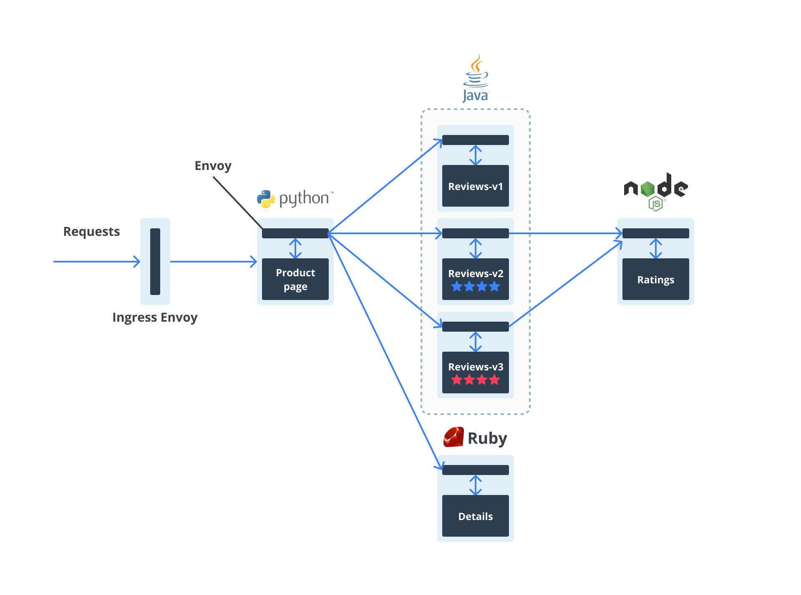

# Latihan Implementasi Service Mesh dengan Istio: Pengantar

Akhirnya kita tiba di penghujung modul Service Mesh. Usai menguasai semua teori yang diperlukan untuk mencerna service mesh, kali ini kita akan bertualang dengan praktik menggunakan Istio. Niscaya Anda akan makin memahami service mesh dan Istio selepas mengikuti latihan ini.

Jadi, kita akan menggunakan aplikasi Bookinfo untuk mendemonstrasikan beragam fitur yang dimiliki Istio. Seperti namanya, aplikasi Bookinfo ini menampilkan informasi terkait buku, seperti ISBN, jumlah halaman, review, dan sebagainya. Bisa dibilang, aplikasi ini macam toko buku online yang berisi katalog buku.

Aplikasi Bookinfo terdiri dari 4 services sebagai berikut:

- **productpage**: service ini memanggil **details** dan **reviews** service untuk mengisi informasi di halaman product.
- **details**: berisi informasi buku.
- **reviews**: berisi ulasan buku. Service ini berkomunikasi dengan **ratings** service.
- **ratings**: berisi informasi rating buku yang digunakan oleh **reviews** service.

Informasi tambahan, terkhusus untuk **reviews** service, ia memiliki 3 versi seperti berikut:

- Versi **v1** tak berkomunikasi dengan **ratings** service.
- Versi **v2** berkomunikasi dengan **ratings** service dan menampilkan rating 1-5 dalam bentuk bintang berwarna hitam.
- Versi **v3** berkomunikasi dengan **ratings** service dan menampilkan rating 1-5 dalam bentuk bintang berwarna merah.

Supaya ada gambaran, silakan Anda cermati arsitektur aplikasi Bookinfo berikut.



Perlu Anda ketahui bahwa aplikasi Bookinfo ini **polyglot**. Artinya, tiap services ditulis dalam bahasa pemrograman yang berbeda (lihat diagram arsitektur di atas), di mana:

- **productpage** menggunakan Python
- **details** memakai Ruby
- **reviews** dalam Java
- **ratings** memanfaatkan Node.js

## Berikut tahapan proses yang akan kita lalui dalam latihan ini:

1. Mengunduh dan menginstal Istio.
2. Deploy aplikasi ke Kubernetes cluster.
3. Berinteraksi dengan Istio untuk mengatur traffic ke aplikasi.

---

**Bagaimana menurut Anda? Sudah siap berpetualang bersama? Mari kita melangkah.**

---

> **Penting!**
>
> Pastikan Kubernetes cluster pada Minikube Anda dalam kondisi berjalan. Rujuk kembali ke materi ini.

---

## Latihan Implementasi Service Mesh dengan Istio: Instalasi Istio

Langkah pertama sebelum menjelajah lebih dalam adalah mengunduh dan menginstal Istio terlebih dahulu. Silakan ikuti langkah-langkah berikut.

### 1. Unduh dan Ekstrak Istio
Kunjungi halaman [Istio release](https://istio.io/latest/docs/setup/getting-started/#download) untuk mengunduh berkas instalasi sesuai OS yang Anda gunakan. Bila Anda menggunakan **Linux atau macOS**, jalankan perintah berikut untuk mengunduh (versi terbaru) dan mengekstraknya secara otomatis:

```bash
curl -L https://istio.io/downloadIstio | sh -
```

### 2. Masuk ke Direktori Istio
Beralih ke direktori Istio yang tadi diunduh (versi mungkin berbeda):

```bash
cd istio-1.17.1
```

### 3. Tambahkan `istioctl` ke PATH
Bagi pengguna Linux atau macOS, tambahkan `istioctl` (command line tool untuk mengelola deployment pada Istio service mesh) ke PATH Anda:

```bash
export PATH=$PWD/bin:$PATH
```

### 4. Instal Istio dengan Profil Demo
Instalasi menggunakan profil `demo`, cocok untuk skenario pengujian karena menyediakan fungsionalitas lengkap dengan sumber daya minimal:

```bash
istioctl install --set profile=demo -y
```

Output yang berhasil:
```
✔ Istio core installed
✔ Istiod installed
✔ Ingress gateways installed
✔ Egress gateways installed
✔ Installation complete
```

### 5. Aktifkan Sidecar Injection Otomatis
Tambahkan label pada namespace `default` agar Istio secara otomatis menyisipkan Envoy sidecar proxy saat melakukan deployment aplikasi:

```bash
kubectl label namespace default istio-injection=enabled
```

---

Mantap! Kita sudah berhasil mengunduh dan menginstal Istio. Yuk, masuk ke tahap berikutnya!