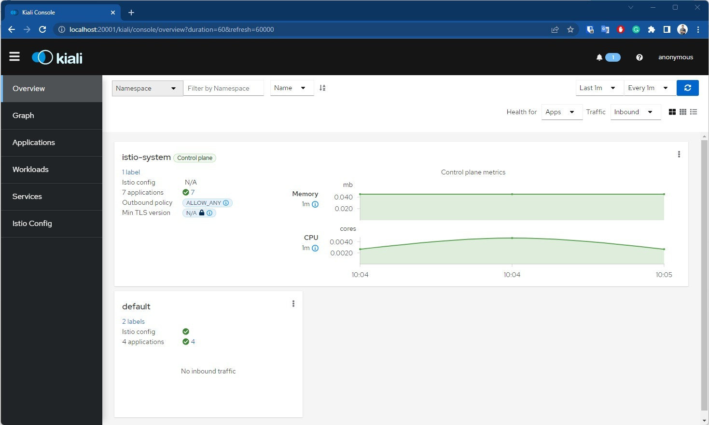
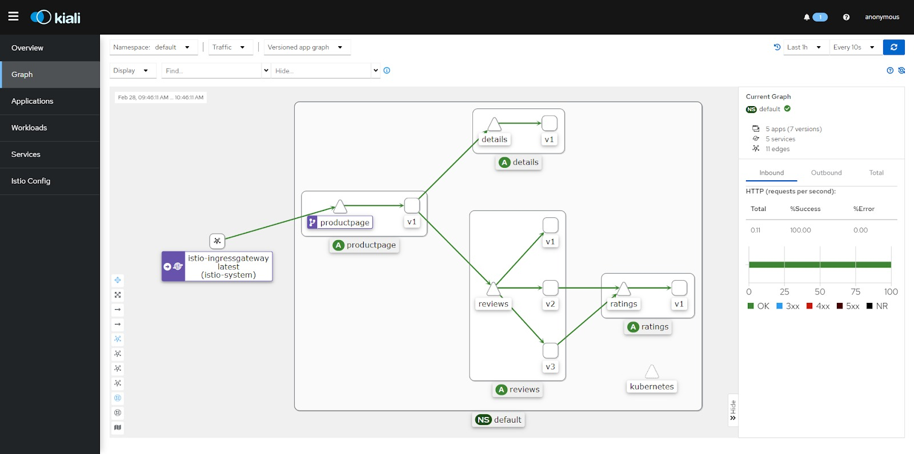
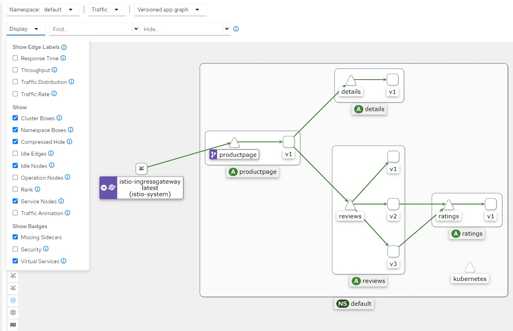

## Deploy Kiali Dashboard dan Addons Lainnya di Istio

Istio terintegrasi dengan sejumlah tools pengumpul telemetri sehingga dapat membantu Anda untuk mendapatkan wawasan tentang struktur service mesh, menampilkan topologi service mesh, dan menganalisis kondisi service mesh.

Kali ini kita akan deploy **Kiali dashboard** bersama sejumlah addons lain seperti **Prometheus**, **Grafana**, dan **Jaeger**. Mari kita mulai.

### 1. Instal Semua Addons

Jalankan perintah berikut untuk menginstal semua addons yang ada di direktori `samples/addons`:

```bash
cd /opt/istio-1.25.2/
kubectl apply -f samples/addons
```

Contoh hasil keluaran:

```
serviceaccount/grafana created
configmap/grafana created
service/grafana created
deployment.apps/grafana created
...
deployment.apps/prometheus created
```

### 2. Cek Status Rollout Kiali

Pastikan status rollout untuk Kiali sudah berhasil:

```bash
kubectl rollout status deployment/kiali -n istio-system
```

Jika berhasil, Anda akan melihat:

```
deployment "kiali" successfully rolled out
```

### 3. Akses Kiali Dashboard

Gunakan perintah berikut untuk membuka Kiali dashboard:

```bash
istioctl dashboard kiali
```

Akan terbuka browser tab baru dengan URL seperti:

```
http://localhost:20001/kiali
```

Jika tidak terbuka otomatis, akses URL tersebut secara manual di browser Anda.



### 4. Visualisasi Topologi Service Mesh

- Pilih menu **Graph** di navigasi sebelah kiri.
- Klik **Select Namespaces** dan centang `default`.
- Ubah **Traffic metrics per refresh** menjadi `Last 1h`.
- Ubah **Refresh interval** menjadi `Every 10s`.

### 5. Kirim Request untuk Menghasilkan Trace

Agar trace muncul (karena sampling rate default 1%), kita harus mengirim setidaknya 100 request:

1. Hentikan Kiali dashboard di terminal (CTRL+C).
2. Jalankan perintah berikut:

```bash
for i in $(seq 1 100); do curl -s -o /dev/null "http://$GATEWAY_URL/productpage"; done
```

3. Jalankan kembali Kiali dashboard:

```bash
istioctl dashboard kiali
```

4. Tekan tombol **refresh biru** di pojok kanan atas dashboard, atau tunggu 10 detik untuk auto-refresh.

### 6. Lihat Visualisasi



Kini Anda akan melihat visualisasi dari service mesh Bookinfo, termasuk relasi antara services.

Kiali juga menyediakan fitur filter untuk membantu analisis aliran traffic pada service mesh.



---

Kita sudah berhasil melihat visualisasi dari service mesh menggunakan Kiali dashboard. Great job!

### Next Step

Berikutnya, kita akan mengonfigurasi Istio agar dapat melakukan routing traffic sesuai kebutuhan.

