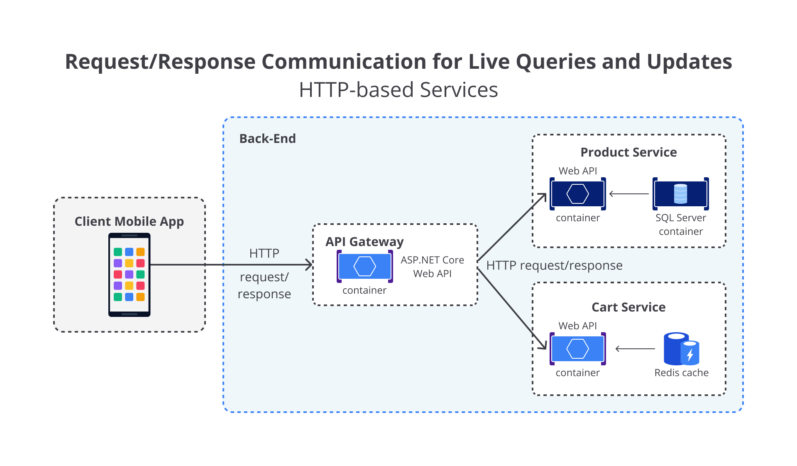

# Komunikasi dalam Arsitektur Monolithic dan Microservices

Beralih dari arsitektur monolithic ke microservices merupakan langkah kompleks yang memerlukan pemikiran mendalam terhadap banyak aspek. Salah satu aspek terpenting dan menjadi kunci keberhasilan proses migrasi pendekatan arsitektur adalah **komunikasi**, utamanya tentang bagaimana sistem menyampaikan *message* (pesan) dari satu komponen aplikasi ke komponen aplikasi lain.

> **Catatan:** *Message* adalah payload (muatan) data yang dapat dikirim di antara berbagai sistem.

## Komunikasi dalam Arsitektur Monolithic

Dalam arsitektur monolithic yang sederhana, semua komponen aplikasi ditulis dalam bahasa pemrograman yang seragam. Untuk berkomunikasi dengan komponen aplikasi lain, kita cukup memanggil methods/functions yang diinginkan untuk menjalankan sejumlah logic.

Mekanisme ini bisa bersifat:
- **Coupled (Ketergantungan)**: Bila Anda membuat objek secara langsung, contoh `new ClassName()`.
- **Decoupled (Terpisah)**: Bila Anda menggunakan *Dependency Injection* dengan mereferensikan abstraksi ketimbang instance objek.

Namun, object tetap berada dalam unit komponen yang sama sehingga komunikasi antar bagian berlangsung **in-process** dan sangat cepat.

## Komunikasi dalam Arsitektur Microservices

Dalam arsitektur microservices, proses komunikasi menjadi lebih kompleks karena:
- Komponen dipisahkan berdasarkan **hard boundaries** (domain bisnis yang jelas).
- Tidak ada lagi *in-process call* sederhana.
- Setiap service adalah proses terpisah dan mungkin berjalan di server berbeda.

Salah satu tantangan terbesar saat migrasi adalah perubahan mekanisme komunikasi. Konversi langsung dari metode *in-process calls* menjadi *calls to services* akan menyebabkan komunikasi:
- Kompleks.
- Tidak efisien.
- Rentan terhadap kegagalan.

Ini akan menyulitkan jika diterapkan langsung di sistem terdistribusi seperti microservices.

## Solusi Migrasi Komunikasi

Salah satu pendekatan terbaik adalah:

1. **Mengisolasi services sebanyak mungkin**, terutama yang berkaitan dengan domain bisnis.
2. **Menggunakan komunikasi asynchronous** antar services.

Cara umum untuk mendukung komunikasi ini:
- Mengelompokkan *calls*.
- Mengembalikan data yang menggabungkan hasil dari beberapa internal calls.

## Protokol Komunikasi Microservices

Setiap service instance adalah proses terpisah, sehingga interaksi antar service memerlukan protokol komunikasi antarproses, seperti:

- **HTTP** (Hypertext Transfer Protocol)
- **AMQP** (Advanced Message Queuing Protocol)
- **TCP** (Transmission Control Protocol)

Bergantung pada kebutuhan dan sifat masing-masing service.

Namun, dua protokol yang paling umum digunakan adalah:
- **HTTP Request/Response** menggunakan resource API (saat melakukan query).
- **Asynchronous Messaging** (biasanya dengan AMQP) saat mengomunikasikan pembaruan di sejumlah services.

# Masalah Komunikasi dalam Arsitektur Microservices

Berkomunikasi lintas services dalam arsitektur microservices merupakan tantangan yang nyata. Dalam konteks ini, komunikasi tidak mengacu pada protokol apa yang harus Anda gunakan (HTTP dan REST, AMQP, messaging, dan sebagainya). Akan tetapi, yang harus dipertimbangkan adalah **gaya komunikasi** apa yang harus Anda gunakan, terutama **seberapa coupled** (ketergantungan antar-service) aplikasi Anda. Bergantung pada tingkat coupled yang aplikasi Anda miliki, saat suatu kegagalan terjadi, dampak pada sistem Anda akan sangat bervariasi.

Dalam sistem terdistribusi seperti microservices, dengan banyaknya services yang bertebaran dan berjalan di sejumlah server, satu atau lebih komponen aplikasi berpotensi mengalami kegagalan sewaktu-waktu. Itu artinya, kegagalan sebagian komponen aplikasi (atau bahkan keseluruhan) mungkin terjadi. Dengan demikian, Anda perlu merancang arsitektur microservices dan komunikasi di antara services tersebut dengan mempertimbangkan risiko umum yang dapat menimpa aplikasi.

## Pendekatan Berbasis HTTP

Salah satu pendekatan yang populer adalah dengan mengimplementasikan microservices berbasis HTTP (REST) karena kesederhanaannya. Pendekatan berbasis HTTP ini tentu bukanlah masalah dan sangat oke untuk diterapkan. Akan tetapi, masalahnya justru ada pada **bagaimana cara Anda menggunakannya**.

Apabila Anda menggunakan HTTP request/response untuk berinteraksi dengan services dari client app atau dari API Gateway, itu tidak mengapa. Contohnya seperti ilustrasi berikut:

Ketika menggunakan komunikasi request/response:
- Client mengirimkan request ke service.
- Service memproses request dan mengirimkan response kembali.

Mekanisme ini **sangat ideal untuk kasus query data** pada UI real-time di client app. Dalam arsitektur microservices, Anda mungkin akan menggunakan mekanisme ini untuk sebagian besar proses query.

Client biasanya menganggap bahwa response akan tiba dalam waktu singkat, biasanya kurang dari satu detik atau paling lama beberapa detik.

## Bahaya Rangkaian HTTP Request

Namun, jika membuat sejumlah synchronous HTTP request yang membutuhkan waktu lama di seluruh services Anda, aplikasi Anda pada akhirnya akan mengalami masalah. Coba amati arsitektur di bawah ini:

Sebagai contoh:
- Aplikasi Anda melakukan HTTP API call ke Order Service.
- Order Service kemudian melakukan HTTP call ke Service lain dalam siklus request/response yang sama.

Ini mungkin terdengar masuk akal pada awalnya. Namun ada poin penting:

- Karena HTTP bersifat synchronous, client tidak akan mendapat response hingga semua proses internal selesai.
- Jika jumlah request dari client meningkat dan salah satu service lambat/tidak responsif, kinerja sistem **akan terpengaruh**.
- Skalabilitas sistem akan **turun drastis** saat beban request meningkat.

Faktanya, jika internal service Anda berkomunikasi dengan membuat rangkaian HTTP call seperti ini, **Anda sebenarnya membuat aplikasi monolithic baru**, hanya saja berbasis HTTP.

## Solusi: Minimalkan Synchronous HTTP dan Gunakan Asynchronous Communication

Untuk menegakkan otonomi tiap service dan meningkatkan ketahanan sistem:

- **Minimalkan** penggunaan rangkaian synchronous HTTP request/response di internal microservices.
- **Implementasikan komunikasi asynchronous**:
  - **Message-based** (berbasis pesan)
  - **Event-based** (berbasis peristiwa)

Dengan cara ini, setiap service dapat lebih otonom, responsif terhadap kegagalan, dan lebih mudah diskalakan.

---

Tenang, tak perlu tergesa-gesa. Kita akan bahas itu semua secara perlahan di bagian selanjutnya. **Stay tuned!**