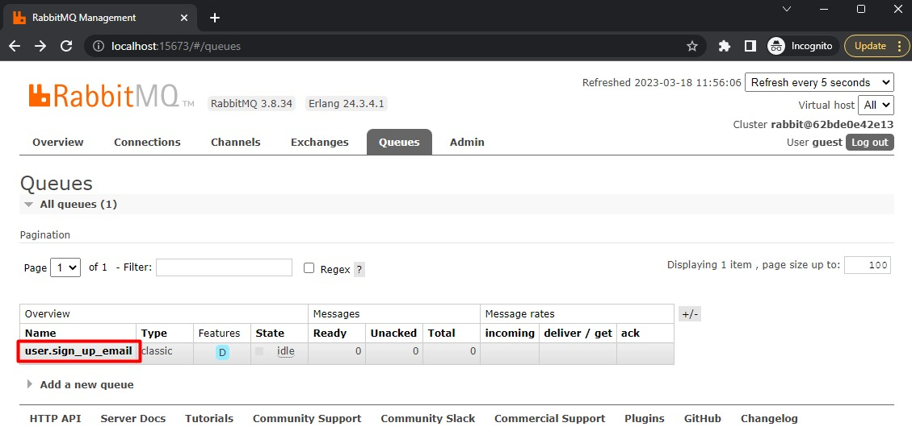
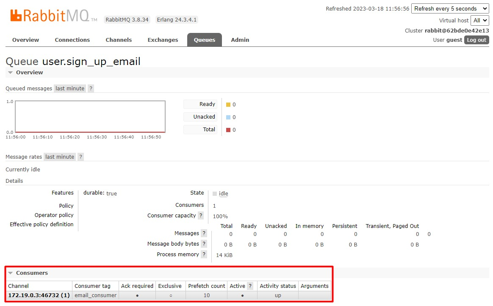
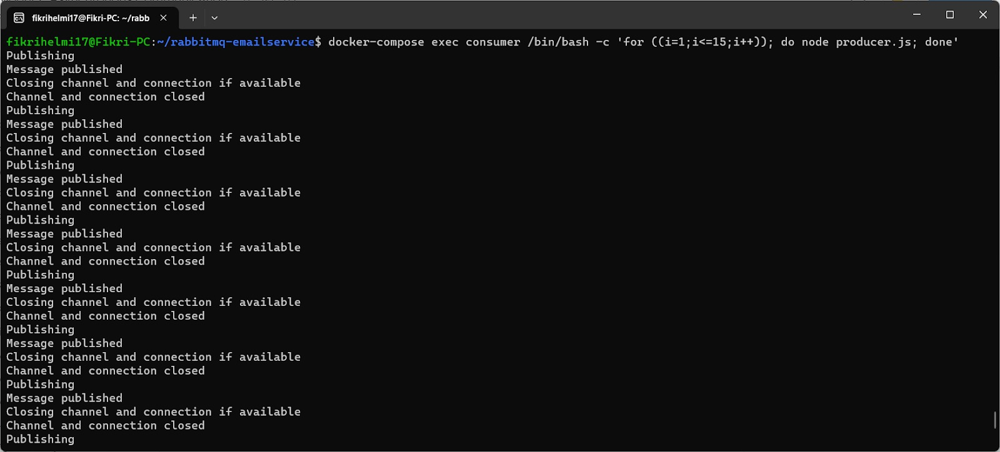
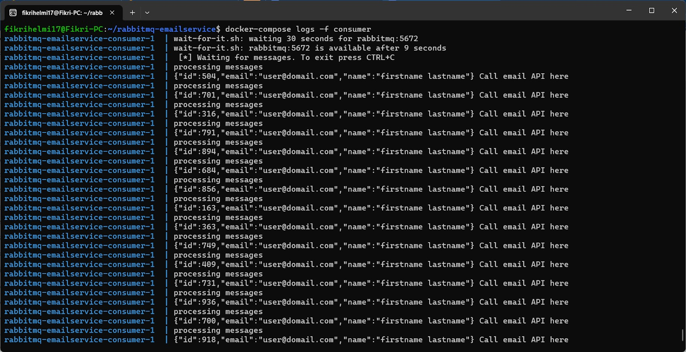
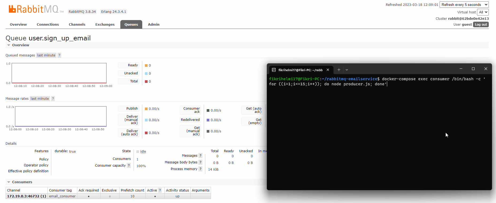

# Latihan Implementasi Asynchronous Communication dengan RabbitMQ: Uji Coba

## 1. Menjalankan Docker Compose

Silakan jalankan perintah berikut untuk memulai:

```bash
docker-compose up -d
```

Perintah ini akan:
- Membuild berkas `Dockerfile`.
- Memulai container untuk `rabbitmq` dan `consumer service`.

## 2. Mengecek RabbitMQ Management Interface

- Akses RabbitMQ management interface.
- Buka menu **Queues**.
- Anda akan melihat queue bernama `user.sign_up_email`. Klik nama queue tersebut.



Terdapat satu consumer yang sedang menunggu message.



## 3. Mengirim Message ke Queue

Untuk mengirim message ke queue, jalankan perintah berikut:

```bash
docker-compose exec consumer /bin/bash -c 'for ((i=1;i<=15;i++)); do node producer.js; done'
```

Perintah ini akan mengirim **15 message** ke queue menggunakan bash loop.



## 4. Melihat Logs dari Consumer

Gunakan perintah berikut untuk melihat log dari consumer service:

```bash
docker-compose logs -f consumer
```

Contoh tampilan log consumer:



## 5. Memantau Queue di RabbitMQ

Saat message diproses, Anda bisa mengakses RabbitMQ management interface untuk melihat aktivitas queue.



- Terjadi lonjakan pada queue.
- 15 message masuk dari producer.
- Garis hijau pada grafik **Message rates** menandakan semua message sukses diproses.

---

**Luar biasa!** Selama latihan ini, kita berhasil:
- Mengirim message ke queue (producer).
- Mengambil dan memproses message dari queue (consumer).

Menggunakan **RabbitMQ** dan aplikasi **Node.js** yang dijalankan via **Docker Compose**.