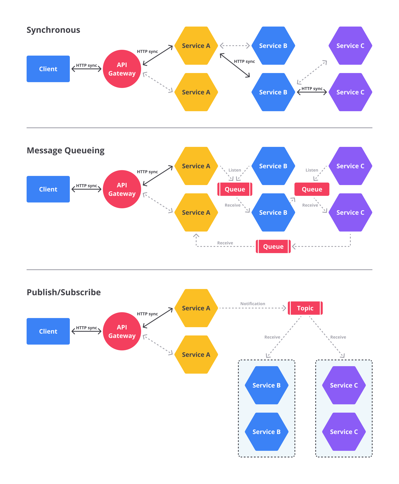

# Jenis Komunikasi dalam Arsitektur Microservices

Satu service dengan service lain dapat berkomunikasi melalui berbagai jenis komunikasi tergantung skenario dan tujuan yang diinginkan. Pada dasarnya, jenis komunikasi dalam aplikasi dapat diklasifikasikan dalam dua poros:

- **Synchronous vs Asynchronous**
- **Single Receiver vs Multiple Receivers**

Mari kita uraikan satu per satu.

## Synchronous vs Asynchronous

Poros pertama adalah mendefinisikan apakah protokol yang digunakan untuk berkomunikasi itu **synchronous** atau **asynchronous**.

### Protokol Synchronous

HTTP/HTTPS merupakan contoh protokol synchronous. Sebuah service secara eksplisit mengirimkan request ke service lain (baik untuk menyimpan maupun meminta data) dan kemudian **menunggu response** dari service tersebut.

Service yang melakukan request mungkin menerima response dalam milidetik atau beberapa detik. Namun, service tersebut **tidak dapat melanjutkan** ke tugas berikutnya sebelum ia menerima response dari service tujuan.

> Ini sama seperti saat Anda menelepon seseorang. Anda harus menunggu sampai orang tersebut mengangkat telepon. Bila tidak dijawab, komunikasi tidak terjadi.

### Protokol Asynchronous

Protokol seperti **AMQP** menggunakan mekanisme asynchronous message. Biasanya setelah mengirimkan message, service tidak menunggu response, melainkan hanya menunggu **acknowledgement** bahwa message telah diterima oleh **message broker**. Setelah itu, service melanjutkan tugas lain.

> Ini serupa dengan mengirim email. Kita tidak perlu menunggu penerima langsung membalas email tersebut.

### Ilustrasi

Kita ambil contoh aplikasi media sosial sederhana berbasis arsitektur microservices:

Saat pengguna mendaftar akun:
- Client app mengirimkan **POST request** ke API Endpoint dengan data: nama pengguna, kata sandi, email, dll.
- POST request ini disebarkan ke beberapa service:
  - **Profile Info Service** (menyimpan informasi dasar)
  - **Password Service** (menyimpan kata sandi terenkripsi)

Profile Info Service dan Password Service menggunakan komunikasi **synchronous**. API Endpoint untuk User Signup **tidak akan mengembalikan** response 200 OK ke client app sebelum kedua proses ini sukses.

Selain itu, ada service lain yang berjalan secara **asynchronous**:
- **Email Verification Service** (mengirimkan tautan verifikasi)
- **Friend Recommendation Service** (memberikan rekomendasi teman)

Kedua service ini menggunakan pola **event-driven**. Client app tidak perlu menunggu email verifikasi terkirim atau rekomendasi teman dibuat. Service ini akan memproses event pendaftaran secara asynchronous di background.

## Single Receiver vs Multiple Receivers

Sementara itu, poros kedua menentukan apakah proses komunikasi terdiri dari **single receiver** (satu penerima) atau **multiple receivers** (beberapa penerima).

### Single Receiver

Setiap request harus diproses oleh tepat satu receiver atau service. Contoh komunikasi yang menggunakan gaya ini adalah **point-to-point messaging** atau disebut juga **message queueing**.

### Multiple Receivers

Setiap request dapat diproses oleh nol hingga beberapa receiver. Jenis komunikasi ini haruslah **asynchronous**. Contohnya adalah mekanisme **publish/subscribe** yang digunakan dalam pola **event-driven architecture**. Pola ini didasarkan pada **event-bus interface** atau **message broker** saat menyebarkan pembaruan data untuk sejumlah services melalui event (biasanya diimplementasikan oleh service bus menggunakan **topics** dan **subscriptions**).

## Kesimpulan

Bila mengembangkan aplikasi yang menganut microservices, Anda dapat menggunakan kombinasi gaya komunikasi yang disebutkan di atas. Salah satu yang paling umum adalah komunikasi **single receiver** dengan protokol **synchronous** (seperti HTTP/HTTPS) untuk menjalankan Web API HTTP. Selain itu, aplikasi microservices juga biasanya menggunakan **messaging protocol** (seperti AMQP) untuk **asynchronous communication** di antara services yang ada.

Di bawah ini adalah visualisasi perbedaan antara pola komunikasi:

- **Synchronous** dengan HTTP request/response
- **Asynchronous** dengan point-to-point messaging (message queueing)
- **Asynchronous** dengan publish/subscribe messaging

Perhatikan bahwa ada beberapa contoh yang mengombinasikan berbagai jenis komunikasi. Ada sejumlah microservices yang berinteraksi secara synchronous, ada juga yang menerapkan point-to-point messaging, dan adapun yang menggunakan model publish/subscribe.

Kedua poros yang dijelaskan sebelumnya baik untuk diketahui sehingga Anda memiliki kejelasan tentang mekanisme komunikasi dalam berbagai arsitektur. Akan tetapi, keduanya itu bukan hal yang paling penting saat mengembangkan aplikasi berbasis microservices. Yang terpenting adalah Anda mampu mengintegrasikan services yang Anda miliki secara **asynchronous** seraya menjaga **independensi** masing-masing service tersebut.