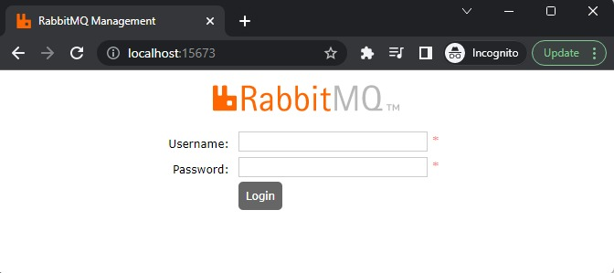
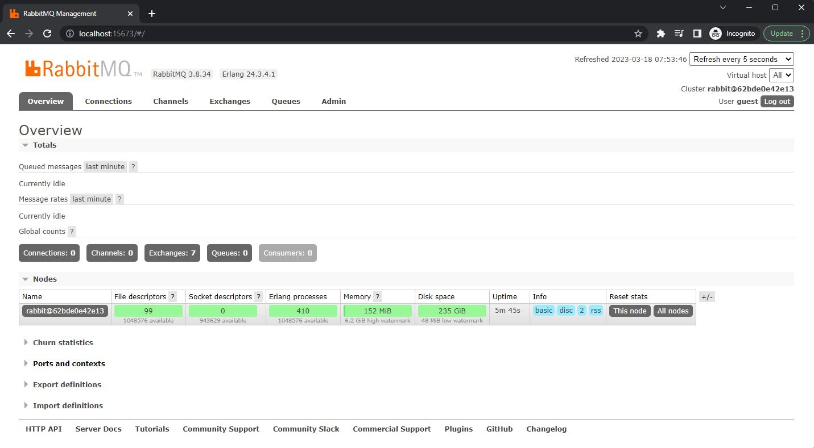

# Latihan Implementasi Asynchronous Communication dengan RabbitMQ: Menjalankan RabbitMQ via Docker Compose

Salah satu cara paling mudah untuk menjalankan RabbitMQ adalah melalui Docker. Nah, kali ini kita akan menggunakan Docker Compose untuk mempermudah pengaturan service yang akan dibuat (nantinya akan ada dua service: `rabbitmq` dan `consumer`).

## Persiapan

Pertama, buka Terminal (Linux/macOS) atau WSL/Ubuntu (Windows) Anda.

Buat sebuah directory khusus untuk latihan ini.

```bash
mkdir rabbitmq-emailservice
```

Silakan pindah ke directory tersebut. Kita akan menuliskan semua kode di sana.

```bash
cd rabbitmq-emailservice/
```

## Membuat docker-compose.yml

Lanjut, buat sebuah berkas `docker-compose.yml` dengan konten di bawah ini.

```yaml
version: "3.2"
services:
  rabbitmq:
    image: rabbitmq:3.8-management-alpine
    container_name: 'rabbitmq_container'
    ports:
        - 5673:5672
        - 15673:15672
    volumes:
        - ~/.docker-conf/rabbitmq/data/:/var/lib/rabbitmq/
        - ~/.docker-conf/rabbitmq/log/:/var/log/rabbitmq
    networks:
        - rabbitmq_network

networks:
  rabbitmq_network:
    driver: bridge
```

Jangan lupa simpan berkas tersebut.

## Penjelasan docker-compose.yml

- Kita mendefinisikan sebuah service bernama `rabbitmq` yang menggunakan image `rabbitmq:3.8-management-alpine` dari Docker Hub.
- Menamai container yang akan dibuat dengan `rabbitmq_container`.
- Mengekspos port `5673` dari lokal ke `5672` milik container (untuk RabbitMQ), serta port `15673` dari lokal ke `15672` milik container (untuk management interface).
- Memetakan dua volume, masing-masing untuk data dan log, sehingga data queue dan log takkan hilang saat restart.
- Membuat sebuah bridge network bernama `rabbitmq_network` yang akan digunakan kelak saat mengirim (produce) dan mengambil (consume) message dari queue.

## Menjalankan RabbitMQ

Untuk menjalankan RabbitMQ, eksekusi perintah berikut.

```bash
docker compose up -d
```

Nice! RabbitMQ sudah berjalan sebagaimana mestinya.

Sekarang, buka browser Anda dan akses:

```
http://localhost:15673
```

(Tunggu beberapa saat sampai sukses termuat.)



Perlu diingat bahwa saat ini kita menggunakan konfigurasi default. Jadi, Anda bisa login menggunakan kredensial berikut untuk login ke RabbitMQ management interface:

- **Username**: guest
- **Password**: guest

Setelah berhasil login, Anda akan mendapati halaman RabbitMQ management interface seperti berikut:



Dengan dashboard ini, kita bisa mengonfigurasi RabbitMQ dan melihat apa yang terjadi di dalam queue dan exchange. Anda bisa eksplorasi RabbitMQ management interface tersebut sambil mempelajari seluk-beluknya.

---

Oke, kita sudah berhasil menjalankan RabbitMQ via Docker Compose. Lanjut ke tahap berikutnya!