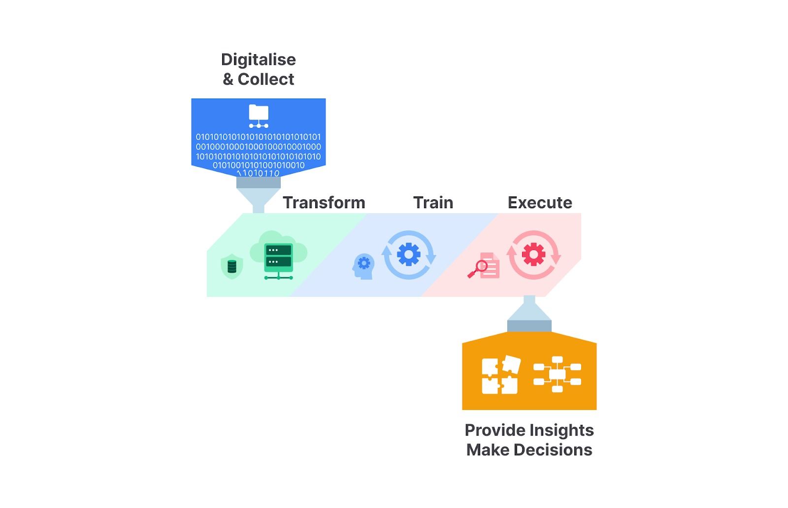
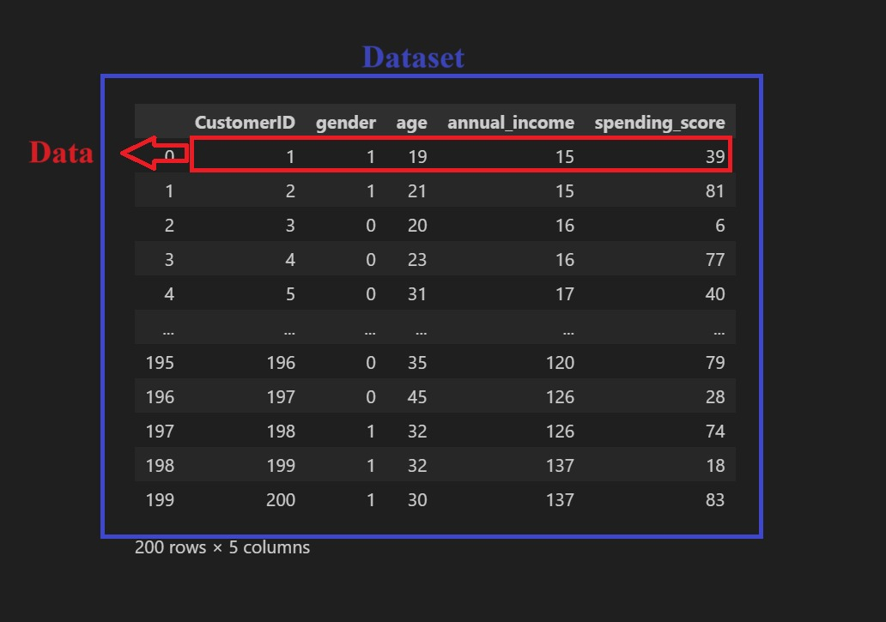
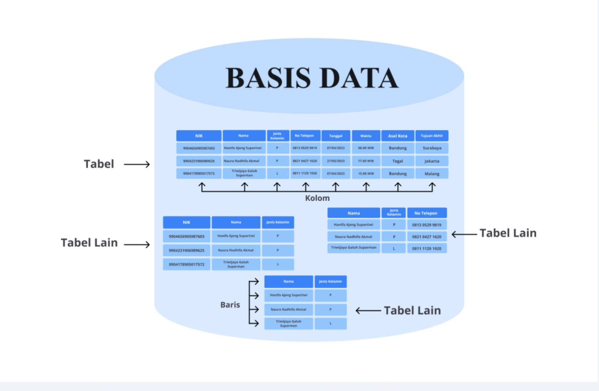
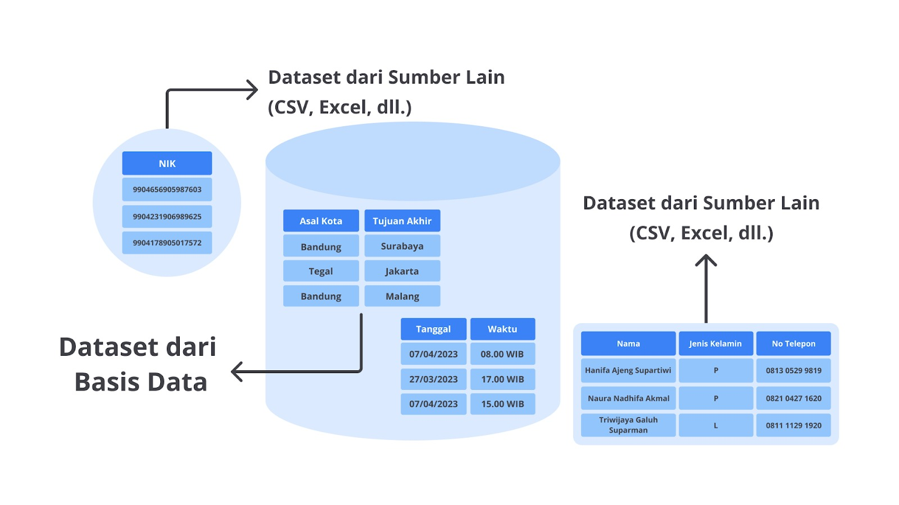

# jenis AI
## Artificial Intelligence (AI)
- AI adalah teknologi yang menerapkan peniruan perilaku manusia terhadap komputer supaya dapat mempelajari dan melakukan tugas tanpa perlu bantuan eksplisit tentang output yang diharapkan.

## Machine Learning (ML)
-  merupakan salah satu bagian dari kelompok keilmuan AI yang secara otomatis dapat belajar dan berkembang berdasarkan pengalamannya. 
    - Machine learning adalah sebuah teknologi yang menggunakan metode statistika untuk membuat komputer dapat mempelajari pola pada data tanpa perlu diprogram secara eksplisit.

## Deep Learning
- bahwa Machine Learning merupakan bagian dari AI
- Deep Learning merupakan bagian dari Machine Learning
- Deep Learning memiliki pengolahan dan komputasi yang lebih kompleks sehingga dapat menangani permasalahan yang lebih kompleks.
- Deep Learning merupakan pembelajaran mesin yang didasari oleh jaringan saraf tiruan, proses yang lebih kompleks dari pada Machine Learning karena 
    - pada tahapan ini proses pembelajarannya terdiri dari beberapa bagian mulai dari input, hidden layer, dan output. 

## Generative AI
- Generative AI merupakan bagian lebih dalam dari Deep Learning
- Pembelajaran generative AI ini dapat menghasilkan berbagai konten baru berdasarkan input yang diberikan oleh pengguna.
- model yang dibangun oleh Generative AI dapat menghasilkan berbagai konten mulai dari bahasa, kode, suara, hingga gambar.

# tahapan proses AI

## Digitalise & Collect
- Digitalise & collect merupakan tahapan pengumpulan dan penyimpanan data yang akan digunakan pada proses pembangunan AI.

## Transform
- Transform di sini bisa diartikan sebagai proses perubahan. Pada tahapan ini, data yang telah dikumpulkan akan diproses secara berulang mulai dari persiapan data, 
    - mengubah data menjadi format yang dibutuhkan, hingga mengevaluasi data dengan mengidentifikasi data yang tidak dibutuhkan.

## Train
- (Digitalise & Collect; dan Transform), kita telah mendapatkan data yang telah terstruktur
    - selanjutnya, pada tahap pelatihan/train, kita akan menentukan algoritma yang cocok untuk pengembangan AI ini. 
    - Proses pelatihan/train ini bertujuan untuk membuat komputer dapat mempelajari data yang diberikan sehingga komputer dapat melakukan tugas berdasarkan data yang telah ia pelajari.

## Execute
- Anda telah memiliki model AI yang telah dibangun dari proses pelatihan/training sebelumnya. 
    - Setelah melalui tahap train, model AI yang telah dilatih dan disempurnakan dapat digunakan untuk melakukan hal yang bisa manusia lakukan. 
    - Selama fase ini, keakuratan model juga dievaluasi secara terus-menerus. 
    - Proses eksekusi dianalisis ulang untuk memastikan bahwa sistem memenuhi harapan dan memberikan umpan balik untuk perbaikan.

## Provide Insights to Make Decisions
- Ketika model AI sudah dapat melakukan tugasnya dengan baik, sekarang kita harus melakukan ekstraksi dari pengetahuan yang diberikan oleh model tersebut. 
    - Proses ini membantu pengambilan keputusan serta meningkatkan pemahaman kita dalam pengembangan AI selanjutnya.

# perbedaan data, dataset, basis data
## data
- Data adalah fakta, nyata, dan informasi yang tersimpan di dalamnya dapat berbentuk teks, angka, gambar, suara, dan banyak bentuk lainnya

## dataset
- Dataset adalah kumpulan data yang disusun secara terstruktur. 
- Biasanya, dataset dipresentasikan dalam bentuk tabel alias kumpulan baris dan kolom yang dapat disimpan pada beberapa format, seperti CSV, Excel, JSON, dan format lainnya

## basis data
- Basis Data merupakan kumpulan data yang diatur dan disimpan secara terorganisir sehingga dapat diambil dan diakses dengan mudah. Selain itu, 
    - ia juga dapat menyimpan berbagai macam tipe data, termasuk teks, nomor, gambar, dan tipe data lainnya

# Tipe-Tipe Data
## Data Terstruktur
- Data terstruktur merupakan jenis data yang memiliki format dan tata letak yang tetap atau teratur. 
- Artinya, data ini diatur dalam suatu pola atau struktur yang konsisten sehingga mudah dibaca, diproses, dan dianalisis oleh komputer atau manusia.

## Data Kuantitatif
- Data kuantitatif adalah jenis data yang dapat diukur atau diungkapkan dalam bentuk angka. 
    - Data ini digunakan untuk mengukur atau menggambarkan jumlah, besaran, atau atribut-atribut yang dapat diukur secara numerik.
- Data Kuantitatif terbagi menjadi 2 yaitu
### Data Kontinu
- Data kontinu dapat direpresentasikan dalam berbagai nilai numerik, seperti bilangan desimal, bulat, dan lain-lain. 
    - Beberapa contoh tipe data kontinu yang umum adalah tinggi, berat, waktu, suhu, usia, dan lain-lain. 
### Data Diskrit
- Data diskrit merupakan data numerik yang hanya bisa direpresentasikan dengan bilangan bulat dan tidak dapat dibagi ke dalam unit yang lebih kecil.

## Data Kategorikal
- Data kategorikal mengacu pada bentuk informasi yang dapat disimpan dan diidentifikasi berdasarkan nama atau labelnya. 
    - Data kategorikal merupakan data yang dapat dikelompokkan dan terbagi berdasarkan karakteristik atau ciri khasnya masing-masing
- terbagi menjadi 2
### Data Ordinal
- Data ordinal adalah jenis pengelompokan data yang memiliki urutan atau harus disusun secara berurutan dengan mekanisme peringkat.
### Data Nominal
- Berkebalikan dengan data ordinal, data nominal adalah jenis pengelompokan data yang tidak memiliki keterkaitan dengan data lainnya dan tidak memiliki arti khusus.

## Data Tidak Terstruktur
- Data tidak terstruktur adalah jenis data yang tidak memiliki format atau struktur yang jelas.
- Data ini cenderung bervariasi bentuknya dan sulit untuk diorganisasi dalam kategori atau kolom tertentu. 
    - Data tidak terstruktur seringkali memiliki sifat lebih bebas, tidak terbatas, dan lebih kompleks dibandingkan dengan data terstruktur.

